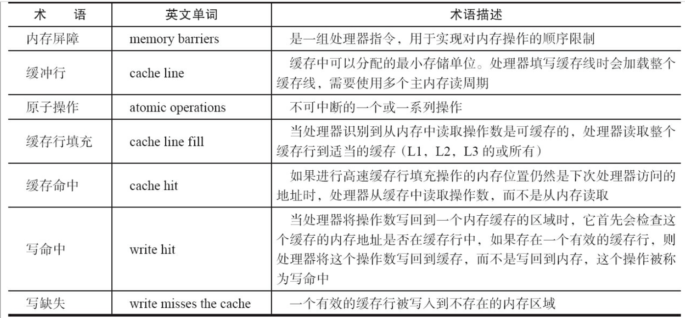
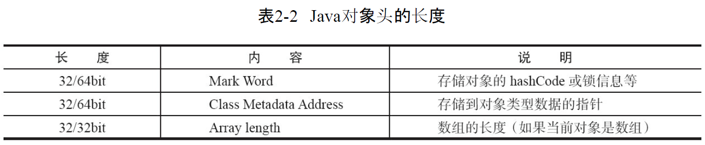
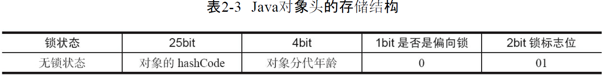
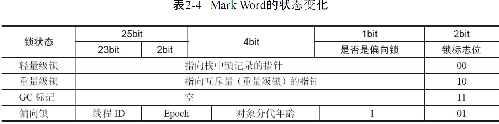
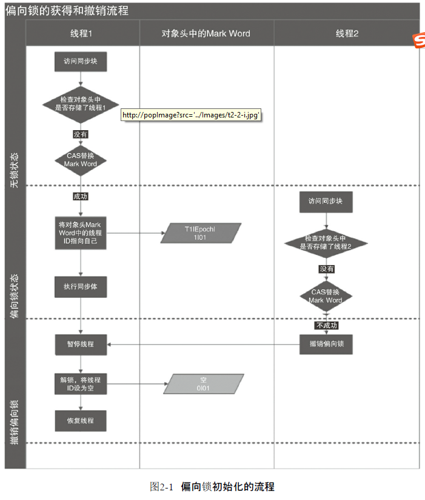
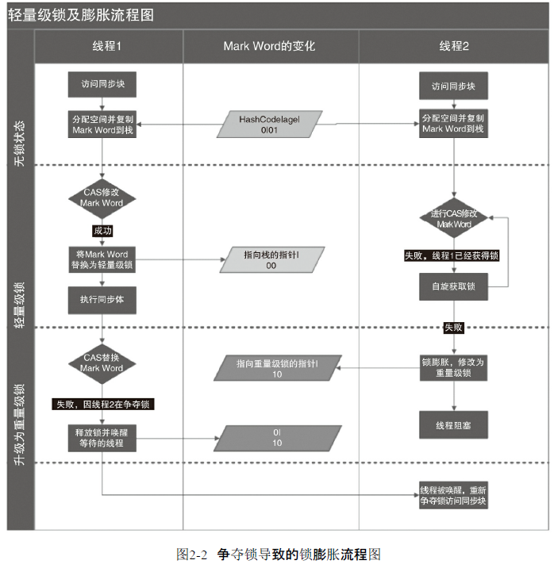

##### Java 并发机制的底层实现原理
1. CPU术语的定义 \

2. volatile原理
   1. volatile是如何来保证可见性的呢? \
   有volatile变量修饰的共享变量进行写操作的时候会多出第二行汇编代码，通过查IA-32架构软件开发者手册可知，Lock前缀的指令在多核处理器下会引发了两件事情
      1. 将当前处理器缓存行的数据写回到系统内存。
          - Lock前缀指令导致在执行指令期间，声言处理器的LOCK#信号。在多处理器环境中，LOCK#信号确保在声言该信号期间，处理器可以独占任何共享内存。但是，在最近的处理器里，LOCK＃信号一般不锁总线，而是锁缓存，毕竟锁总线开销的比较大。
      2. 这个写回内存的操作会使在其他CPU里缓存了该内存地址的数据无效。
         - 。IA-32处理器和Intel 64处理器使用MESI（修改、独占、共享、无效）控制协议去维护内部缓存和其他处理器缓存的一致性\
   *在多处理器下，为了保证各个处理器的缓存是一致的，就会实现缓存一
   致性协议，每个处理器通过嗅探在总线上传播的数据来检查自己缓存的值是不是过期了，当处理器发现自己缓存行对应的内存地址被修改，就会将当前处理器的缓存行设置成无效状态，当处理器对这个数据进行修改操作的时候，会重新从系统内存中把数据读到处理器缓存里。*
   1. JDK 7的并发包里新增一个队列集合类LinkedTransferQueue，它在使用volatile变量时，用一种追加字节的方式来优化队列出队和入队的性能。这种追加字节的方式在Java 7下可能不生效，因为Java 7变得更加智慧，它会淘汰或重新排列无用字段，需要使用其他追加字节的方式
   2. 是不是在使用volatile变量时都应该追加到64字节? 在两种场景下不应该
   使用这种方式: 
      1. 缓存行非64字节宽的处理器
      2. 共享变量不会被频繁地写
3. synchronized的实现原理与应用
   1. 用synchronized实现同步的基础: Java中的每一个对象都可以作为锁。具体表现为以下3种形式:
      1. 对于普通同步方法，锁是当前实例对象。
      2. 对于静态同步方法，锁是当前类的Class对象。
      3. 对于同步方法块，锁是Synchonized括号里配置的对象。
   2. JVM基于进入和退出Monitor对象来实现方法同步和代码块同步，但两者的实现细节不一样。代码块同步是使用monitorenter和monitorexit指令实现的，而方法同步是使用另外一种方式实现的，细节在JVM规范里并没有详细说明。但是，方法的同步同样可以使用这两个指令来实现。
   3. monitorenter指令是在编译后插入到同步代码块的开始位置，而monitorexit是插入到方法结束处和异常处，JVM要保证每个monitorenter必须有对应的monitorexit与之配对。任何对象都有一个monitor与之关联，当且一个monitor被持有后，它将处于锁定状态。线程执行到monitorenter指令时，将会尝试获取对象所对应的monitor的所有权，即尝试获得对象的锁
   4. Java对象头 \
     \
    
    
    2. 锁的升级与对比 ("偏向锁"和"轻量级锁" Since JDK1.6)
       1. 偏向锁
           1. 初衷: 大多数情况下，锁不仅不存在多线程竞争，而且总是由同一线程多次获得，为了让线程获得锁的代价更低而引入了偏向锁
           2. 加锁流程: 当一个线程访问同步块并获取锁时，会在对象头和栈帧中的锁记录里存储锁偏向的线程ID，以后该线程在进入和退出同步块时不需要进行CAS操作来加锁和解锁，只需简单地测试一下对象头的Mark Word里是否存储着指向当前线程的偏向锁。如果测试成功，表示线程已经获得了锁。如果测试失败，则需要再测试一下Mark Word中偏向锁的标识是否设置成1（表示当前是偏向锁）：如果没有设置，则使用CAS竞争锁；如果设置了，则尝试使用CAS将对象头的偏向锁指向当前线程。 
           3. 偏向锁的加解锁流程 \
            
        2. 轻量级锁
           1. 加锁流程: 线程在执行同步块之前，JVM会先在当前线程的栈桢中创建用于存储锁记录的空间，并将对象头中的Mark Word复制到锁记录中，官方称为Displaced Mark Word。然后线程尝试使用CAS将对象头中的Mark Word替换为指向锁记录的指针。如果成功，当前线程获得锁，如果失败，表示其他线程竞争锁，当前线程便尝试使用自旋来获取锁。
           2. 解锁流程: 轻量级解锁时，会使用原子的CAS操作将Displaced Mark Word替换回到对象头，如果成功，则表示没有竞争发生。如果失败，表示当前锁存在竞争，锁就会膨胀成重量级锁。
           3. 轻量级锁的加解锁流程 \
            