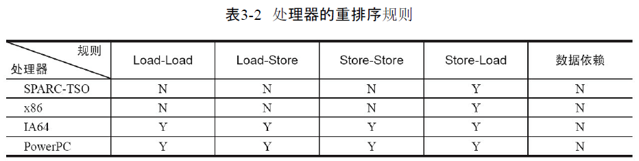
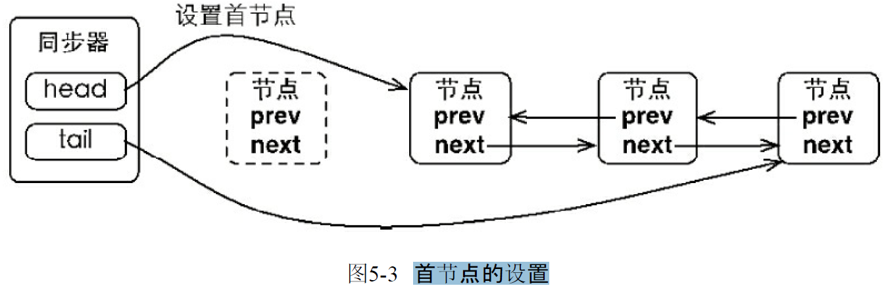

##### Java 并发机制的底层实现原理
1. CPU术语的定义 \

2. volatile原理
   1. volatile是如何来保证可见性的呢? \
   有volatile变量修饰的共享变量进行写操作的时候会多出第二行汇编代码，通过查IA-32架构软件开发者手册可知，Lock前缀的指令在多核处理器下会引发了两件事情
      1. 将当前处理器缓存行的数据写回到系统内存。
          - Lock前缀指令导致在执行指令期间，声言处理器的LOCK#信号。在多处理器环境中，LOCK#信号确保在声言该信号期间，处理器可以独占任何共享内存。但是，在最近的处理器里，LOCK＃信号一般不锁总线，而是锁缓存，毕竟锁总线开销的比较大。
      2. 这个写回内存的操作会使在其他CPU里缓存了该内存地址的数据无效。
         - 。IA-32处理器和Intel 64处理器使用MESI（修改、独占、共享、无效）控制协议去维护内部缓存和其他处理器缓存的一致性\
   *在多处理器下，为了保证各个处理器的缓存是一致的，就会实现缓存一
   致性协议，每个处理器通过嗅探在总线上传播的数据来检查自己缓存的值是不是过期了，当处理器发现自己缓存行对应的内存地址被修改，就会将当前处理器的缓存行设置成无效状态，当处理器对这个数据进行修改操作的时候，会重新从系统内存中把数据读到处理器缓存里。*
   1. JDK 7的并发包里新增一个队列集合类LinkedTransferQueue，它在使用volatile变量时，用一种追加字节的方式来优化队列出队和入队的性能。这种追加字节的方式在Java 7下可能不生效，因为Java 7变得更加智慧，它会淘汰或重新排列无用字段，需要使用其他追加字节的方式
   2. 是不是在使用volatile变量时都应该追加到64字节? 在两种场景下不应该
   使用这种方式: 
      1. 缓存行非64字节宽的处理器
      2. 共享变量不会被频繁地写
3. synchronized的实现原理与应用
   1. 用synchronized实现同步的基础: Java中的每一个对象都可以作为锁。具体表现为以下3种形式:
      1. 对于普通同步方法，锁是当前实例对象。
      2. 对于静态同步方法，锁是当前类的Class对象。
      3. 对于同步方法块，锁是Synchonized括号里配置的对象。
   2. JVM基于进入和退出Monitor对象来实现方法同步和代码块同步，但两者的实现细节不一样。代码块同步是使用monitorenter和monitorexit指令实现的，而方法同步是使用另外一种方式实现的，细节在JVM规范里并没有详细说明。但是，方法的同步同样可以使用这两个指令来实现。
   3. monitorenter指令是在编译后插入到同步代码块的开始位置，而monitorexit是插入到方法结束处和异常处，JVM要保证每个monitorenter必须有对应的monitorexit与之配对。任何对象都有一个monitor与之关联，当且一个monitor被持有后，它将处于锁定状态。线程执行到monitorenter指令时，将会尝试获取对象所对应的monitor的所有权，即尝试获得对象的锁
   4. Java对象头 \
     \
    
    
   5. 锁的升级与对比 ("偏向锁"和"轻量级锁" Since JDK1.6)
       1. 偏向锁
           1. 初衷: 大多数情况下，锁不仅不存在多线程竞争，而且总是由同一线程多次获得，为了让线程获得锁的代价更低而引入了偏向锁
           2. 加锁流程: 当一个线程访问同步块并获取锁时，会在对象头和栈帧中的锁记录里存储锁偏向的线程ID，以后该线程在进入和退出同步块时不需要进行CAS操作来加锁和解锁，只需简单地测试一下对象头的Mark Word里是否存储着指向当前线程的偏向锁。如果测试成功，表示线程已经获得了锁。如果测试失败，则需要再测试一下Mark Word中偏向锁的标识是否设置成1（表示当前是偏向锁）：如果没有设置，则使用CAS竞争锁；如果设置了，则尝试使用CAS将对象头的偏向锁指向当前线程。 
           3. 偏向锁的加解锁流程 \
            
        1. 轻量级锁
           1. 加锁流程: 线程在执行同步块之前，JVM会先在当前线程的栈桢中创建用于存储锁记录的空间，并将对象头中的Mark Word复制到锁记录中，官方称为Displaced Mark Word。然后线程尝试使用CAS将对象头中的Mark Word替换为指向锁记录的指针。如果成功，当前线程获得锁，如果失败，表示其他线程竞争锁，当前线程便尝试使用自旋来获取锁。
           2. 解锁流程: 轻量级解锁时，会使用原子的CAS操作将Displaced Mark Word替换回到对象头，如果成功，则表示没有竞争发生。如果失败，表示当前锁存在竞争，锁就会膨胀成重量级锁。
           3. 轻量级锁的加解锁流程 \
            
   6. 锁的优缺点的对比 \
   
4. 原子操作的实现原理
   1. CPU术语定义 \
   
   2. 处理器如何实现原子操作: 32位IA-32处理器使用基于对缓存加锁或总线加锁的方式来实现多处理器之间的原子操作
      1. 对总线加锁:所谓总线锁就是使用处理器提供的一个LOCK＃信号，当一个处理器在总线上输出此信号时，其他处理器的请求将被阻塞住，那么该处理器可以独占共享内存。
      2. 使用缓存锁保证原子性: 所谓"缓存锁定"是指内存区域如果被缓存在处理器的缓存行中，并且在Lock操作期间被锁定，那么当它执行锁操作回写到内存时，处理器不在总线上声言LOCK＃信号，而是修改内部的内存地址，并允许它的缓存一致性机制来保证操作的原子性，因为缓存一致性机制会阻止同时修改由两个以上处理器缓存的内存区域数据，当其他处理器回写已被锁定的缓存行的数据时，会使缓存行无效. 有两种情况下处理器不会使用缓存锁定:
         1. 当操作的数据不能被缓存在处理器内部，或操作的数据跨多个缓存行(cache line)时，则处理器会调用总线锁定。
         2. 有些处理器不支持缓存锁定。对于Intel 486和Pentium处理器，就算锁定的内存区域在处理器的缓存行中也会调用总线锁定。
   3. Java如何实现原子操作: 在Java中可以通过锁和循环CAS的方式来实现原子操作。
      1. 循环CAS的方式实现原子操作
         1. JVM中的CAS操作正是利用了处理器提供的CMPXCHG指令实现的。自旋CAS实现的基本思路就是循环进行CAS操作直到成功为止
         2. CAS实现原子操作的三大问题
            1. ABA问题: Atomic包里提供了一个类AtomicStampedReference来解决ABA问题。这个类的compareAndSet方法的作用是首先检查当前引用是否等于预期引用，并且检查当前标志是否等于预期标志，如果全部相等，则以原子方式将该引用和该标志的值设置为给定的更新值
            2. 循环时间长开销大: 如果JVM能支持处理器提供的pause指令，那么效率会有一定的提升。pause指令有两个作用：
               1. 它可以延迟流水线执行指令(de-pipeline)，使CPU不会消耗过多的执行资源，延迟的时间取决于具体实现的版本，在一些处理器上延迟时间是零；
               2. 它可以避免在退出循环的时候因内存顺序冲突(Memory Order Violation)而引起CPU流水线被清空(CPU Pipeline Flush)，从而提高CPU的执行效率。
            3. 只能保证一个共享变量的原子操作: AtomicReference类来保证引用对象之间的原子性，就可以把多个变量放在一个对象里来进行CAS操作。
      2. 使用锁机制实现原子操作
         1. 锁机制保证了只有获得锁的线程才能够操作锁定的内存区域
         2. 除了偏向锁，JVM实现锁的方式都用了循环CAS，即当一个线程想进入同步块的时候使用循环CAS的方式来获取锁，当它退出同步块的时候使用循环CAS释放锁。


##### Java内存模型
1. Java内存模型的基础
   1. 并发编程模型的两个关键问题: 线程之间如何通信及线程之间如何同步. 
      1. 通信是指线程之间以何种机制来交换信息. 在命令式编程中，线程之间的通信机制有两种：共享内存和消息传递。
         1. 在共享内存的并发模型里，线程之间共享程序的公共状态，通过写-读内存中的公共状态进行隐式通信。
         2. 在消息传递的并发模型里，线程之间没有公共状态，线程之间必须通过发送消息来显式进行通信。
      2. 同步是指程序中用于控制不同线程间操作发生相对顺序的机制。
         1. 在共享内存并发模型里，同步是显式进行的。程序员必须显式指定某个方法或某段代码需要在线程之间互斥执行。
         2. 在消息传递的并发模型里，由于消息的发送必须在消息的接收之前，因此同步是隐式进行的。
   2. Java的并发采用的是共享内存模型，Java线程之间的通信总是隐式进行，整个通信过程对程序员完全透明
   3. Java内存模型的抽象结构
      1. 在Java中，所有实例域、静态域和数组元素都存储在堆内存中，堆内存在线程之间共享(本章用“共享变量”这个术语代指实例域，静态域和数组元素)。局部变量（Local Variables），方法定义参数（Java语言规范称之为Formal Method Parameters）和异常处理器参数（Exception Handler Parameters）不会在线程之间共享，它们不会有内存可见性问题，也不受内存模型的影响。
      2. Java线程之间的通信由Java内存模型（本文简称为JMM）控制，JMM决定一个线程对共享变量的写入何时对另一个线程可见。从抽象的角度来看，JMM定义了线程和主内存之间的抽象关系：线程之间的共享变量存储在主内存（Main Memory）中，每个线程都有一个私有的本地内存（Local Memory），本地内存中存储了该线程以读/写共享变量的副本。**本地内存是JMM的一个抽象概念，并不真实存在** \
      
      3. 如果线程A与线程B之间要通信的话，必须要经历下面2个步骤:
         1. 线程A把本地内存A中更新过的共享变量刷新到主内存中去。
         2. 线程B到主内存中去读取线程A之前已更新过的共享变量。
      
      4. JMM通过控制主内存与每个线程的本地内存之间的交互，来为Java程序员提供内存可见性保证。
   4. 从源代码到指令序列的重排序
      1. 在执行程序时，为了提高性能，编译器和处理器常常会对指令做重排序。重排序分3种类型。
      
         1. 编译器优化的重排序。编译器在不改变单线程程序语义的前提下，可以重新安排语句的执行顺序。
         2. 指令级并行的重排序。现代处理器采用了指令级并行技术（Instruction-Level Parallelism，ILP）来将多条指令重叠执行。如果不存在数据依赖性，处理器可以改变语句对应机器指令的执行顺序。
         3. 内存系统的重排序。由于处理器使用缓存和读/写缓冲区，这使得加载和存储操作看上去可能是在乱序执行。
      1. 对于编译器，JMM的编译器重排序规则会禁止特定类型的编译器重排序（不是所有的编译器重排序都要禁止）。对于处理器重排序，JMM的处理器重排序规则会要求Java编译器在生成指令序列时，插入特定类型的内存屏障（Memory Barriers，Intel称之为 Memory Fence）指令，通过内存屏障指令来禁止特定类型的处理器重排序。
      2. JMM属于语言级的内存模型，它确保在不同的编译器和不同的处理器平台之上，通过禁止特定类型的编译器重排序和处理器重排序，为程序员提供一致的内存可见性保证。
   5. 并发编程模型的分类
      1. 处理器的重排序规则 \
      
      2. 为了保证内存可见性，Java编译器在生成指令序列的适当位置会插入内存屏障指令来禁止特定类型的处理器重排序。JMM把内存屏障指令分为4类 \
      
      *StoreLoad Barriers是一个“全能型”的屏障，它同时具有其他3个屏障的效果。现代的多处理器大多支持该屏障（其他类型的屏障不一定被所有处理器支持）。执行该屏障开销会很昂贵，因为当前处理器通常要把写缓冲区中的数据全部刷新到内存中（Buffer Fully Flush）。* 
   6. happens-before
      1. JSR-133使用happens-before的概念来阐述操作之间的内存可见性。在JMM中，如果一个操作执行的结果需要对另一个操作可见，那么这两个操作之间必须要存在happens-before关系。这里提到的两个操作既可以是在一个线程之内，也可以是在不同线程之间。
      2. 与程序员密切相关的happens-before规则如下:
         1. 程序顺序规则：一个线程中的每个操作，happens-before于该线程中的任意后续操作。
         2. 监视器锁规则：对一个锁的解锁，happens-before于随后对这个锁的加锁。
         3. volatile变量规则：对一个volatile域的写, happens-before于任意后续对这个volatile域的读。
         4. 传递性：如果A happens-before B，且B happens-before C，那么A happens-before C。
      3. 两个操作之间具有happens-before关系，并不意味着前一个操作必须要在后一个操作之前执行！happens-before仅仅要求前一个操作（执行的结果）对后一个操作可见，且前一个操作按顺序排在第二个操作之前
      4. happens-before与JMM的关系 \
      
      5. 为什么需要happens-before规则: happens-before规则简单易懂，它避免Java程序员为了理解JMM提供的内存可见性保证而去学习复杂的重排序规则以及这些规则的具体实现方法。
2. 重排序
   1. 重排序是指编译器和处理器为了优化程序性能而对指令序列进行重新排序的一种手
   2. 数据依赖性: 如果两个操作访问同一个变量，且这两个操作中有一个为写操作，此时这两个操作之间就存在数据依赖性 \
   
   3. as-if-serial语义
      1. 不管怎么重排序（编译器和处理器为了提高并行度），（单线程）程序的执行结果不能被改变。编译器、runtime和处理器都必须遵守as-if-serial语义。
      2. 为了遵守as-if-serial语义，编译器和处理器不会对存在数据依赖关系的操作做重排序，因为这种重排序会改变执行结果。但是，如果操作之间不存在数据依赖关系，这些操作就可能被编译器和处理器重排序。
   4. 程序顺序规则
   5. 重排序对多线程的影响
3. 顺序一致性
   1. 顺序一致性内存模型是一个理论参考模型，在设计的时候，处理器的内存模型和编程语言的内存模型都会以顺序一致性内存模型作为参照。
   2. 当程序未正确同步时，就可能会存在数据竞争。Java内存模型规范对数据竞争的定义如下:
      1. 在一个线程中写一个变量，
      2. 在另一个线程读同一个变量，
      3. 而且写和读没有通过同步来排序。
   3. JMM对正确同步的多线程程序的内存一致性做了如下保证: 如果程序是正确同步的，程序的执行将具有顺序一致性（Sequentially Consistent）——即程序的执行结果与该程序在顺序一致性内存模型中的执行结果相同。
   4. 顺序一致性内存模型有两大特性: 
      1. 一个线程中的所有操作必须按照程序的顺序来执行。
      2. （不管程序是否同步）所有线程都只能看到一个单一的操作执行顺序。在顺序一致性内存模型中，每个操作都必须原子执行且立刻对所有线程可见。
   5. 在JMM中没有顺序一致性保证。未同步程序在JMM中不但整体的执行顺序是无序的，而且所有线程看到的操作执行顺序也可能不一致。比如，在当前线程把写过的数据缓存在本地内存中，在没有刷新到主内存之前，这个写操作仅对当前线程可见；从其他线程的角度来观察，会认为这个写操作根本没有被当前线程执行。只有当前线程把本地内存中写过的数据刷新到主内存之后，这个写操作才能对其他线程可见。在这种情况下，当前线程和其他线程看到的操作执行顺序将不一致
   6. 同步程序的顺序一致性效果
   7. 未同步程序的执行特性
      1. 对于未同步或未正确同步的多线程程序，JMM只提供最小安全性：线程执行时读取到的值，要么是之前某个线程写入的值，要么是默认值（0，Null，False），JMM保证线程读操作读取到的值不会无中生有（Out Of Thin Air）的冒出来。为了实现最小安全性，JVM在堆上分配对象时，首先会对内存空间进行清零，然后才会在上面分配对象（JVM内部会同步这两个操作）。因此，在已清零的内存空间（Pre-zeroed Memory）分配对象时，域的默认初始化已经完成了。
      2. JMM不保证未同步程序的执行结果与该程序在顺序一致性模型中的执行结果一致。因为如果想要保证执行结果一致，JMM需要禁止大量的处理器和编译器的优化，这对程序的执行性能会产生很大的影响。而且未同步程序在顺序一致性模型中执行时，整体是无序的，其执行结果往往无法预知。而且，保证未同步程序在这两个模型中的执行结果一致没什么意义。
      3. 未同步程序在JMM中的执行时，整体上是无序的，其执行结果无法预知。未同步程序在两个模型中的执行特性有如下几个差异:
         1. 顺序一致性模型保证单线程内的操作会按程序的顺序执行，而JMM不保证单线程内的操作会按程序的顺序执行（比如上面正确同步的多线程程序在临界区内的重排序）。
         2. 顺序一致性模型保证所有线程只能看到一致的操作执行顺序，而JMM不保证所有线程能看到一致的操作执行顺序。
         3. JMM不保证对64位的long型和double型变量的写操作具有原子性，而顺序一致性模型保证对所有的内存读/写操作都具有原子性。
4. volatile的内存语义
   1. volatile概述
      1. 理解volatile特性的一个好方法是把对volatile变量的单个读/写，看成是使用同一个锁对这些单个读/写操作做了同步
      2. 一个volatile变量的单个读/写操作，与一个普通变量的读/写操作都是使用同一个锁来同步，它们之间的执行效果相同。锁的happens-before规则保证释放锁和获取锁的两个线程之间的内存可见性，这意味着对一个volatile变量的读，总是能看到（任意线程）对这个volatile变量最后的写入。
      3. 如果是多个volatile操作或类似于volatile++这种复合操作，这些操作整体上不具有原子性。
   2. volatile变量自身具有下列特性:
      - 可见性。对一个volatile变量的读，总是能看到（任意线程）对这个volatile变量最后的写入。
      - 原子性：对任意单个volatile变量的读/写具有原子性，但类似于volatile++这种复合操作不具有原子性。
   3. Volatile写-读建立的happens-before关系
      1. 从JSR-133开始（即从JDK5开始），volatile变量的写-读可以实现线程之间的通信。从内存语义的角度来说，volatile的写-读与锁的释放-获取有相同的内存效果：volatile写和锁的释放有相同的内存语义；volatile读与锁的获取有相同的内存语义。
   4. volatile写-读的内存语义
      1. 当写一个volatile变量时，JMM会把该线程对应的本地内存中的共享变量值刷新到主内存。
      2. 把volatile写和volatile读两个步骤综合起来看的话，在读线程B读一个volatile变量后，写线程A在写这个volatile变量之前所有可见的共享变量的值都将立即变得对读线程B可见。
      3. 对volatile写和volatile读的内存语义做个总结。
         - 线程A写一个volatile变量，实质上是线程A向接下来将要读这个volatile变量的某个线程发出了（其对共享变量所做修改的）消息。
         - 线程B读一个volatile变量，实质上是线程B接收了之前某个线程发出的（在写这个volatile变量之前对共享变量所做修改的）消息。
         - 线程A写一个volatile变量，随后线程B读这个volatile变量，这个过程实质上是线程A通过主内存向线程B发送消息。
   5. volatile内存语义的实现
      1. 为了实现volatile内存语义，JMM会分别限制这编译器重排序和处理器重排序。针对编译器制定的volatile重排序规则表如下: \
      
         1. 当第二个操作是volatile写时，不管第一个操作是什么，都不能重排序。这个规则确保volatile写之前的操作不会被编译器重排序到volatile写之后。
         2. 当第一个操作是volatile读时，不管第二个操作是什么，都不能重排序。这个规则确保 volatile读之后的操作不会被编译器重排序到volatile读之前。
         3. 当第一个操作是volatile写，第二个操作是volatile读时，不能重排序。
      1. 基于保守策略的JMM内存屏障插入策略
         1. 在每个volatile写操作的前面插入一个StoreStore屏障。
         2. 在每个volatile写操作的后面插入一个StoreLoad屏障。
         3. 在每个volatile读操作的后面插入一个LoadLoad屏障。
         4. 在每个volatile读操作的后面插入一个LoadStore屏障。 \
       \
      
      3. ，JMM在采取了保守策略：在每个volatile写的后面，或者在每个volatile读的前面插入一个StoreLoad屏障。从整体执行效率的角度考虑，JMM最终选择了在每个volatile写的后面插入一个StoreLoad屏障。为什么? \
      因为volatile写-读内存语义的常见使用模式是：一个写线程写volatile变量，多个读线程读同一个volatile变量。当读线程的数量大大超过写线程时，选择在volatile写之后插入StoreLoad屏障将带来可观的执行效率的提升。从这里可以看到JMM在实现上的一个特点：首先确保正确性，然后再去追求执行效率。
      4. JVM 对内存屏障优化的案例
         ```java
         class VolatileBarrierExample {
            int a;
            volatile int v1 = 1;
            volatile int v2 = 2;
            void readAndWrite() {
               int i = v1;　　 // 第一个volatile读
               int j = v2; 　 // 第二个volatile读
               a = i + j; // 普通写
               v1 = i + 1; 　 // 第一个volatile写
               v2 = j * 2; 　 // 第二个 volatile写
            }
            …　　　　　　 // 其他方法
            }
         ```
          \
      5. JSR-133为什么要增强volatile的内存语义
         1. 在JSR-133之前的旧Java内存模型中，虽然不允许volatile变量之间重排序，但旧的Java内存模型允许volatile变量与普通变量重排序
         
         1. 在旧的内存模型中，volatile的写-读没有锁的释放-获所具有的内存语义。为了提供一种比锁更轻量级的线程之间通信的机制，JSR-133专家组决定增强volatile的内存语义：严格限制编译器和处理器对volatile变量与普通变量的重排序，确保volatile的写-读和锁的释放-获取具有相同的内存语义。从编译器重排序规则和处理器内存屏障插入策略来看，只要volatile变量与普通变量之间的重排序可能会破坏volatile的内存语义，这种重排序就会被编译器重排序规则和处理器内存屏障插入策略禁止。
      6. 锁与volatile的区别: 由于volatile仅仅保证对单个volatile变量的读/写具有原子性，而锁的互斥执行的特性可以确保对整个临界区代码的执行具有原子性。在功能上，锁比volatile更强大；在可伸缩性和执行性能上，volatile更有优势
5. 锁的内存语义
   1. 锁的释放-获取建立的happens-before关系
      1. 锁是Java并发编程中最重要的同步机制。锁除了让临界区互斥执行外，还可以让释放锁的线程向获取同一个锁的线程发送消息。\
      
   2. 锁的释放和获取的内存语义
      1. 当线程释放锁时，JMM会把该线程对应的本地内存中的共享变量刷新到主内存中 \
      
   3. 对锁释放和锁获取的内存语义做个总结
      1. 线程A释放一个锁，实质上是线程A向接下来将要获取这个锁的某个线程发出了（线程A对共享变量所做修改的）消息。
      2. 线程B获取一个锁，实质上是线程B接收了之前某个线程发出的（在释放这个锁之前对共享变量所做修改的）消息。
      3. 线程A释放锁，随后线程B获取这个锁，这个过程实质上是线程A通过主内存向线程B发送消息。
   4. 锁内存语义的实现
      1. 借助ReentrantLock的源代码，来分析锁内存语义的具体实现机制。 下面是一段示例代码 
         ```java
         class ReentrantLockExample {
            int a = 0;
            ReentrantLock lock = new ReentrantLock();
            public void writer() {
               lock.lock();　　　　 // 获取锁
               try {
               a++;
               } finally {
                  lock.unlock();　　// 释放锁
               }
            }
            public void reader () {
               lock.lock();　　　　 // 获取锁
               try {
                  int i = a;
               ……
               } finally {
                  lock.unlock();　 // 释放锁
               }
            }
         }
         ```
      2. ReentrantLock的实现依赖于Java同步器框架AbstractQueuedSynchronizer (AQS)。AQS使用一个整型的volatile变量(命名为state)来维护同步状态. 这个volatile变量是ReentrantLock内存语义实现的关键。
      3. ReentrantLock的类图 \
      
      4. ReentrantLock分为公平锁和非公平锁
         1. 公平锁
            1. 加锁方法lock()调用轨迹
               1. ReentrantLock:lock()。
               2. FairSync:lock()。
               3. AbstractQueuedSynchronizer:acquire(int arg)。
               4. ReentrantLock:tryAcquire(int acquires)。
                  ```java
                  protected final boolean tryAcquire(int acquires) {
                     final Thread current = Thread.currentThread();
                     int c = getState();　　　　// 获取锁的开始，首先读volatile变量state
                     if (c == 0) {
                        if (isFirst(current) &&
                        compareAndSetState(0, acquires)) {
                           setExclusiveOwnerThread(current);
                           return true;
                        }
                     }
                     else if (current == getExclusiveOwnerThread()) {
                        int nextc = c + acquires;
                        if (nextc < 0)　　
                           throw new Error("Maximum lock count exceeded");
                        setState(nextc);
                        return true;
                     }
                     return false;
                  }
                  ```
            2. 解锁方法unlock()调用轨迹
               1. ReentrantLock:unlock()。
               2. AbstractQueuedSynchronizer:release(int arg)。
               3. Sync:tryRelease(int releases)。
                  ```java
                  protected final boolean tryRelease(int releases) {
                     int c = getState() - releases;
                     if (Thread.currentThread() != getExclusiveOwnerThread())
                        throw new IllegalMonitorStateException();
                     boolean free = false;
                     if (c == 0) {
                        free = true;
                        setExclusiveOwnerThread(null);
                     }
                     setState(c);　　　　　// 释放锁的最后，写volatile变量state
                     return free;
                  }
                  ```
            3. 公平锁在释放锁的最后写volatile变量state，在获取锁时首先读这个volatile变量。根据volatile的happens-before规则，释放锁的线程在写volatile变量之前可见的共享变量，在获取锁的线程读取同一个volatile变量后将立即变得对获取锁的线程可见。
         2. 非公平锁
            1. 非公平锁的释放和公平锁完全一样，所以这里仅仅分析非公平锁的获取。使用非公平锁时，加锁方法lock()调用轨迹如下:
               1. ReentrantLock:lock()。
               2. NonfairSync:lock()。
               3. AbstractQueuedSynchronizer:compareAndSetState(int expect,int update)
                  ```java
                  //  该方法以原子操作的方式更新state变量
                  protected final boolean compareAndSetState(int expect, int update) {
                     return unsafe.compareAndSwapInt(this, stateOffset, expect, update);
                  }
                  ```
            2. 从编译器和处理器的角度分析CAS如何同时具有volatile读和volatile写的内存语义。
               1. 编译器不会对volatile读与volatile读后面的任意内存操作重排序；编译器不会对volatile写与volatile写前面的任意内存操作重排序。组合这两个条件，意味着为了同时实现volatile读和volatile写的内存语义，编译器不能对CAS与CAS前面和后面的任意内存操作重排序。
         3. 对公平锁和非公平锁的内存语义做个总结：
            1. 公平锁和非公平锁释放时，最后都要写一个volatile变量state。
            2. 公平锁获取时，首先会去读volatile变量。
            3. 非公平锁获取时，首先会用CAS更新volatile变量，这个操作同时具有volatile读和volatile写的内存语义。
         4. 锁释放-获取的内存语义的实现至少有下面两种方式
            1. 利用volatile变量的写-读所具有的内存语义。
            2. 利用CAS所附带的volatile读和volatile写的内存语义。
   5. concurrent包的实现
      1. 由于Java的CAS同时具有volatile读和volatile写的内存语义，因此Java线程之间的通信现在有了下面4种方式。
         1. A线程写volatile变量，随后B线程读这个volatile变量。
         2. A线程写volatile变量，随后B线程用CAS更新这个volatile变量。
         3. A线程用CAS更新一个volatile变量，随后B线程用CAS更新这个volatile变量。
         4. A线程用CAS更新一个volatile变量，随后B线程读这个volatile变量。
      2. 通用化的实现模式
         1. 声明共享变量为volatile。
         2. 使用CAS的原子条件更新来实现线程之间的同步。
         3. 配合以volatile的读/写和CAS所具有的volatile读和写的内存语义来实现线程之间的通信。
      3. concurrent包的实现示意图 \
      
6. final域的内存语义
   1. final域的重排序规则: 对于final域，编译器和处理器要遵守两个重排序规则
      1. 在构造函数内对一个final域的写入，与随后把这个被构造对象的引用赋值给一个引用变量，这两个操作之间不能重排序。
      1. 初次读一个包含final域的对象的引用，与随后初次读这个final域，这两个操作之间不能重排序。
   2. 写final域的重排序规则: 写final域的重排序规则禁止把final域的写重排序到构造函数之外。这个规则的实现包含下面2个方面。
      1. JMM禁止编译器把final域的写重排序到构造函数之外。
      2. 编译器会在final域的写之后，构造函数return之前，插入一个StoreStore屏障。这个屏障禁止处理器把final域的写重排序到构造函数之外。\
      **写final域的重排序规则可以确保：在对象引用为任意线程可见之前，对象的final域已经被正确初始化过了，而普通域不具有这个保障**
   3. 读final域的重排序规则: 在一个线程中，初次读对象引用与初次读该对象包含的final域，JMM禁止处理器重排序这两个操作（注意，这个规则仅仅针对处理器）。编译器会在读final域操作的前面插入一个LoadLoad屏障 \
   **读final域的重排序规则可以确保：在读一个对象的final域之前，一定会先读包含这个final域的对象的引用**
   4. final域为引用类型
      1. 对于引用类型，写final域的重排序规则对编译器和处理器增加了如下约束：在构造函数内对一个final引用的对象的成员域的写入，与随后在构造函数外把这个被构造对象的引用赋值给一个引用变量，这两个操作之间不能重排序。\
   
   5. 为什么final引用不能从构造函数内"逸出"
      ```java
      public class FinalReferenceEscapeExample {
         final int i;
         static FinalReferenceEscapeExample obj;
         public FinalReferenceEscapeExample () {
            i = 1; // 1写final域
            obj = this; // 2 this引用在此"逸出"
         }
         public static void writer() {
            new FinalReferenceEscapeExample ();
         }
         public static void reader() {
            if (obj != null) { // 3
               int temp = obj.i; // 4
            }
         }
      }
      ```
      
   6. final语义在处理器中的实现
      1. 由于X86处理器不会对写-写操作做重排序，所以在X86处理器中，写final域需要的StoreStore障屏会被省略掉。同样，由于X86处理器不会对存在间接依赖关系的操作做重排序，所以在X86处理器中，读final域需要的LoadLoad屏障也会被省略掉。也就是说，在X86处理器中，final域的读/写不会插入任何内存屏障！
   7. JSR-133对final的语义增强: 通过为final域增加写和读重排序规则，可以为Java程序员提供初始化安全保证：只要对象是正确构造的（被构造对象的引用在构造函数中没有"逸出"），那么不需要使用同步（指lock和volatile的使用）就可以保证任意线程都能看到这个final域在构造函数中被初始化之后的值。
7. happens-before
   1. JMM的设计
      1. 从JMM设计者的角度，在设计JMM时，需要考虑两个关键因素:
         1. 程序员对内存模型的使用。程序员希望内存模型易于理解、易于编程。程序员希望基于一个强内存模型来编写代码。
         2. 编译器和处理器对内存模型的实现。编译器和处理器希望内存模型对它们的束缚越少越好，这样它们就可以做尽可能多的优化来提高性能。编译器和处理器希望实现一个弱内存模型。
      2. JMM把happens-before要求禁止的重排序分为了下面两类:
         1. 会改变程序执行结果的重排序: JMM要求编译器和处理器必须禁止这种重排序。
         2. 不会改变程序执行结果的重排序: JMM对编译器和处理器不做要求（JMM允许这种重排序）。
      3. JMM的设计示意图 \
      
      1. JMM其实是在遵循一个基本原则：只要不改变程序的执行结果(指的是**单线程程序和正确同步的多线程程序**)，编译器和处理器怎么优化都行。
   2. happens-before的定义
      1. happens-before用于指定两个操作之间的执行顺序。由于这两个操作可以在一个线程之内，也可以是在不同线程之间。因此，JMM可以通过happens-before关系向程序员提供跨线程的内存可见性保证
      2. 定义:
         1. 如果一个操作happens-before另一个操作，那么第一个操作的执行结果将对第二个操作可见，而且第一个操作的执行顺序排在第二个操作之前。
         2. 两个操作之间存在happens-before关系，并不意味着Java平台的具体实现必须要按照happens-before关系指定的顺序来执行。如果重排序之后的执行结果，与按happens-before关系来执行的结果一致，那么这种重排序并不非法（也就是说，JMM允许这种重排序）。
      3. happens-before 和 as-if-serial (happens-before可以看做是as-if-serial 对正确同步的多线程程序进行支持)
         1. as-if-serial语义保证单线程内程序的执行结果不被改变，happens-before关系保证正确同步的多线程程序的执行结果不被改变。
         2. as-if-serial语义给编写单线程程序的程序员创造了一个幻境：单线程程序是按程序的顺序来执行的。happens-before关系给编写正确同步的多线程程序的程序员创造了一个幻境：正确同步的多线程程序是按happens-before指定的顺序来执行的。
         3. as-if-serial语义和happens-before这么做的目的，都是为了在不改变程序执行结果的前提下，尽可能地提高程序执行的并行度。
      4. happens-before规则
         1. 程序顺序规则：一个线程中的每个操作，happens-before于该线程中的任意后续操作。
         2. 监视器锁规则：对一个锁的解锁，happens-before于随后对这个锁的加锁。
         3. volatile变量规则：对一个volatile域的写，happens-before于任意后续对这个volatile域的读。
         4. 传递性：如果A happens-before B，且B happens-before C，那么A happens-before C。
         5. start()规则：如果线程A执行操作ThreadB.start()（启动线程B），那么A线程的ThreadB.start()操作happens-before于线程B中的任意操作。
         6. join()规则：如果线程A执行操作ThreadB.join()并成功返回，那么线程B中的任意操作happens-before于线程A从ThreadB.join()操作成功返回。
      5. happens-before关系的示意图
         1. volatile \
         
         2. Thread.start() \
         
         3. Thread.join()
         
8. 双重检查锁定与延迟初始化 \
*在Java多线程程序中，有时候需要采用延迟初始化来降低初始化类和创建对象的开销。双重检查锁定是常见的延迟初始化技术，但它是一个错误的用法。*   
   1. 错误的双重锁定
      1. 代码
         ```java
         public class DoubleCheckedLocking { // 1
            private static Instance instance; // 2
            public static Instance getInstance() { // 3
               if (instance == null) { // 4:第一次检查
                  synchronized (DoubleCheckedLocking.class) { // 5:加锁
                     if (instance == null) // 6:第二次检查
                     instance = new Instance(); // 7:问题的根源出在这里
                  } // 8
               } // 9
               return instance; // 10
            } // 11
         }
         ``` 
      2. 问题: 在线程执行到第4行，代码读取到instance不为null时，instance引用的对象有可能还没有完成初始
      3. 根源
         1. 第7行（instance=new Singleton();）创建了一个对象。这一行代码可以分解为如下的3行伪代码
            ```java
            memory = allocate();　　// 1：分配对象的内存空间
            ctorInstance(memory);　 // 2：初始化对象
            instance = memory;　　 // 3：设置instance指向刚分配的内存地址
            ```
         2. 2和3可能会被重排序
         3. ，intra-thread semantics允许那些在单线程内，不会改变单线程程序执行结果的重排序。上面3行伪代码的2和3之间虽然被重排序了，但这个重排序并不会违反intra-thread semantics。这个重排序在没有改变单线程程序执行结果的前提下，可以提高程序的执行性能。
         4. 示意图 \
          \
         
         5. 解决思路:
            1. 不允许2和3重排序。
            2. 允许2和3重排序，但不允许其他线程“看到”这个重排序。
      4. 解决方案
         1. 基于volatile的解决方案 \
         
         2. 基于类初始化的解决方案
            1. JVM在类的初始化阶段（即在Class被加载后，且被线程使用之前），会执行类的初始化。在执行类的初始化期间，JVM会去获取一个锁。这个锁可以同步多个线程对同一个类的初始化。基于这个特性，可以实现另一种线程安全的延迟初始化方案
            2. 代码
               ```java
               public class InstanceFactory {
                  private static class InstanceHolder {
                     public static Instance instance = new Instance();
                  }
                  public static Instance getInstance() {
                     return InstanceHolder.instance ;　　// 这里将导致InstanceHolder类被初始化
                  }
               }
               ```
            3. 内部类单例运行时图解 \
            
            4. 初始化一个类，包括执行这个类的静态初始化和初始化在这个类中声明的静态字段。根据Java语言规范，在首次发生下列任意一种情况时，一个类或接口类型T将被立即初始化:
               1. T是一个类，而且一个T类型的实例被创建。
               2. T是一个类，且T中声明的一个静态方法被调用。
               3. T中声明的一个静态字段被赋值。
               4. T中声明的一个静态字段被使用，而且这个字段不是一个常量字段。
               5. T是一个顶级类（Top Level Class，见Java语言规范的§7.6），而且一个断言语句嵌套在T内部被执行。
            5. Java初始化一个类或接口的处理过程
               1. 通过在Class对象上同步（即获取Class对象的初始化锁），来控制类或接口的初始化。这个获取锁的线程会一直等待，直到当前线程能够获取到这个初始化锁。\
                \
               
               2. 线程A执行类的初始化，同时线程B在初始化锁对应的condition上等待 \
                \
               
               3. 线程A设置state=initialized，然后唤醒在condition中等待的所有线程 \
                \
               
               4. 线程B结束类的初始化处理 \
               
               5. 线程C执行类的初始化的处理 \
               
         3. 对比
            1. 基于类初始化的方案的实现代码更简洁。
            2. 但基于volatile的双重检查锁定的方案有一个额外的优势：除了可以对静态字段实现延迟初始化外，还可以对实例字段实现延迟初始化。
9. Java内存模型综述
   1.  JMM是一个语言级的内存模型，处理器内存模型是硬件级的内存模型，顺序一致性内存模型是一个理论参考模型。
   2.  常见的4种处理器内存模型比常用的3中语言内存模型要弱，处理器内存模型和语言内存模型都比顺序一致性内存模型要弱。同处理器内存模型一样，越是追求执行性能的语言，内存模型设计得会越弱。\
   
   3. JMM的内存可见性保证. 按程序类型，Java程序的内存可见性保证可以分为下列3类:
      1. 单线程程序。单线程程序不会出现内存可见性问题。编译器、runtime和处理器会共同确保单线程程序的执行结果与该程序在顺序一致性模型中的执行结果相同。
      2. 正确同步的多线程程序。正确同步的多线程程序的执行将具有顺序一致性（程序的执行结果与该程序在顺序一致性内存模型中的执行结果相同）。这是JMM关注的重点，JMM通过限制编译器和处理器的重排序来为程序员提供内存可见性保证。
      3. 未同步/未正确同步的多线程程序。JMM为它们提供了最小安全性保障：线程执行时读取到的值，要么是之前某个线程写入的值，要么是默认值（0、null、false）。 \
   
   1. 最小安全性保障与64位数据的非原子性写
      1. 它们是两个不同的概念，它们“发生”的时间点也不同。最小安全性保证对象默认初始化之后（设置成员域为0、null或false），才会被任意线程使用。最小安全性“发生”在对象被任意线程使用之前。64位数据的非原子性写“发生”在对象被多个线程使用的过程中（写共享变量）。当发生问题时（处理器B看到仅仅被处理器A“写了一半”的无效值），这里虽然处理器B读取到一个被写了一半的无效值，但这个值仍然是处理器A写入的，只不过是处理器A还没有写完而已。
      2. 最小安全性保证线程读取到的值，要么是之前某个线程写入的值，要么是默认值（0、null、false）。但最小安全性并不保证线程读取到的值，一定是某个线程写完后的值。最小安全性保证线程读取到的值不会无中生有的冒出来，但并不保证线程读取到的值一定是正确的。
   4. JSR-133对旧内存模型的修补
      1. 增强volatile的内存语义。旧内存模型允许volatile变量与普通变量重排序。JSR-133严格限制volatile变量与普通变量的重排序，使volatile的写-读和锁的释放-获取具有相同的内存语义。
      2. 增强final的内存语义。在旧内存模型中，多次读取同一个final变量的值可能会不相同。为此，JSR-133为final增加了两个重排序规则。在保证final引用不会从构造函数内逸出的情况下，final具有了初始化安全性。

##### Java并发编程基础

###### 线程简介
1. 什么是线程
   1. 现代操作系统在运行一个程序时，会为其创建一个进程。现代操作系统调度的最小单元是线程，也叫轻量级进程（Light Weight Process），在一个进程里可以创建多个线程，这些线程都拥有各自的计数器、堆栈和局部变量等属性，并且能够访问共享的内存变量。
   2. 一个普通的Java程序包含哪些线程 \
   
2. 为什么要使用多线程   
   1. 更多的处理器核心
   2. 更快的响应时间
   3. 更好的编程模型
3. 线程优先级
   1. 线程优先级就是决定线程需要多或者少分配一些处理器资源的线程属性。
   2. 在Java线程中，通过一个整型成员变量priority来控制优先级，优先级的范围从1~10，在线程构建的时候可以通过setPriority(int)方法来修改优先级，默认优先级是5，优先级高的线程分配时间片的数量要多于优先级低的线程。设置线程优先级时，针对频繁阻塞（休眠或者I/O操作）的线程需要设置较高优先级，而偏重计算（需要较多CPU时间或者偏运算）的线程则设置较低的优先级，确保处理器不会被独占
   3. 程序正确性不能依赖线程的优先级高低. 因为有的操作系统会忽略线程优先级
4. 线程的状态
   1. Java线程在运行的生命周期中可能处于表4-1所示的6种不同的状态，在给定的一个时刻，线程只能处于其中的一个状态 \
   
   2. Java线程状态变迁 \
   
   3. 注意: Java将操作系统中的运行和就绪两个状态合并称为运行状态。阻塞状态是线程阻塞在进入synchronized关键字修饰的方法或代码块（获取锁）时的状态，但是阻塞在java.concurrent包中Lock接口的线程状态却是等待状态，因为java.concurrent包中Lock接口对于阻塞的实现均使用了LockSupport类中的相关方法。
5. Daemon线程
   1. Daemon线程是一种支持型线程，因为它主要被用作程序中后台调度以及支持性工作。这意味着，当一个Java虚拟机中不存在非Daemon线程的时候，Java虚拟机将会退出。可以通过调用Thread.setDaemon(true)将线程设置为Daemon线程(Daemon属性需要在启动线程之前设置，不能在启动线程之后设置)。
   2. Daemon线程被用作完成支持性工作，但是在Java虚拟机退出时Daemon线程中的finally块并不一定会执行. 因此, 在构建Daemon线程时，不能依靠finally块中的内容来确保执行关闭或清理资源的逻

###### 启动和终止线程
1. 构造线程
   1. 在运行线程之前首先要构造一个线程对象，线程对象在构造的时候需要提供线程所需要的属性，如线程所属的线程组、线程优先级、是否是Daemon线程等信息
   2. Thread源码的初始化部分如下: 
      ```java
      private void init(ThreadGroup g, Runnable target, String name,
                  long stackSize, AccessControlContext acc) {

        this.name = name.toCharArray();

        Thread parent = currentThread();

        this.group = g;
        this.daemon = parent.isDaemon();
        this.priority = parent.getPriority();
        if (security == null || isCCLOverridden(parent.getClass()))
            this.contextClassLoader = parent.getContextClassLoader();
        else
            this.contextClassLoader = parent.contextClassLoader;
        this.inheritedAccessControlContext =
                acc != null ? acc : AccessController.getContext();
        this.target = target;
        setPriority(priority);
        if (parent.inheritableThreadLocals != null)
            this.inheritableThreadLocals =
                ThreadLocal.createInheritedMap(parent.inheritableThreadLocals);
        /* Stash the specified stack size in case the VM cares */
        this.stackSize = stackSize;

        /* Set thread ID */
        tid = nextThreadID();
      }

      ```
   3. 一个新构造的线程对象是由其parent线程来进行空间分配的，而child线程继承了parent是否为Daemon、优先级和加载资源的contextClassLoader以及可继承的ThreadLocal，同时还会分配一个唯一的ID来标识这个child线程。至此，一个能够运行的线程对象就初始化好了，在堆内存中等待着运行。
2. 线程启动
   1. 线程对象在初始化完成之后，调用start()方法就可以启动这个线程。线程start()方法的含义是：当前线程（即parent线程）同步告知Java虚拟机，只要线程规划器空闲，应立即启动调用start()方法的线程。
3. 理解中断
   1. 中断可以理解为线程的一个标识位属性，它表示一个运行中的线程是否被其他线程进行了中断操作。中断好比其他线程对该线程打了个招呼，其他线程通过调用该线程的interrupt()方法对其进行中断操作
   2. 线程通过检查自身是否被中断来进行响应，线程通过方法isInterrupted()来进行判断是否被中断，也可以调用静态方法Thread.interrupted()对当前线程的中断标识位进行复位。如果该线程已经处于终结状态，即使该线程被中断过，在调用该线程对象的isInterrupted()时依旧会返回false。
   3. 许多声明抛出InterruptedException的方法（例如Thread.sleep(longmillis)方法）这些方法在抛出InterruptedException之前，Java虚拟机会先将该线程的中断标识位清除，然后抛出InterruptedException，此时调用isInterrupted()方法将会返回false。
4. 过期的suspend()、resume()和stop()
   1. 不建议使用的原因主要有：以suspend()方法为例，在调用后，线程不会释放已经占有的资源（比如锁），而是占有着资源进入睡眠状态，这样容易引发死锁问题。同样，stop()方法在终结一个线程时不会保证线程的资源正常释放，通常是没有给予线程完成资源释放工作的机会，因此会导致程序可能工作在不确定状态下。
   2. 正因为suspend()、resume()和stop()方法带来的副作用，这些方法才被标注为不建议使用的过期方法，而暂停和恢复操作可以用wait()/notify()机制来替代
5. 安全地终止线程
   1. 终止线程的方法
      1. 中断: 中断状态是线程的一个标识位，而中断操作是一种简便的线程间交互方式，而这种交互方式最适合用来取消或停止任务。
      2. 除了中断以外，还可以利用一个boolean变量来控制是否需要停止任务并终止该线程。
   2. 通过标识位或者中断操作的方式能够使线程在终止时有机会去清理资源，而不是武断地将线程停止，因此这种终止线程的做法显得更加安全和优雅。

###### 线程间通信
1. volatile和synchronized关键字
   1. 关键字volatile可以用来修饰字段（成员变量），就是告知程序任何对该变量的访问均需要从共享内存中获取，而对它的改变必须同步刷新回共享内存，它能保证所有线程对变量访问的可见性。
   2. 关键字synchronized可以修饰方法或者以同步块的形式来进行使用，它主要确保多个线程在同一个时刻，只能有一个线程处于方法或者同步块中，它保证了线程对变量访问的可见性和排他性。
   3. 对于同步块的实现使用了monitorenter和monitorexit指令，而同步方法则是依靠方法修饰符上的ACC_SYNCHRONIZED来完成的。无论采用哪种方式，其本质是对一个对象的监视器（monitor）进行获取，而这个获取过程是排他的，也就是同一时刻只能有一个线程获取到由synchronized所保护对象的监视器
   4. 任意一个对象都拥有自己的监视器，当这个对象由同步块或者这个对象的同步方法调用时，执行方法的线程必须先获取到该对象的监视器才能进入同步块或者同步方法，而没有获取到监视器（执行该方法）的线程将会被阻塞在同步块和同步方法的入口处，进入BLOCKED状
   5. 对象、对象的监视器、同步队列和执行线程之间的关系 \
   
   任意线程对Object（Object由synchronized保护）的访问，首先要获得Object的监视器。如果获取失败，线程进入同步队列，线程状态变为BLOCKED。当访问Object的前驱（获得了锁的线程）释放了锁，则该释放操作唤醒阻塞在同步队列中的线程，使其重新尝试对监视器的获取。
2. 等待/通知机制
   1. 轮询方式的缺陷 
      ```java
      while (value != desire) {
         Thread.sleep(1000);
      } doSomething();
      ```
      1. 难以确保及时性。在睡眠时，基本不消耗处理器资源，但是如果睡得过久，就不能及时发现条件已经变化，也就是及时性难以保证。
      2. 难以降低开销。如果降低睡眠的时间，比如休眠1毫秒，这样消费者能更加迅速地发现条件变化，但是却可能消耗更多的处理器资源，造成了无端的浪费。
   2. 等待/通知的相关方法是任意Java对象都具备的,因为这些方法被定义在所有对象的超类java.lang.Object上 \
   
   3. 等待/通知机制，是指一个线程A调用了对象O的wait()方法进入等待状态，而另一个线程B调用了对象O的notify()或者notifyAll()方法，线程A收到通知后从对象O的wait()方法返回，进而执行后续操作。
   4. wait/notify运行过程 \
   
      1. 使用wait()、notify()和notifyAll()时需要先对调用对象加锁。
      2. 调用wait()方法后，线程状态由RUNNING变为WAITING，并将当前线程放置到对象的等待队列。
      3. notify()或notifyAll()方法调用后，等待线程依旧不会从wait()返回，需要调用notify()或notifAll()的线程释放锁之后，等待线程才有机会从wait()返回。
      4. notify()方法将等待队列中的一个等待线程从等待队列中移到同步队列中，而notifyAll()方法则是将等待队列中所有的线程全部移到同步队列，被移动的线程状态由WAITING变为BLOCKED。
      5. 从wait()方法返回的前提是获得了调用对象的锁。
   5. 等待/通知的经典范式
      1. 范式分为两部分，分别针对等待方(消费者)和通知方(生产者)。 
         1. 等待方遵循如下原则。
            1. 获取对象的锁。
            2. 如果条件不满足，那么调用对象的wait()方法，被通知后仍要检查条件。
            3. 条件满足则执行对应的逻辑。
            ```java
            synchronized(对象) {
               while(条件不满足) {
                  对象.wait();
               }
               对应的处理逻辑
            }
            ```
         2. 通知方遵循如下原则。
            1. 获得对象的锁。
            2. 改变条件。
            3. 通知所有等待在对象上的线程。
            ```java
            synchronized(对象) {
               改变条件
               对象.notifyAll();
            }
            ```
4. 管道输入/输出流
   1. 管道输入/输出流和普通的文件输入/输出流或者网络输入/输出流不同之处在于，它主要用于线程之间的数据传输，而传输的媒介为内存。
   2. 管道输入/输出流主要包括了如下4种具体实现：PipedOutputStream、PipedInputStream、PipedReader和PipedWriter，前两种面向字节，而后两种面向字符。
5. Thread.join()的使用
   1. 如果一个线程A执行了thread.join()语句，其含义是：当前线程A等待thread线程终止之后才从thread.join()返回。线程Thread除了提供join()方法之外，还提供了join(long millis)和join(longmillis,int nanos)两个具备超时特性的方法。这两个超时方法表示，如果线程thread在给定的超时时间里没有终止，那么将会从该超时方法中返回
   2. JDK实现
   ```java
      // 加锁当前线程对象
      public final synchronized void join() throws InterruptedException {
         // 条件不满足，继续等待
         while (isAlive()) {
            wait(0);
         }
         // 条件符合，方法返回
      }
      ```
6. ThreadLocal的使用
   1. ThreadLocal，即线程变量，是一个以ThreadLocal对象为键、任意对象为值的存储结构。这个结构被附带在线程上，也就是说一个线程可以根据一个ThreadLocal对象查询到绑定在这个线程上的一个值。

###### 线程应用实例
1. 等待超时模式
   1. 调用场景：调用一个方法时等待一段时间（一般来说是给定一个时间段），如果该方法能够在给定的时间段之内得到结果，那么将结果立刻返回，反之，超时返回默认结果。
   2. 等待超时模式的伪代码
   ```java
   // 对当前对象加锁
   public synchronized Object get(long mills) throws InterruptedException {
      long future = System.currentTimeMillis() + mills;
      long remaining = mills;
      // 当超时大于0并且result返回值不满足要求
      while ((result == null) && remaining > 0){
         wait(remaining);   
         remaining = future - System.currentTimeMillis();
      }
      return result;
   }
   ```
   3. 等待超时模式就是在等待/通知范式基础上增加了超时控制，这使得该模式相比原有范式更具有灵活性，因为即使方法执行时间过长，也不会“永久”阻塞调用者，而是会按照调用者的要求“按时”返回。
2. 一个简单的数据库连接池示例(基于等待超时模式)
3. 线程池技术及其示例
   1. 为什么需要线程池技术
      1. 面对成千上万的任务递交进服务器时，如果还是采用一个任务一个线程的方式，那么将会创建数以万记的线程，这不是一个好的选择。因为这会使操作系统频繁的进行线程上下文切换，无故增加系统的负载，而线程的创建和消亡都是需要耗费系统资源的，也无疑浪费了系统资源。
      2. 线程池技术能够很好地解决这个问题，它预先创建了若干数量的线程，并且不能由用户直接对线程的创建进行控制，在这个前提下重复使用固定或较为固定数目的线程来完成任务的执行。这样做的好处是，一方面，消除了频繁创建和消亡线程的系统资源开销，另一方面，面对过量任务的提交能够平缓的劣化。
   2. 线程池接口
   ```java
   public interface ThreadPool<Job extends Runnable> {
      // 执行一个Job，这个Job需要实现Runnable
      void execute(Job job);
      // 关闭线程池
      void shutdown();
      // 增加工作者线程
      void addWorkers(int num);
      // 减少工作者线程
      void removeWorker(int num);
      // 得到正在等待执行的任务数量
      int getJobSize();
   }
   ```
   3. 线程池接口的默认实现: DefaultThreadPool
      1. 从线程池的实现可以看到，当客户端调用execute(Job)方法时，会不断地向任务列表jobs中添加Job，而每个工作者线程会不断地从jobs上取出一个Job进行执行，当jobs为空时，工作者线程进入等待状态。
      2. 添加一个Job后，对工作队列jobs调用了其notify()方法，而不是notifyAll()方法，因为能够确定有工作者线程被唤醒，这时使用notify()方法将会比notifyAll()方法获得更小的开销（避免将等待队列中的线程全部移动到阻塞队列中）。
   4. 线程池的本质就是使用了一个线程安全的工作队列连接工作者线程和客户端线程，客户端线程将任务放入工作队列后便返回，而工作者线程则不断地从工作队列上取出工作并执行。当工作队列为空时，所有的工作者线程均等待在工作队列上，当有客户端提交了一个任务之后会通知任意一个工作者线程，随着大量的任务被提交，更多的工作者线程会被唤醒。

4. 一个基于线程池技术的简单Web服务器

##### Java中的锁

###### Lock接口
1. 缺少了（通过synchronized块或者方法所提供的）隐式获取释放锁的便捷性，但是却拥有了锁获取与释放的可操作性、可中断的获取锁以及超时获取锁等多种synchronized关键字所不具备的同步特性
2. 示例代码
   ```java
   Lock lock = new ReentrantLock();
   lock.lock();
   try {
   } finally {
   lock.unlock();
   }
   ```
   注意: 不要将获取锁的过程写在try块中，因为如果在获取锁（自定义锁的实现）时发生了异常，
   异常抛出的同时，也会导致锁无故释放。
3. Lock接口提供的synchronized关键字不具备的主要特性 \

4. Lock的API \


###### 队列同步器
1. 队列同步器AbstractQueuedSynchronizer（以下简称同步器），是用来构建锁或者其他同步组件的基础框架，它使用了一个int成员变量表示同步状态，通过内置的FIFO队列来完成资源获取线程的排队工作
2. 同步器的主要使用方式是继承，子类通过继承同步器并实现它的抽象方法来管理同步状态，在抽象方法的实现过程中免不了要对同步状态进行更改，这时就需要使用同步器提供的3个方法（getState()、setState(int newState)和compareAndSetState(int expect,int update)）来进行操作，因为它们能够保证状态的改变是安全的。子类推荐被定义为自定义同步组件的静态内部
类，同步器自身没有实现任何同步接口，它仅仅是定义了若干同步状态获取和释放的方法来供自定义同步组件使用，同步器既可以支持独占式地获取同步状态，也可以支持共享式地获取同步状态，这样就可以方便实现不同类型的同步组件（ReentrantLock、
ReentrantReadWriteLock和CountDownLatch等）。
3. 同步器是实现锁（也可以是任意同步组件）的关键，在锁的实现中聚合同步器，利用同步器实现锁的语义。可以这样理解二者之间的关系：
   1. 锁是面向使用者的，它定义了使用者与锁交互的接口（比如可以允许两个线程并行访问），隐藏了实现细节；
   2. 同步器面向的是锁的实现者，它简化了锁的实现方式，屏蔽了同步状态管理、线程的排队、等待与唤醒等底层操作。
   3. 锁和同步器很好地隔离了使用者和实现者所需关注的领域。
4. 队列同步器的接口与示例
   1. 同步器的设计是基于模板方法模式的，也就是说，使用者需要继承同步器并重写指定的方法，随后将同步器组合在自定义同步组件的实现中，并调用同步器提供的模板方法，而这些模板方法将会调用使用者重写的方法。
   2. 重写同步器指定的方法时，需要使用同步器提供的如下3个方法来访问或修改同步状态:
      1. getState()：获取当前同步状态。
      2. setState(int newState)：设置当前同步状态。
      3. compareAndSetState(int expect,int update)：使用CAS设置当前状态，该方法能够保证状态设置的原子性。
   3. 同步器提供的模板方法基本上分为3类：独占式获取与释放同步状态、共享式获取与释放同步状态和查询同步队列中的等待线程情况。自定义同步组件将使用同步器提供的模板方法来实现自己的同步语义。
   4. 同步器可重写的方法 \
    \
   
   5. 通过一个独占锁的示例来深入了解一下同步器的工作原理 \
   独占锁Mutex是一个自定义同步组件，它在同一时刻只允许一个线程占有锁。Mutex中定义了一个静态内部类，该内部类继承了同步器并实现了独占式获取和释放同步状态
5. 队列同步器的实现分析 \
主要包括：同步队列、独占式同步状态获取与释放、共享式同步状态获取与释放以及超时获取同步状态等同步器的核心数据结构与模板方法。
   1. 同步队列
      1. 同步器依赖内部的同步队列（一个FIFO双向队列）来完成同步状态的管理，当前线程获取同步状态失败时，同步器会将当前线程以及等待状态等信息构造成为一个节点（Node）并将其加入同步队列，同时会阻塞当前线程，当同步状态释放时，会把首节点中的线程唤醒，使其再次尝试获取同步状态。
      2. 同步队列中的节点（Node）用来保存获取同步状态失败的线程引用、等待状态以及前驱和后继节点，节点的属性类型与名称以及描述如下: \
      
      3. 节点是构成同步队列和等待队列的基础，同步器拥有首节点（head）和尾节点（tail），没有成功获取同步状态的线程将会成为节点加入该队列的尾部，同步队列的基本结构如图5-1所示。 \
      
      4. 当一个线程成功地获取了同步状态（或者锁），其他线程将无法获取到同步状态，转而被构造成为节点并加入到同步队列中，而这个加入队列的过程必须要保证线程安全，因此同步器提供了一个基于CAS的设置尾节点的方法：compareAndSetTail(Node expect,Nodeupdate)，它需要传递当前线程“认为”的尾节点和当前节点，只有设置成功后，当前节点才正式与之前的尾节点建立关联。\
      
      6. 同步队列遵循FIFO，首节点是获取同步状态成功的节点，首节点的线程在释放同步状态时，将会唤醒后继节点，而后继节点将会在获取同步状态成功时将自己设置为首节点 \
      
      7. 设置首节点是通过获取同步状态成功的线程来完成的，由于只有一个线程能够成功获取到同步状态，因此设置头节点的方法并不需要使用CAS来保证，它只需要将首节点设置成为原首节点的后继节点并断开原首节点的next引用即可。
   2. 独占式同步状态获取与释放
      1. 通过调用同步器的acquire(int arg)方法可以获取同步状态，该方法对中断不敏感，也就是由于线程获取同步状态失败后进入同步队列中，后续对线程进行中断操作时，线程不会从同步队列中移出，

   


                 

      

      

   