### 基本数据结构
#### 字符串SDS
1. Redis字符串SDS (sds.h/sdshdr)
    ```c
    struct sdshdr {
        int len;
        int free;
        char [] buf;
    }
    ```
2. SDS与C字符串的区别
   1. 常数时间获取字符串长度
   2. 杜绝缓冲区溢出: 当SDS API需要对SDS进行修改时, API会先检查SDS的空间是否满足修改所需的要求, 如果不满足的话, API会自动将SDS的空间扩展至执行修改所需的大小, 然后才执行实际的修改操作. 所以使用SDS既不需要手动修改SDS空间的大小, 也不会缓冲区溢出问题
   3. 减少字符串修改时带来的内存重新分配次数
      1. C字符串内存分配问题 \
      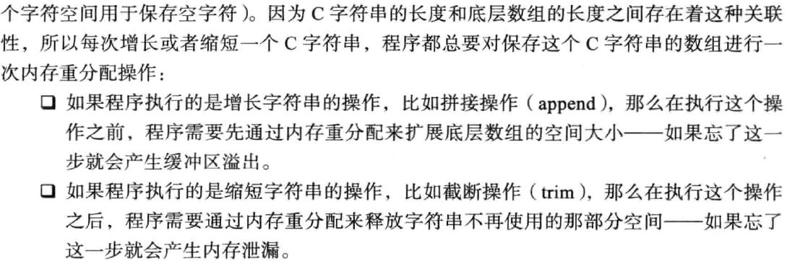
      2. 为什么Redis需要降低内存分配次数 \
      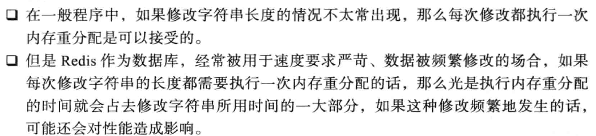
      3. 通过SDS中的未使用空间信息, SDS实现了空间预分配和惰性空间释放两种优化策略
         1. 空间预分配  \
         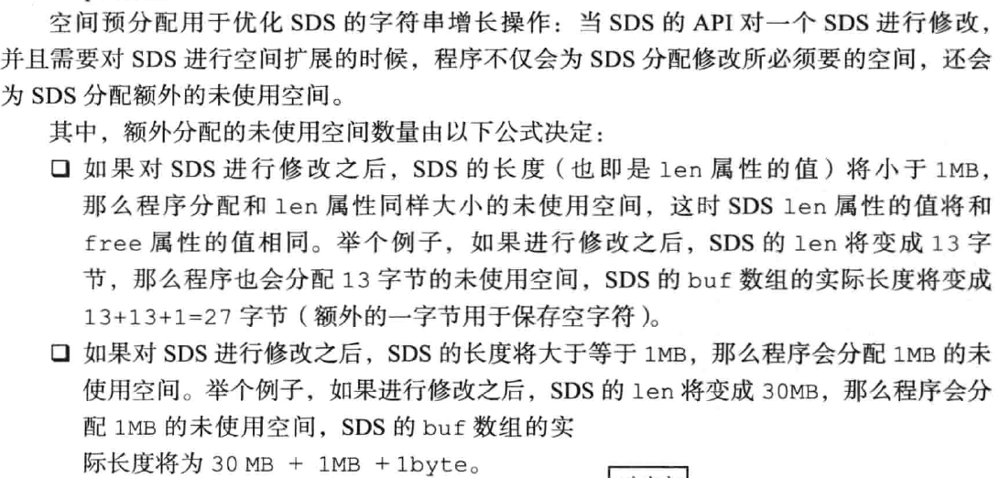
         2. 惰性空间释放 \
         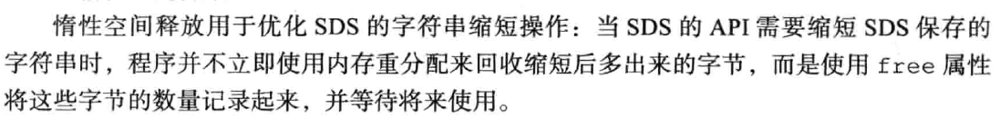
      4. 二进制安全: SDSs使用len属性而不是空字符来判断字符串是否结束
      5. 兼容部分C字符串函数 \
      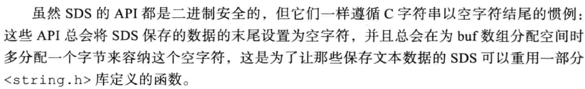
      6. 总结 \
      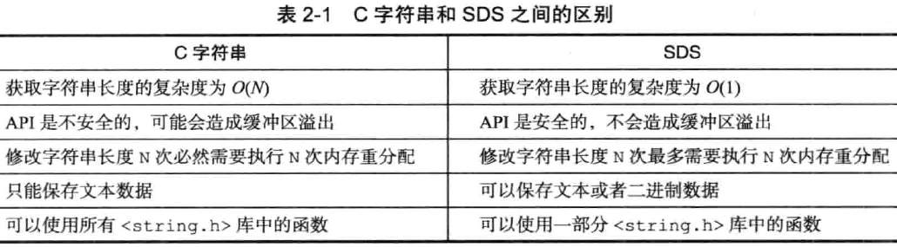
3. SDS API \
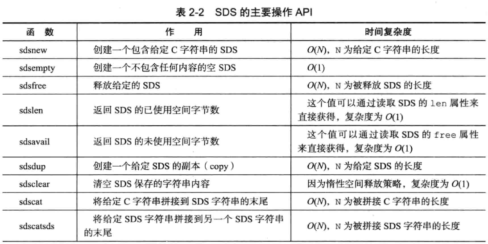
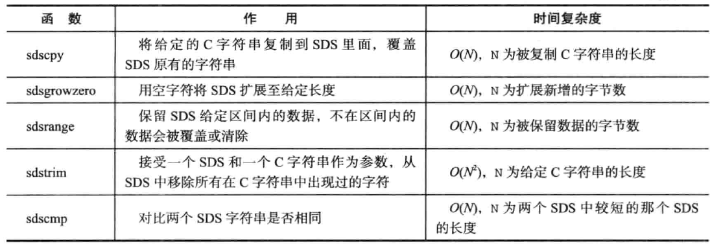

#### 链表
1. Redis链表的数据结构 \
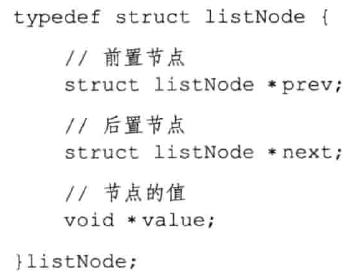
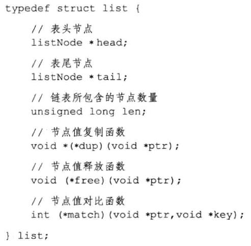
2. Redis链表特性 \
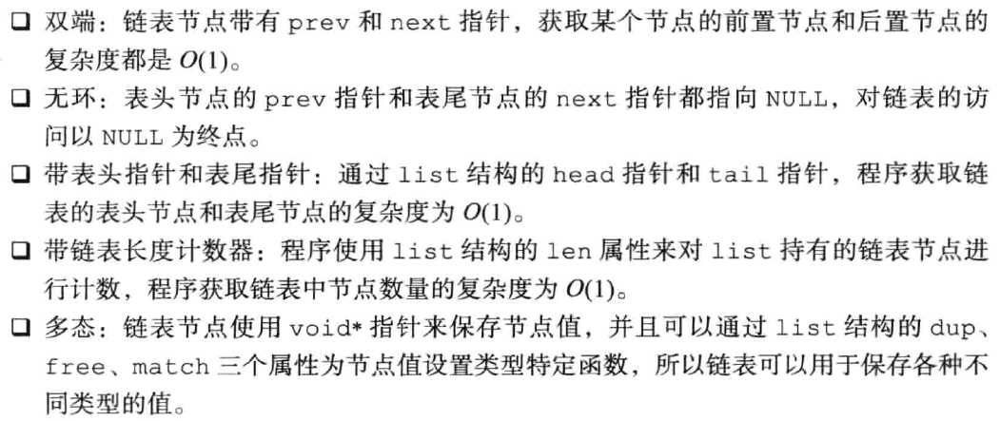
3. 链表和链表节点的API


#### 字典
1. 字典的实现
   1. 哈希表 \
   
   2. 哈希表的节点 \
   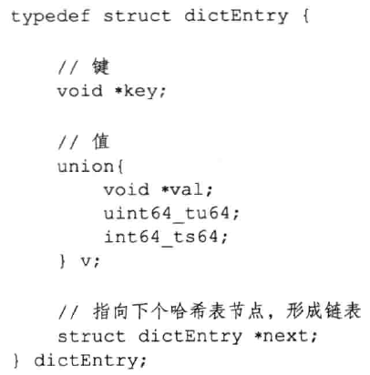
   3. 字典 \
   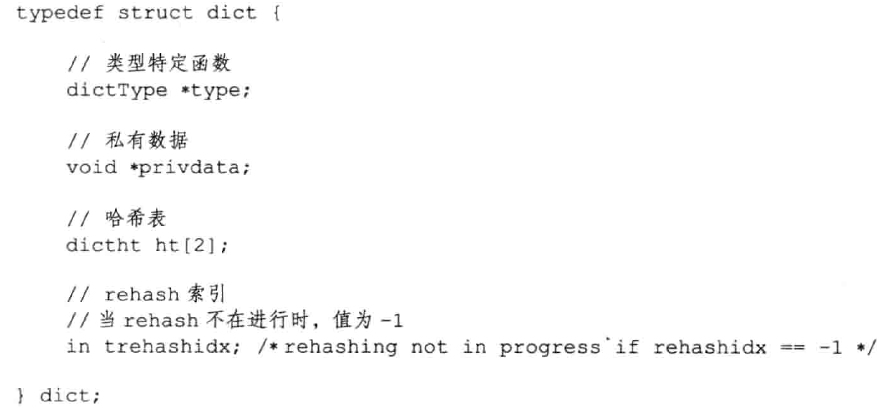 \
   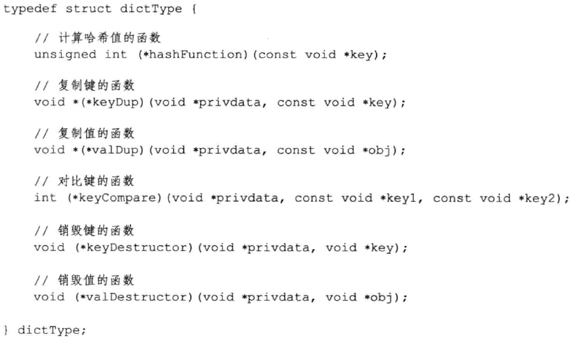
2. 哈希算法
   1. Redis 计算hash值和索引值的方法 \
   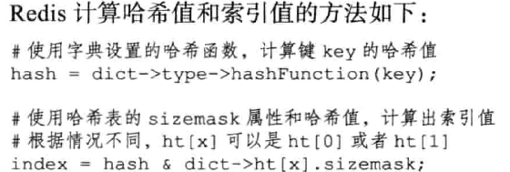 
   *Redis 使用MurMurHash2算法计算Hash值*
3. 解决哈希冲突: 链地址法
4. rehash
   1. rehash步骤 \
   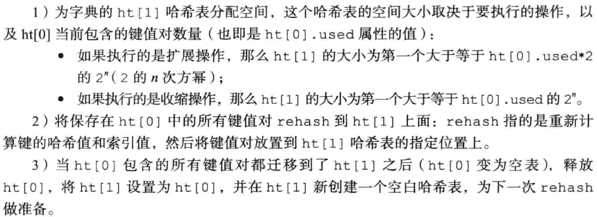
   *注意: 负载因子的概念在Redis哈希表和JDK中是不一样的, JDK中是以桶大小作为参考, Redis是存在的key-value数量*
   2. 哈希表的扩展与收缩 \
   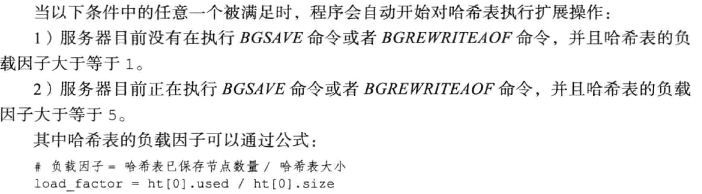
   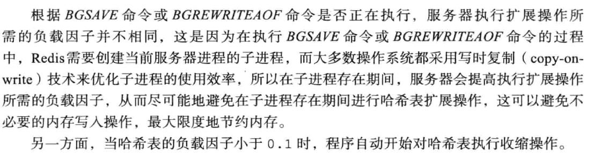
5. 渐进式hash
   1. 渐进式rehash的详细步骤 \
   
   2. 渐进式rehash执行期间的哈希表操作 \
   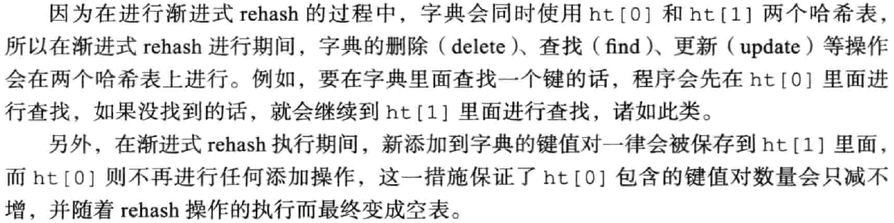
6. 字典API \
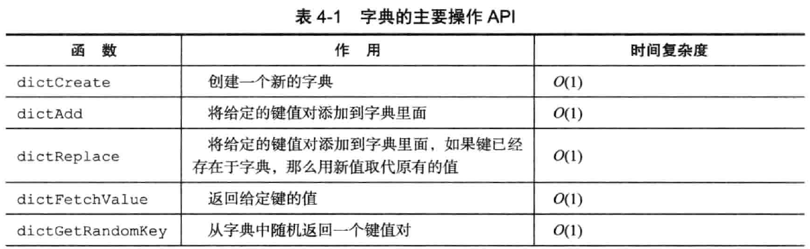
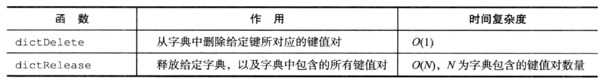


#### 跳跃表
1. 概述
   1. 什么是跳跃表? 跳跃表是一种有序的数据结构, 它通过在每个节点中维持多个指向其他节点的指针, 从而达到快速访问节点的目的.
   2. 跳跃表支持评均O(logN), 最坏O(N)的复杂度节点查找
   3. 可以与平衡树媲美, 但是更为简单
   4. Redis使用跳跃表作为有序集合键的底层实现之一, 如果一个有序集合包含的元素数量比较多, 又或者有序集合中元素的成员是比较长的字符串时, Redis就会使用跳跃表
   5. Redis只在两个地方用到了跳跃表: 
      1. 实现有序集合键
      2. 在集群节点中用作内部数据结构
2. 跳跃表的实现
   1. 跳跃表节点定义 \
   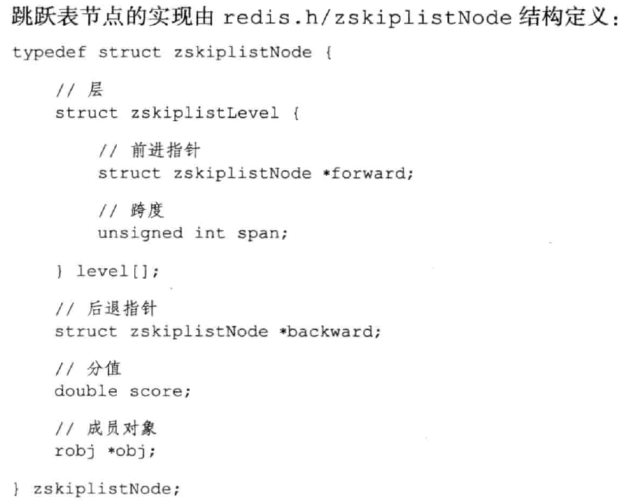
   2. 跳跃表的定义 \
   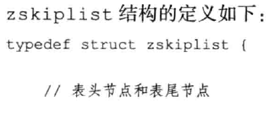
   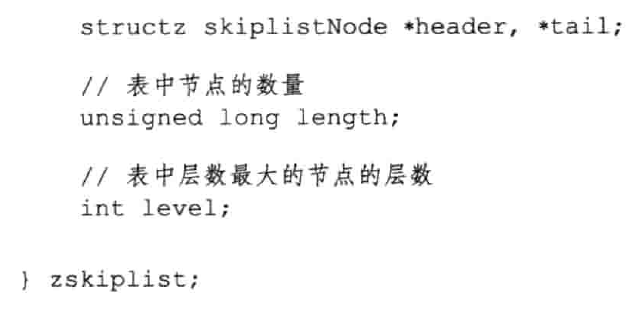
3. 跳跃表API \
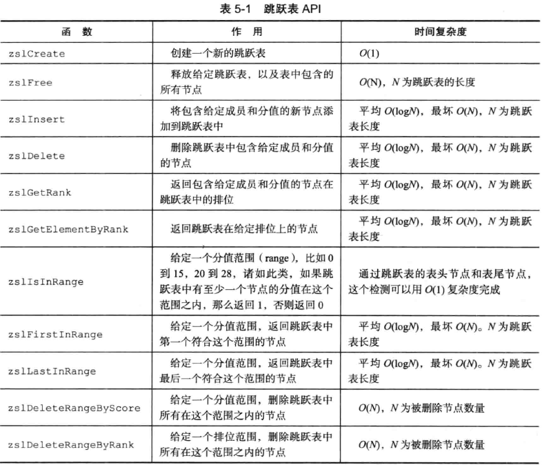


#### 整数集合
#### 压缩列表
#### 对象