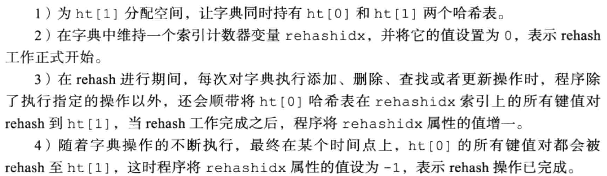
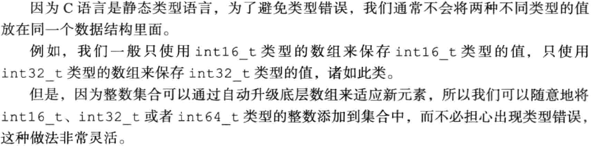
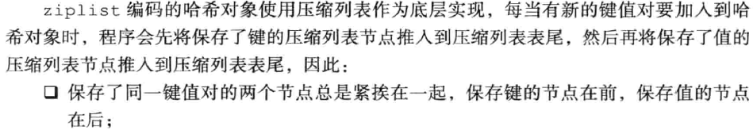
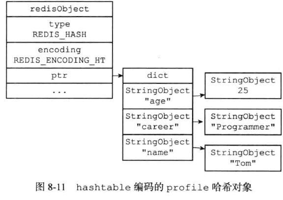
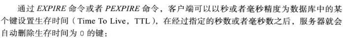
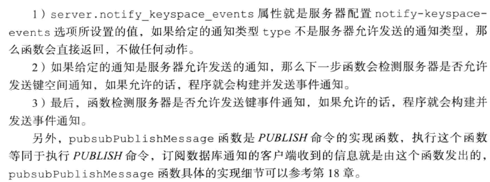
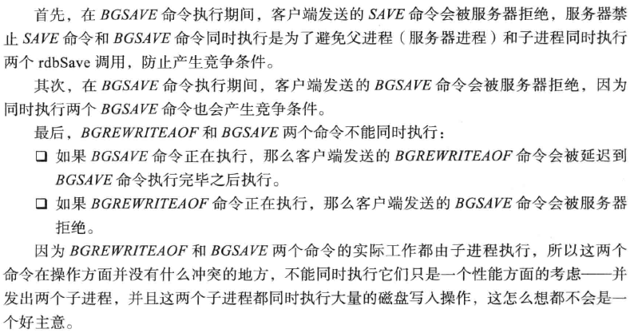
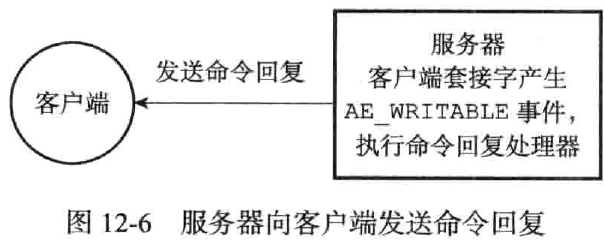

### 基本数据结构
#### 字符串SDS
1. Redis字符串SDS (sds.h/sdshdr)
    ```c
    struct sdshdr {
        int len;
        int free;
        char [] buf;
    }
    ```
2. SDS与C字符串的区别
   1. 常数时间获取字符串长度
   2. 杜绝缓冲区溢出: 当SDS API需要对SDS进行修改时, API会先检查SDS的空间是否满足修改所需的要求, 如果不满足的话, API会自动将SDS的空间扩展至执行修改所需的大小, 然后才执行实际的修改操作. 所以使用SDS既不需要手动修改SDS空间的大小, 也不会缓冲区溢出问题
   3. 减少字符串修改时带来的内存重新分配次数
      1. C字符串内存分配问题 \
      
      2. 为什么Redis需要降低内存分配次数 \
      
      3. 通过SDS中的未使用空间信息, SDS实现了空间预分配和惰性空间释放两种优化策略
         1. 空间预分配  \
         
         2. 惰性空间释放 \
         
      4. 二进制安全: SDSs使用len属性而不是空字符来判断字符串是否结束
      5. 兼容部分C字符串函数 \
      
      6. 总结 \
      
3. SDS API \


#### 链表
1. Redis链表的数据结构 \


2. Redis链表特性 \

3. 链表和链表节点的API


#### 字典
1. 字典的实现
   1. 哈希表 \
   
   2. 哈希表的节点 \
   
   3. 字典 \
    \
   
2. 哈希算法
   1. Redis 计算hash值和索引值的方法 \
    
   *Redis 使用MurMurHash2算法计算Hash值*
3. 解决哈希冲突: 链地址法
4. rehash
   1. rehash步骤 \
   
   *注意: 负载因子的概念在Redis哈希表和JDK中是不一样的, JDK中是以桶大小作为参考, Redis是存在的key-value数量*
   2. 哈希表的扩展与收缩 \
   
   
5. 渐进式hash
   1. 渐进式rehash的详细步骤 \
   
   2. 渐进式rehash执行期间的哈希表操作 \
   
6. 字典API \


#### 跳跃表
1. 概述
   1. 什么是跳跃表? 跳跃表是一种有序的数据结构, 它通过在每个节点中维持多个指向其他节点的指针, 从而达到快速访问节点的目的.
   2. 跳跃表支持评均O(logN), 最坏O(N)的复杂度节点查找
   3. 可以与平衡树媲美, 但是更为简单
   4. Redis使用跳跃表作为有序集合键的底层实现之一, 如果一个有序集合包含的元素数量比较多, 又或者有序集合中元素的成员是比较长的字符串时, Redis就会使用跳跃表
   5. Redis只在两个地方用到了跳跃表: 
      1. 实现有序集合键
      2. 在集群节点中用作内部数据结构
2. 跳跃表的实现
   1. 跳跃表节点定义 \
   
   2. 跳跃表的定义 \
   
   
3. 跳跃表API \


#### 整数集合
1. 整数集合是集合键的实现之一
1. 整数集合的实现
   1. 整数集合数据结构 \
   
   2. contents属性
    \
   
2. 升级
   1. 触发升级的条件 \
   
   2. 升级的步骤 \
   
3. 升级的好处
   1. 提升灵活性 \
   
   2. 节约内存
4. 降级
   1. 整数集合不支持降级, 一旦对集合进行了升级操作, 编码就会一直保存在升级后的状态
5. 整数集合API \

6. 疑问
   1. intset以有序,无重复的方式存在, 那么存在重复元素怎么办?. --- 有重复就不叫set了...


#### 压缩列表
1. 压缩列表(ziplist)是列表键和哈希键的底层实现之一. 当一个列表键只包含少量列表项, 并且每个列表项要么就是小整数值, 要么就是长度比较短的字符串, 那么Redis就会使用压缩列表来做列表键的底层实现. \
*OBJECT ENCODING 可以查看底层用的数据结构*
2. 压缩列表的构成
   1. 什么是压缩列表 \
   
   2. 压缩列表的组成 \
   
   3. 压缩列表节点的构成 \
   
      1. previous_entry_length \
      
         1. 压缩链表的从表尾向表头遍历操作就是利用这个属性
      1. encoding   \
      
      
3. 连锁更新
   1. 两种触发连锁更新的情况    \
    \
   
   2. 连锁更新代价 \
    \
   
4. 压缩列表API


#### 对象
1. Redis为什么要引入对象 \

2. 对象的类型和编码
   1. Redis使用对象表示数据库中的键和值, 当在数据库中创建一个键值对时, 至少会创建两个对象: 键对象 + 值对象
   2. Redis中的每个对象都由一个redisObject结构表示, 保存了数据有关的三个属性: type + eccoding + ptr \
   
   3. 类型 \
   
   4. 编码和底层实现
      1. 对象的编码 \
      
      2. 不同类型和编码的对象 \
      
      2. 为什么要通过encoding属性来设定对象所使用的编码 \
      
3. 字符串对象
   1. 字符串对象的编码可以是int, raw或者embstr
   2. 分配规则 
      1. 如果一个字符串对象保存的是整数值, 并且该数可以用long表示, 则编码为int
      2. 如果一个字符串对象保存的是字符串值, 并且该字符串值长度大于32字节, 那么使用SDS, 编码为raw
      3. 如果一个字符串对象保存的是字符串值, 并且该字符串值长度小于等于32字节, 使用embstr编码
   3. embstr
      1. 什么是是emstr \
      
      2. embstr好处
      
      3. emstr实际上没有任何修改api, 只读
   4. 可以用 long double保存的浮点数在redis中也是以字符串形式保存
   5. 字符串对象保存各类型值的编码方式 \
   
   6. 编码的转换
      1. int, raw特定情况下可以转换
      2. emstr实际上没有任何修改api, 只读的, 发生转换就会变成raw
   7. 字符串命令的实现
4. 列表对象
   1. 概述
      1. 列表对象的实现可以是ziplist或者linkedlist
   2. 编码转换
      1. 列表对象使用ziplist编码的必要条件 \
       \
      
   3. 列表命令的实现 \
   
5. 哈希对象
   1. 概述
      1. 哈希对象的编码可以是ziplist或者hashtable
      2. 使用ziplist作为底层实现时 \
            \
            \
        
      3. 使用hashtable作为底层实现时 \
      
      
   2. 编码转换    \
      1. 哈希对象使用ziplist编码的必要条件
        \
      
   3. 哈希命令的实现    \
   
6. 集合对象
   1. 概述
      1. 集合对象的编码可以是intset或者hashtable
      2. 使用intset作为底层实现 \
      
      3. 使用hashtable作为底层实现 \
      
      *Redis里面, set也是用hashtable实现, 但是value设置为null, 而jdk里是设为一个特定的object*
   2. 编码转换
      1. 使用inset作为底层数据结构的必要条件 \
       \
      
   3. 集合命令的实现    \
    \
    
7. 有序集合对象
   1. 概述
      1. 有序集合对象的底层实现可以是ziplist或者skiplist
      2. 有序集合对象使用ziplist作为底层实现 \
      
      3. 有序集合对象使用skiplist作为底层实现 \
        \
      
      4. 为什么同时使用跳表和字典 \
      
   2. 编码转换
      1. 有序集合对象使用ziplist作为底层数据结构的必要条件 \
       \
      
   3. 有序集合命令的实现      \
   
8. 类型检查与命令多态
   1. Redis中用于操作键的命令大致可以分为两类
      1. 可以对任何类型的键执行, 如: DEL, EXPIRE, RENAME, TYPE, OBJECT
      2. 只能对特定类型的键执行 \
      
   2. 类型检查的实现    \
     \
   
   3. 多态命令的实现
      1. 可以认为有两种形式的多态: 面向类型的多态 + 面向编码的多态
      2. LLEN多态的流程图 \
      
9. 内存回收
   1. Redis基于引用计数实现内存回收
   2. 引用计数信息有redisObject结构的refcount属性记录 \
   
   3. 引用计数的改变场景 \
   
   4. 修改对象引用计数的API   \
   
10. 对象共享
    1. 对象共享的例子 \
    
    2. Redis让多个键共享一个值对象的操作:
       1. 将数据库键的值指针指向一个现有的值对象
       2. 将被共享的值对象的应用计数+1
    3. Redis初始化操作 (类似于常量池) \
    
    
    4. OBJECT REFCOUNT `[key]`: 可以用来查看对象的应用计数
    5. 共享对象可以被谁使用? \
    
    6. Redis只对包含整数值的字符串对象进行共享 \
    
10. 对象的空转时长
    1. 对象的空转时长通过redisObject中的lru属性来记录, 该属性记录了对象最后一次被访问的时间
    2. OBJECT IDELTIME `[key]`: 可以打印给定键的空转时长


### 单机数据的实现

#### 数据库
1. 服务器中的数据库
   1. 数据库保存数据结构 \
     \
   
2. 切换数据库
   1. SELECT命令切换数据库
   2. 服务器实现 \
   
3. 数据库键空间
   1. 概述
      1. redisDb结构中的dict字典保存了数据库中所有的键值对, 称为"键空间"
      2. 键空间和用户看到数据库是对应的 \
      
   2. 添加新键: 将一个新键值对添加到字典空间中, 键为字符串对象, 而值可以为任意一种Redis对象
   3. 删除键: 在键空间里将对应的键值对对象删除.
   4. 更新键: 对键空间里所对应的值对象进行更新, 根据值对象类型不同, 更新的具体方法也会不同
   5. 其他键空间操作 \
   
   6. 读写键空间时的维护操作 \
    \
   
4. 设置键的生存时间或过期时间
   1. 概述
      1. EXPIRE 或 PEXPIRE 命令 \
       \
      
      1. EXPIREAT 或 PEXPIREAT 命令 
      
      1. TTL或PTTL \
      
   2. 设置过期时间 \
      1. 四种方法
       \
      
      2. 实现: 都是基于PEXPIREAT, 各种设置过期时间实现上的转换如下: \
      
   3. 保存过期时间
      1. redisDb结构的expires字典保存了数据库中所有键的过期时间, 该字典称为过期字典 \
      
      3. 当客户端执行PEXPIREAT(或其他三个)为一个数据库键设置过期时间时, 服务器会在数据的过期字典中关联给定数据库键和过期时间
   4. 移除过期时间
      1. PERSIST命令可以移除一个键的过期时间
      2. PERSIST就是PEXPIREAT的反操作: PERSIST在过期字典中查找给定的键, 并解除键和值(过期时间)在过期字典总的关联
   5. 计算并返回剩余生存时间
      1. TTL返回以"秒"为单位的剩余生存时间, PTTL返回以"毫秒"为单位的剩余生存时间
      2. 通过计算键的过期时间和当前时间之间的差来实现
   6. 过期键的判定
      1. 步骤
         1. 检查给定键是否存在于过期字典: 如果存在, 那么取得键的过期时间
         2. 检查当前UNIX时间戳是否大于键的过期时间: 如果是的话, 那么键已经过期, 否则, 则未过期.
5. 过期键的删除策略
   1. 概述
      1. 三种不同的删除策略 \
      
   2. 定时删除
      1. 使用定时器, 时间到尽可能快地删除, 释放内存
      2. 优点: 删除时间精确, 对内存友好
      3. 缺点: 
         1. 对CPU时间不友好: 在过期键较多的情况下, 删除过期键这一行为可能会占用相当一部分CPU时间, 在内存不紧张但是CPU紧张的情况下, 将CPU时间用在删除和当前任务无关的键上, 对服务器响应时间和吞吐量造成影响
         2. 创建定时器需要用到Redis服务器的时间时间, 而当前时间事件的实现方式---无序链表, 查找时间复杂度为O(N), 不能高效处理大量时间时间
   3. 惰性删除 \
   
   4. 定期删除 \
   
7. Redis的过期键删除策略
   1. 概述
      1. Redis服务器实际使用的是定期删除和惰性删除两种策略: 通过配合使用这两种策略, 服务器可以很好地在合理使用CPU时间和避免浪费内存空间之间取得平衡
   2. 惰性删除策略的实现
      1. 由db.c/expireIfNeed函数实现, 所有读写数据库的Redis命令在执行之前都会调用 expireIfNeed 函数对输入键进行检查:
         1. 如果输入键已经过期, 那么expireIfNeed函数将输入键从库中删除
         2. 如果输入键未过期, 那么expireIfNeed 函数不做动作
      2. 流程图 \
      
   3. 定期删除策略的实现
      1. 由redis.c/activateExpireCycle函数实现, me恶党Redis服务器周期性的操作redis.c/serverCron函数执行时, activateExpireCycle函数就会被调用, 它在规定时间内, 分多次遍历服务器中的各个数据库, 从数据库的expires字典中随机检查一部分键的过期时间, 并删除其中的过期键
      2. activateExpireCycle 函数的工作模式总结如下 \
      
8. AOF , RDB 和 复制功能对过期键的处理
   1. 生成RDB文件
      1. 在执行SAVE命令或者BGSAVE命令创建一个新的RDB文件时, 程序会对数据库中的键进行检查, 已过期的键不会被保存到新创建的RDB文件中
      2. 因此, 数据库中包含过期键不会对生成新的RDB文件造成影响
   2. 载入RDB文件
      1. 主从从服务器对待过期键的策略有所不同 \
      
   3. AOF文件写入
      1. 当服务器以AOF持久化模式运行时, 如果数据库中某个键已经过期, 但是他还没有被惰性删除或者定期删除, AOF文件不会因为这个过期键而产生任何影响
      2. 策略: 当过期键被惰性删除或者定期删除之后, 程序会向AOF文件追加一条DEL命令, 来显式地记录该键已被删除
   4. AOF文件重写
      1. 和生成RDB文件时类似, 在执行AOF重写过程中, 程序会对数据库中的键进行检查, 已过期的键不会被保存到重写后的AOF文件中
   5. 复制
      1. 当服务器运行在复制模式下, 从服务器的过期键删除动作由主服务器控制 \
      
9. 数据库通知
   1.  概述
       1. 数据库通知是Redis2.8版本新增功能, 可以让客户端通过订阅给定的频道或者模式, 来获知数据库中键的变化, 以及数据库中命令的执行情况
       2. 通知类型
           1. 键空间通知: 某个键执行了什么命令
           2. 键事件通知: 某个命令被什么键执行了
       3.  服务器配置的notify-keyspace-events选项决定了服务器所发送的通知的类型 \
       
   2. 发送通知
      1. 发送数据库通知的功能是由notify.c/notifyKeyspaceEvent函数实现的 \
      
      2. 发送通知的实现
         1. 伪代码 \
         
         2. 执行的操作 \
         

#### RDB持久化
1. 概述
   1. 为什么需要持久化
      1. Redis是内存数据库, 如果不持久化到磁盘, 那么一段服务器进程退出, 数据库状态也会消失不见
   2. RDB持久化既可以手动执行, 也可以根据服务器配置选项定期执行, 该功能可以将某一时间点上的数据库状态保存到一个RDB文件中
   3. RDB持久化功能所生成的RDB文件是一个经过压缩的二进制文件, 通过该文件可以还原生成RDB文件时的数据库状态
2. RDB文件的创建与载入
   1. 概述
      1. 创建
         1. SAVE
            1. SAVE会阻塞Redis服务器进程, 直到RDB文件创建完毕为止, 在服务器进程阻塞期间, 服务器不能处理任何命令请求
         2. BGSAVE
            1. BGSAVE会派生出一个子进程, 然后由子进程负责创建RDB文件, 服务器进程(父进程)继续处理命令请求
         3. 创建RDB文件的实际工作由rdb.c/rdbSave函数完成, SAVE 和BGSAVE命令会以不同的方式调用该函数 \
         
      2. 载入
         1. RDB文件的载入工作是在服务器启动时自动执行的, 所以RDB并没有专门用于RDB文件的命令, 只要Redis服务器在启动时检测到RDB文件存在, 就会自动载入.
      3. 载入流程 \
      
   2. SAVE命令执行时的服务器状态 \
   
   3. BGSAVE命令执行时的服务器状态
      1. BGSAVE命令的保存工作由子进程执行, 子进程创建RDB文件过程中, Redis服务器仍然可以继续处理客户端的命令请求
      2. 处理SAVE, BGSAVE, BGREWRITEAOF命令的方式有所不同 \
      
   4. RDB 文件载入时的服务器状态
      1. 服务器在载入RDB文件期间, 会一直处于阻塞状态, 直到载入工作完成为止
3. 自动间隔保存
   1. 概述
      1. 因为BGSAVE命令可以不阻塞服务器, 所以Redis允许用户通过设置服务器的save选项, 让服务器每隔一段时间自动执行一次BGSAVE命令
      2. 用户可以通过save选项设置多个保存条件, 但是只要其中任意一个条件被满足, 服务器就会执行BGSAVE命令
      3. 一个例子 \
      
   2. 设置保存条件
      1. 服务器启动时, 用户可以通过配置文件或者启动参数设置save选项
      2. 服务器程序根据save选项设置的保存条件, 设置服务器状态redisServer结构的saveparams属性 \
      
   3. dirty计数器和lastsave属性 \
   
   4. 检查保存条件是否满足
      1. Redis的服务器周期性操作函数serverCron默认每隔100ms就会执行一次, 该函数用于对正在运行的服务器进行维护, 它的其中一项工作就是检查save选项所设置的保存条件是否满足, 如果满足的话就执行BGSAVE命令
4. RDB文件结构
   1. 概述
      1. RDB文件结构 \
      
      *注意: RDB文件保存的二进制数据, 不是C字符串*
      2. db_version: 长度4字节, 它的值是一个字符串表示的整数
      3. databases部分包含着零个或任意多个数据库, 以及各个数据库中的键值对数据
      4. EOF: 常量, 1个字节. 标志着RDB文件正文内容结束. 当程序读到这个值的时候, 知道数据库所有键值对载入完毕
      5. check_sum: 8字节无符号整数. 根据REDIS, db_version, databases, EOF四个部分计算出来的额校验和. 服务器载入RDB文件中会计算并与之比较, 判断是否出错或出现损坏. 
   2. databases部分
      1. 一个RDB文件的databases部分可以保存任意多个非空数据库
      2. 每个非空数据库在RDB文件中都可以保存为SELECTDB, db_number, key_value_pairs \
      


### 事件
1. Redis服务器是一个事件驱动程序, 服务器需要处理两类事件
   1. 文件事件:Redis服务器通过套接字与客户端(或其他Redis服务器)进行连接, 而文件事件就是服务器对套接字操作的抽象. 服务器与客户端(或其他服务器)的通信会产生相应的文件事件, 而服务器则通过监听并处理这些事件来完成一系列网络通信操作
   2. 时间事件: Redis服务器中的一些操作(比如serverCron函数)就需要在给定的时间点执行, 而时间事件就是服务器对这类定时操作的抽象.
2. 文件事件
   1. 概览 \
   
   2. Redis的单线程设计的简单性
   3. 文件事件处理器的构成
      1. 套接字+I/O多路复用程序+文件事件分派器+事件处理器 \
      
      2. I/O多路复用程序的实现
         1. 通过包装常见的select, epoll, evport, kqueue 这些I/O多路复用的库函数来实现的
         2. Redis为每个I/O多路复用库函数实现了相同的API, 所以I/O多路复用程序的底层实现是可以互换的 \
         
      3. 事件的类型 \
      
      4. API
      5. 文件事件的处理器 \
      
         1. 连接应答处理器 \ 
         
         2. 命令请求处理器 \
         
         3. 命令回复处理器 \
         
   4. 一次完整的客户端与服务器连接事件示例
3. 时间事件
   1. 概述
      1. Redis的时间事件分为两类
         1. 定时事件: 让程序在制定的时间之后执行一次
         2. 周期性事件: 让一段程序每个指定时间就执行一次
      2. 一个时间事件主要由以下三个属性组成
         1. id: 服务器为时间事件创建一个全局唯一ID. ID按从小到大的顺序递增, 新事件的ID好比旧事件的ID号要大
         2. when: 毫秒精度的UNIX时间戳, 记录了时间事件的到达时间
         3. timeProc: 时间事件处理器, 一个函数. 当时间事件到达时, 服务器就会调用相应的处理器来处理事件
      3. 一个事件是定时事件还是周期性事件取决于时间事件处理器的返回值
         1. 如果事件处理器返回ae.h/AE_NOMORE, 那么这个事件为定时时间: 该事件在到达一次之后就会被删除, 之后不再到达
         2. 如果时间处理器返回一个非AE_NOMORE的整数值, 那么这个事件为周期性事件: 当一个时间事件到达之后, 服务器会根据事件处理器返回的值, 对时间事件的when属性进行更新, 让这个事件在一段时间之后再次到达, 并以这种方式一直更新并运行下去.
   2. 实现
      1. 服务器将所有时间事件都放在一个无序链表中, 每当时间事件执行器运行时, 它就遍历整个链表, 查找所有已到达的时间事件, 并调用相应的事件处理器
      2. 一个例子 \
      
      3. 时间事件的链表为无序链表, 是指该链表不按when属性的大小排序. 因此, 当时间事件执行器运行的时候, 它必须遍历链表中所有时间事件, 这样才能确保服务器中所有已到达的时间事件都会被处理 (为什么不用堆)
      4. 无序链表并不影响时间事件的性能 \
      
   3. API
   4. 时间事件应用实例: serverCron函数 \
   
4. 事件的调度与执行
   1. 事件调度伪代码 \
   
   
   1. 事件处理角度下的服务器运行流程 \
   


### 第13章 客户端


### 第14章 服务器

### 第15章 复制

