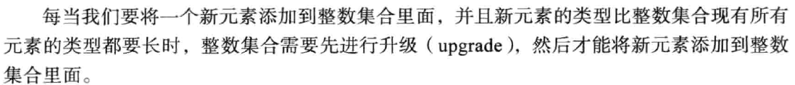
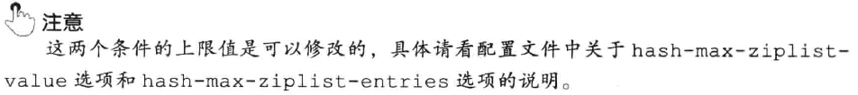
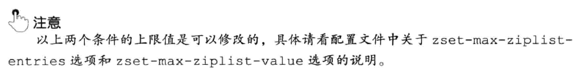

### 基本数据结构
#### 字符串SDS
1. Redis字符串SDS (sds.h/sdshdr)
    ```c
    struct sdshdr {
        int len;
        int free;
        char [] buf;
    }
    ```
2. SDS与C字符串的区别
   1. 常数时间获取字符串长度
   2. 杜绝缓冲区溢出: 当SDS API需要对SDS进行修改时, API会先检查SDS的空间是否满足修改所需的要求, 如果不满足的话, API会自动将SDS的空间扩展至执行修改所需的大小, 然后才执行实际的修改操作. 所以使用SDS既不需要手动修改SDS空间的大小, 也不会缓冲区溢出问题
   3. 减少字符串修改时带来的内存重新分配次数
      1. C字符串内存分配问题 \
      
      2. 为什么Redis需要降低内存分配次数 \
      
      3. 通过SDS中的未使用空间信息, SDS实现了空间预分配和惰性空间释放两种优化策略
         1. 空间预分配  \
         
         2. 惰性空间释放 \
         
      4. 二进制安全: SDSs使用len属性而不是空字符来判断字符串是否结束
      5. 兼容部分C字符串函数 \
      
      6. 总结 \
      
3. SDS API \


#### 链表
1. Redis链表的数据结构 \


2. Redis链表特性 \

3. 链表和链表节点的API


#### 字典
1. 字典的实现
   1. 哈希表 \
   
   2. 哈希表的节点 \
   
   3. 字典 \
    \
   
2. 哈希算法
   1. Redis 计算hash值和索引值的方法 \
    
   *Redis 使用MurMurHash2算法计算Hash值*
3. 解决哈希冲突: 链地址法
4. rehash
   1. rehash步骤 \
   
   *注意: 负载因子的概念在Redis哈希表和JDK中是不一样的, JDK中是以桶大小作为参考, Redis是存在的key-value数量*
   2. 哈希表的扩展与收缩 \
   
   
5. 渐进式hash
   1. 渐进式rehash的详细步骤 \
   
   2. 渐进式rehash执行期间的哈希表操作 \
   
6. 字典API \


#### 跳跃表
1. 概述
   1. 什么是跳跃表? 跳跃表是一种有序的数据结构, 它通过在每个节点中维持多个指向其他节点的指针, 从而达到快速访问节点的目的.
   2. 跳跃表支持评均O(logN), 最坏O(N)的复杂度节点查找
   3. 可以与平衡树媲美, 但是更为简单
   4. Redis使用跳跃表作为有序集合键的底层实现之一, 如果一个有序集合包含的元素数量比较多, 又或者有序集合中元素的成员是比较长的字符串时, Redis就会使用跳跃表
   5. Redis只在两个地方用到了跳跃表: 
      1. 实现有序集合键
      2. 在集群节点中用作内部数据结构
2. 跳跃表的实现
   1. 跳跃表节点定义 \
   
   2. 跳跃表的定义 \
   
   
3. 跳跃表API \


#### 整数集合
1. 整数集合是集合键的实现之一
1. 整数集合的实现
   1. 整数集合数据结构 \
   
   2. contents属性
    \
   
2. 升级
   1. 触发升级的条件 \
   
   2. 升级的步骤 \
   
3. 升级的好处
   1. 提升灵活性 \
   
   2. 节约内存
4. 降级
   1. 整数集合不支持降级, 一旦对集合进行了升级操作, 编码就会一直保存在升级后的状态
5. 整数集合API \

6. 疑问
   1. intset以有序,无重复的方式存在, 那么存在重复元素怎么办?. --- 有重复就不叫set了...


#### 压缩列表
1. 压缩列表(ziplist)是列表键和哈希键的底层实现之一. 当一个列表键只包含少量列表项, 并且每个列表项要么就是小整数值, 要么就是长度比较短的字符串, 那么Redis就会使用压缩列表来做列表键的底层实现. \
*OBJECT ENCODING 可以查看底层用的数据结构*
2. 压缩列表的构成
   1. 什么是压缩列表 \
   
   2. 压缩列表的组成 \
   
   3. 压缩列表节点的构成 \
   
      1. previous_entry_length \
      
         1. 压缩链表的从表尾向表头遍历操作就是利用这个属性
      1. encoding   \
      
      
3. 连锁更新
   1. 两种触发连锁更新的情况    \
    \
   
   2. 连锁更新代价 \
    \
   
4. 压缩列表API


#### 对象
1. Redis为什么要引入对象 \

2. 对象的类型和编码
   1. Redis使用对象表示数据库中的键和值, 当在数据库中创建一个键值对时, 至少会创建两个对象: 键对象 + 值对象
   2. Redis中的每个对象都由一个redisObject结构表示, 保存了数据有关的三个属性: type + eccoding + ptr \
   
   3. 类型 \
   
   4. 编码和底层实现
      1. 对象的编码 \
      
      2. 不同类型和编码的对象 \
      
      2. 为什么要通过encoding属性来设定对象所使用的编码 \
      
3. 字符串对象
   1. 字符串对象的编码可以是int, raw或者embstr
   2. 分配规则 
      1. 如果一个字符串对象保存的是整数值, 并且该数可以用long表示, 则编码为int
      2. 如果一个字符串对象保存的是字符串值, 并且该字符串值长度大于32字节, 那么使用SDS, 编码为raw
      3. 如果一个字符串对象保存的是字符串值, 并且该字符串值长度小于等于32字节, 使用embstr编码
   3. embstr
      1. 什么是是emstr \
      
      2. embstr好处
      
      3. emstr实际上没有任何修改api, 只读
   4. 可以用 long double保存的浮点数在redis中也是以字符串形式保存
   5. 字符串对象保存各类型值的编码方式 \
   
   6. 编码的转换
      1. int, raw特定情况下可以转换
      2. emstr实际上没有任何修改api, 只读的, 发生转换就会变成raw
   7. 字符串命令的实现
4. 列表对象
   1. 概述
      1. 列表对象的实现可以是ziplist或者linkedlist
   2. 编码转换
      1. 列表对象使用ziplist编码的必要条件 \
       \
      
   3. 列表命令的实现 \
   
5. 哈希对象
   1. 概述
      1. 哈希对象的编码可以是ziplist或者hashtable
      2. 使用ziplist作为底层实现时 \
            \
            \
        
      3. 使用hashtable作为底层实现时 \
      
      
   2. 编码转换    \
      1. 哈希对象使用ziplist编码的必要条件
        \
      
   3. 哈希命令的实现    \
   
6. 集合对象
   1. 概述
      1. 集合对象的编码可以是intset或者hashtable
      2. 使用intset作为底层实现 \
      
      3. 使用hashtable作为底层实现 \
      
      *Redis里面, set也是用hashtable实现, 但是value设置为null, 而jdk里是设为一个特定的object*
   2. 编码转换
      1. 使用inset作为底层数据结构的必要条件 \
       \
      
   3. 集合命令的实现    \
    \
    
7. 有序集合对象
   1. 概述
      1. 有序集合对象的底层实现可以是ziplist或者skiplist
      2. 有序集合对象使用ziplist作为底层实现 \
      
      3. 有序集合对象使用skiplist作为底层实现 \
        \
      
      4. 为什么同时使用跳表和字典 \
      
   2. 编码转换
      1. 有序集合对象使用ziplist作为底层数据结构的必要条件 \
       \
      
   3. 有序集合命令的实现      \
   
8. 类型检查与命令多态
   1. Redis中用于操作键的命令大致可以分为两类
      1. 可以对任何类型的键执行, 如: DEL, EXPIRE, RENAME, TYPE, OBJECT
      2. 只能对特定类型的键执行 \
      
   2. 类型检查的实现    \
     \
   
   3. 多态命令的实现
      1. 可以认为有两种形式的多态: 面向类型的多态 + 面向编码的多态
      2. LLEN多态的流程图 \
      
9. 内存回收
    
    