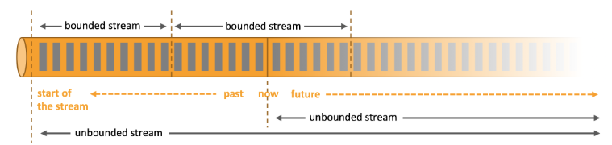
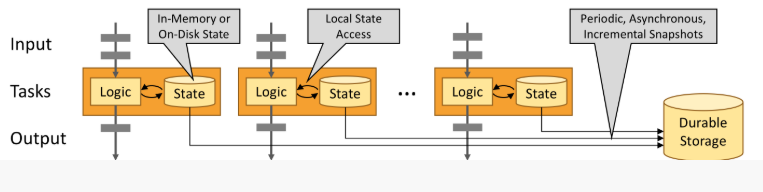

# Flink 是什么

1.  Apache Flink 是一个框架和分布式处理引擎，用于在*无边界和有边界*数据流上进行**有状态**的计算。Flink 能在所有常见集群环境中运行，并能以内存速度和任意规模进行计算。 

### 架构

1. 处理无界和有界数据

   1. 无界流:  有定义流的开始，但没有定义流的结束。它们会无休止地产生数据。无界流的数据必须持续处理，即数据被摄取后需要立刻处理。我们不能等到所有数据都到达再处理，因为输入是无限的，在任何时候输入都不会完成。处理无界数据通常要求以特定顺序摄取事件，例如事件发生的顺序，以便能够推断结果的完整性。 
   2. 有界流:  有定义流的开始，也有定义流的结束。有界流可以在摄取所有数据后再进行计算。有界流所有数据可以被排序，所以并不需要有序摄取。有界流处理通常被称为批处理 

   **Apache Flink 擅长处理无界和有界数据集** 精确的时间控制和状态化使得 Flink 的运行时(runtime)能够运行任何处理无界流的应用。有界流则由一些专为固定大小数据集特殊设计的算法和数据结构进行内部处理，产生了出色的性能 

2. 部署应用到任意地方

   1.  Apache Flink 是一个分布式系统，它需要计算资源来执行应用程序。Flink 集成了所有常见的集群资源管理器，例如 [Hadoop YARN](https://hadoop.apache.org/docs/stable/hadoop-yarn/hadoop-yarn-site/YARN.html)、 [Apache Mesos](https://mesos.apache.org/) 和 [Kubernetes](https://kubernetes.io/)，但同时也可以作为独立集群运行。 
   2.  Flink 被设计为能够很好地工作在上述每个资源管理器中，这是通过资源管理器特定(resource-manager-specific)的部署模式实现的。Flink 可以采用与当前资源管理器相适应的方式进行交互。 
   3.  部署 Flink 应用程序时，Flink 会根据应用程序配置的并行性自动标识所需的资源，并从资源管理器请求这些资源。在发生故障的情况下，Flink 通过请求新资源来替换发生故障的容器。提交或控制应用程序的所有通信都是通过 REST 调用进行的，这可以简化 Flink 与各种环境中的集 

3. 运行任意规模应用

   1.  Flink 旨在任意规模上运行有状态流式应用。因此，应用程序被并行化为可能数千个任务，这些任务分布在集群中并发执行。所以应用程序能够充分利用无尽的 CPU、内存、磁盘和网络 IO。而且 Flink 很容易维护非常大的应用程序状态。其异步和增量的检查点算法对处理延迟产生最小的影响，同时保证精确一次状态的一致性。 

4. 利用内存性能

   1.  有状态的 Flink 程序针对本地状态访问进行了优化。任务的状态始终保留在内存中，如果状态大小超过可用内存，则会保存在能高效访问的磁盘数据结构中。任务通过访问本地（通常在内存中）状态来进行所有的计算，从而产生非常低的处理延迟。Flink 通过定期和异步地对本地状态进行持久化存储来保证故障场景下精确一次的状态一致性。 

      

### 应用

