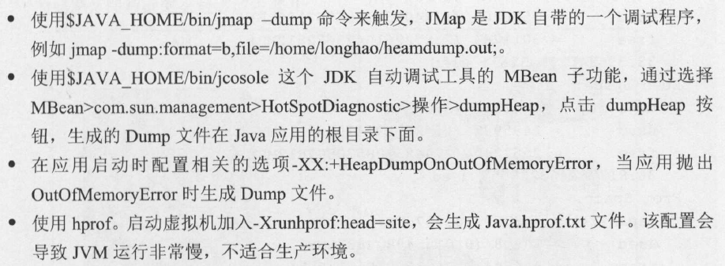

### 深入理解JVM & G1 GC 的读书笔记以及测试代码

##### chapter1 JVM & GC 基础知识
1. Serial GC 、Parallel GC 、Concurrent Mark Sweep GC 这三个GC 有什么不同呢？
   - 如果你想要最小化地使用内存和并行开销，请选Serial GC
   - 如果你想要最大化应用程序的吞吐量，请选Parallel GC
   - 如果你想要最小化GC 的中断或停顿时间，请选CMSGC
2. Gl 内部主要有四个操作阶段，即：
    - 年轻代回收(A Young Collection);
    - 运行在后台的井行循环CA Background, Concurrent Cycle);
    - 混合回收CA Mixed Collection);
    - 全量回收CA Full GC)
3. 虚拟机除了要执行main 函数主线程外，还需要做JIT编译，需要做垃圾回收。无论是main是函数、JIT 编译还是垃圾回收，在虚拟机内部都实现为单独的一个线程
4. 并发和并行是两个非常容易被混淆的概念。它们都可以表示两个或者多个任务一起执行，但是偏重点有些不同。并发偏重于**多个任务交替执行**，而多个任务之间有可能还是串行的。而井行是真正意义上的**同时执行**
5. 线程和进程的区别在于，子进程和父进程有不同的代码和数据空间，而多个线程则共享数据空间，每个线程有自己的执行堆钱和程序计数器为其执行上下文。多线程主要是为了节约CPU时间，对于如何发挥利用，需要根据具体情况而定。注意，线程在运行中需要使用计算机的内存资源和CPU。
*进程是资源分配的基本单位, 线程是资源调度的基本单位*
6. Java 线程生命周期图 \

7. 关于内存泄露 \
    内存泄漏也称作“存储渗漏”，用动态存储分配函数动态开辟的空间，在使用完毕后未被释放，结果导致一直占据该内存单元，一直持续到程序结束，即所谓内存泄漏l 。 \
    内存泄漏形象的比喻是“操作系统可提供给所有进程的存储空间正在被某个进程榨干”，最终结果是程序运行时间越长，占用存储空间越多，最终用尽全部内存空间，造成整个系统崩溃。所以“内存泄漏”是从操作系统的角度来看的。这里的存储空间并不是指物理内存，而是指虚拟内存大小，这个虚拟内存大小取决于磁盘交换区设定的大小。由程序申请的一块内存，如果没有任何一个指针指向它，那么这块内存就泄漏了. \
   在Java程序里，如果发生内存泄漏，那么最后都会抛出OutOfMemoryError 异常.
8. Java中的四种引用类型
    1. 概述: Java 中提供了4 个级别的引用，即强引用(Strong Reference)、软引用(So位Reference)、弱引用(Weak Reference)、虚引用(Phantom Reference)这4 个级别。在这4 个级别中只有强引用类是包内可见的，其他3 种引用类型均为Public ，可以在应用程序中直接使用，垃圾回收器会尝试回收只有弱引用的对象。
    2. 区别:
        - 强引用(Strong Reference)：在一个线程内，无需引用直接可以使用的对象，除非引用不存在了，否则强引用不会被GC 清理。我们平时声明变量使用的就是强引用，普通系统99% 以上都是强引用，比如， Strings ＝”Hello World” 。
        - 软引用(Soft Reference): JVM 抛出OOM 之前， GC 清理所有的软引用对象。垃圾回收器在某个时刻决定回收软可达的对象的时候，会清理软引用，并可选地把引用存放到一个引用队列(Reference Queue) 2 o 类似弱引用，只不过Java 虚拟机会尽量让软引用的存活时间长一些，迫不得已才清理。
        - 弱引用(Weak Reference)： 弱引用对象与软引用对象的最大不同就在于，当GC 在进行回收时，需要通过算法检查是否回收软引用对象，而对于弱引用对象， GC 总是进行回收。弱引用对象更容易、更快被GC 回收。虽然， GC 在运行时一定回收弱引用对象， 但是复杂关系的弱对象群常常需要好几次GC 的运行才能完成。就像上面描述的场
        景， 弱引用对象常常用于Map 结构中，引用数据量较大的对象，一旦该对象的强引用为null 时， GC 能够快速地回收该对象空间。
        - 虚引用(Phantom Reference)： 又称为幽灵引用，主要目的是在一个对象所占的内存被实际回收之前得到通知， 从而可以进行一些相关的清理工作。幽灵引用在使用方式上与之前介绍的三种引用类型有很大的不同。首先幽灵引用在创建时必须提供一个引用队列作为参数，其次幽灵引用对象的get 方法总是返回null ， 因此无法通过幽灵引用来获取被引用的对象。
9. finalize
    1. 从功能上来说， finalize 方法与C ＋＋中的析构函数比较相似，但是Java 采用的是基于垃圾回收器的自动内存管理机制，所以fina lize 方法在本质上不同于C ＋＋中的析构函数。当垃圾回收器发现没有引用指向一个对象时， 会调用这个对象的fina lize 方法。通常在这个方法中进行一些资源释放和清理的工作，比如关闭文件、套接字和数据库连接等。
    2. JVM中对象的三种状态: 由于finalize 方法的存在，虚拟机中的对象一般处于三种可能的状态。
        1. 可达状态: 当有引用指向该对象时，该对象处于可达状态。根据引用类型的不同，有可能处于强引用可达、软引用可达或弱引用可达状态
        2. 可复活状态，如果对象的类覆写了finalnize 方法，则对
象有可能处于该状态。虽然垃圾回收器是在对象没有引用的情况下才调用其finalnize 方法，但是在finalnize 方法的实现中可能为当前对象添加新的引用。因此在finalnize 方法运行完成之后，垃圾回收器需要重新检查该对象的引用。如果发现新的引用，那么对象会回到可达状态，相当于该对象被复活，否则对象会变成不可达状态。当对象从可复活状态变为可达状态之后，对象会再次出现没有引用存在的情况。在这个情况下，finalnize方法不会被再次调用，对象会直接变成不可达状态， 也就是说，**一个对象的finalnize方法只会被调用一次**。
        3. 不可达状态: 在这个状态下，垃圾回收器可以自由地释放对象所占用的内存空间。
10. Serviceability Agent (SA)
    1. SA (Serviceability Agent)是JDK自带的不为广大Java 程序员所熟悉的底层诊断工具. SA 提供了一套可以深入JVM 内部进行探索的机制，对于Java Web 应用、Java服务端应用的各种问题的诊断具有重要意义。
    2. SA 与目标进程是**两个独立的进程**，这个必须明确，所以两个进程之间通过**进程间通信**实现调试，井且SA 不会影响目标进程的正常运行。SA 依赖于操作系统提供的调试API ，属于建立在一系列的Debug 原语上的工具。
11. Interned Strings
    1. 作用: Interned String 就是确保字符串在内存里只有一份拷贝，这样可以节约内存空间，加快字符串操作任务的执行速度。注意，这个值会被存放在字符串内部池(String Intern Pool) 。事实上所有的常量池都有这个目的.
    2. String 常量池
        1. 直接使用双引号声明出来的String 对象会直接存储在常量池中。
        2. 如果不是用双引号声明的String 对象，可以使用String 提供的intern 方法。intern 方法会从字符串常量池中查询当前字符串是否存在，**若不存在**就会将当前字符串放入常量池中。
    3. Java7的改进: Java 7 中Oracle 的工程师对字符串池的逻辑做了很大的改变，即将字符串池的位置调整到Java 堆内，这个改动意味着你再也不会被固定的内存空间限制了。所有的字符串都保存在堆(Heap)中，和其他普通对象一样，这样可以让你在进行调优应用时仅需要调整堆大小就可以了。字符串池概念原本使用得比较多，但是这个改动使得我们有足够的理由让我们重新考虑在Java 7 中使用S位ing.intern()。
12. Java对象头 \
    在HotSpot 虚拟机中，对象在内存中的布局可以分成对象头、实例数据、对齐填充三部分:
    - 对象头：它主要包括对象自身的运行行元数据， 比如哈希码、GC 分代年龄、锁状态标志等，同时还包含一个类型指针，指向类元数据，表明该对象所属的类型。
    - 实例数据：它是对象真正存储的有效信息，包括程序代码中定义的各种类型的字段(包括从父类继承下来的和本身拥有的字段）。
    - 对齐填充：它不是必要存在的，仅仅起着占位符的作用。 \
    *对象头大小在32 位HotSpot VM 和64 位HotSpot VM 之间是不一样的，对象头在32 位系统上占用8byte ，在64 位系统上占用16byte 。我们可以通过Java 对象布局工具获取头大小，这个工具简称为JOL。*
13. JIT (Just-In-Time)编译器
    1. Java程序运行过程: Java源代码首先被编译成字节码文件, 字节码文件是跨平台的, 可以通过解释器解释为机器码执行, 也可以通过编译器直接编译成机器码,然后直接执行编译后的机器码. 两种执行方式在速度上有很大差别
    2. JVM决定函数是否需要编译执行的依据是判断该函数是否为热点代码。如果函数的被调用频率很高，那么就是热点，热点代码就会被编译执行.\
*分别采用－Xint 和－Xcomp 作为VM 选项，对应的是解释执
  行模式和编译执行模式。*
    3. 深入解释一下原理。最早的Java 编译方案是由一套转译程序将每个Java 指令都转译成对等的微处理器指令，并根据转译后的指令先后次序依序执行，由于一个Java 指令可能被转译成十几或数十几个对等的微处理器指令，这种模式执行的速度相当缓慢。针对这个问题，业界首先开发出JIT (just in time)编译器。当Java 执行运行时，每遇到一个新的类别(类别是Java 程序中的功能群组），且JIT编译器在此时就会针对这个类别进行编译(Compile)作业。经过编译后的程序，被优化成相当精简的原生型指令码(Native Code)，这种程序的执行速度相当快。花费少许的编译时间来节省稍后相当长的执行时间，且JIT这种设计的确增加不少效率，但是它并未达到最顶尖的效能，因为某些极少执行到的Java 指令在编译时额外所花费的时间可能比转译器在执行时的时间还长，针对这些指令而言，整体花费的时间并没有减少。基于对JIT的经验，业界发展出动态编译器(Dynamic Compiler)，动态编译器仅针对较常被执行的程序码进行编译，其余部分仍使用转译程序来执行。也就是说，动态编译器会研判是否要编译某个类别。
14. Hotspot VM \
    1. Hotspot 主要负责做以下三件事情:
        - 执行方法所请求的指令和运算。
        - 定位、加载和验证新的类型(即类加载）。
        - 管理应用内存，包括堆、枝、方法区等。
    2. HotSpot 是一个混合执行模式的虚拟机，也就是说它既可以解释字节码，又可以将代码编译为本地机器码，这样执行起来就会更快。
    3. HotSpot 虚拟机可以运行在两种模式下，即Client 和Server 模式。你可以在JVM启动时通过配置－Client 或者－ Server 选项来选择其中一种。两种模式最主要的区别是， Server 模式下会进行更激进的优化措施，在Server 模式下， Hotspot 虚拟机会默认在解释模式下运行方法10000次才会触发JIT编译。
    4. HotSpot VM 有一个稳定强悍的架构，支持强大的功能与特性，具备实现高性能和大规模可伸缩性的能力，例如JIT 编译器能动态进行优化生成。此外，通过针对运行时环境的不断改进、稳定的版本发布，加上不断改进和发布的不同种类的多线程垃圾收集器， HotSpotVM 即使是在大型计算机系统上也能获得很高的伸缩性。
    5. HotSpot VM架构图  \
    
15. 在Java 中，当没有对象引用指向原先分配给某个对象的内存时，该内存便成为垃圾。口巾f 的一个系统级线程会自动释放该内存块，垃圾意味着程序不再需要的对象是“无用信息”，这些信息会被丢弃。当一个对象不再被引用的时候，内存回收它占领的空间，以便被后来的新对象使用，**这个回收过程可能是在年轻代回收，也可能是在老年代回收，甚至是Full GC阶段**。
16. STW
    1. 垃圾回收器的任务是识别和回收垃圾对象进行内存清理。为了让垃圾回收器可以正常且高效地执行，大部分情况下会要求系统进入一个停顿的状态。停顿的目的是终止所有应用程序的执行，只有这样，系统中才不会有新的垃圾产生，同时停顿保证了系统状态在某一个瞬间的一致性，也有益于垃圾回收器更好地标记垃圾对象。因此，在垃圾回收时，都会产生应用程序的停顿。停顿产生时整个应用程序会被暂停，没有任何响应，有点像卡死的感觉，这个停顿称为STW 。
    2. 垃圾回收需要保证整个分析期间整个执行系统看起来就像被冻结在某个时间点上，不可以出现分析过程中，对象引用关系还在不断变化的情况，这点不满足的话分析结果的准确性就无法保证。
    3. STW 事件和采用哪款GC 无关， 所有的GC 都有这个事件。
17. 可达性分析的细节: 目前的主流JVM使用的都是准确式GC ，所以当执行系统停顿下来之后，并不需要一个不漏地检查完所有执行上下文和全局的引用位置，虚拟机应当是有办法直接得到哪些地方存放着对象引用。在Hotspot 的实现中，是使用一组成为OopMap 的数据结构来达到这个目的的，在类加载完成的时候， Hotspot 就把对象内什么偏移量上是什么类型的数据计算出来，在JIT编译过程中，也会在特定的位置记录下栈里和寄存器里哪些位置是引用的。这样GC 在扫描时就就可以直接得知这些信息了。
18. 并行
    1. GC 并行操作: 在GC 内部，并行意味着多线程执行GC 操作，即多个垃圾线程同时并行执行，用户线程处于等待状态。在HotSpot 垃圾收集器里，除了Gl 以外，其他的垃圾收集器使用内置的Java VM( NM)线程执行GC 的多线程操作，而G1 GC 采用的是应用线程承担后台运行的GC 工作，即当VM 的线程处理速度慢时，系统会调用应用程序线程帮助加速垃圾回收过程。
    2. 并发和并行的区别
        - 并行是指两个或者多个事件在同一时刻发生，而并发是指两个或多个事件在同一时间间隔发生。
        - 井行是在不同实体上的多个事件，并发是在同一实体上的多个事件。
        - 并行是在一台处理器上“同时”处理多个任务，并发是在多台处理器上同时处理多个任务。如Hadoop 分布式集群。(????)
        - 并发在JVM里面，是指垃圾收集线程和用户线程同时执行，但不一定是并行执行，可能是交叉执行，用户程序继续运行，而垃圾收集程序运行在另一个CPU 上。\
        [并发并行区别参考资料](https://www.jianshu.com/p/cbf9588b2afb)
19. 吞吐量: 吞吐量主要关注一个特定时间段内应用系统的最大工作量。衡量吞吐量的指标包括以下内容:
    - 给定时间内完成的事务数。
    - 每小时批处理系统能完成的作业(jobs)数量。
    - 每小时能完成多少次数据库查询。
20. 堆内存快照 (Java Heap Dump)
    1. Java Heap 是分配给实例类和数组对象运行的数据区， 所有java线程在运行期间共享Heap中的数据。Java Heap Dump 相当于Java应用在运行的时候在某个时间点上打了个快照(SnapShot)。
    2. 触发Heap Dump \
    
    3. [Windows 平台下 dump操作](https://blog.csdn.net/kyfxbl/article/details/11967233)
        1. jps 找到对应java程序的进程号
        2. `jmap -dump:format=b,file=heap.bin 24724`
21. 堆和栈的区别
    1. 栈是运行时的单位，而堆是存储的单位。
    2. 栈解决程序的运行问题，即程序如何执行，或者说如何处理数据。堆解决的是数据存储的问题，即数据怎么放、放在哪儿。
    3. 栈因为是运行单位，因此里面存储的信息都是跟当前线程（或程序）相关的信息。包括局部变量、程序运行状态、方法返回值等等，而堆只负责存储对象信息。
22. 崩溃文件(Crash Dump Core Files)
    1. 和操作系统已于, JVM在发生异常时也会生成崩溃文件
    2. 一般情况下，JVM会创建两种类型的崩溃文件，即文本形式的、二进制形式的。文本形式的叫Dump 文件， 二进制形式的叫Mdmp (Windows ）或Core C Linux ）文件。两种文件的文件名一般都是＜pid>.dump 之类的， pid 就是我们的应用程序进程号.
    3. 文本形式的Dump 文件包含了JVM 崩溃时的相关信息，可以告诉我们为什么JVM 崩渍了，一般控制在lOOKB 以下，属于一种简易方式。二进制形式的Core 文件包含的内容更多了， 一般情况是整个JVM过程，所以文件很大，需要写入到磁盘保存。通过选项－XXdumpSize可以设置core 文件大小，默认是－XXdumpSize:large ，可选的是Small （ 小）、Normal （正常〉模式。如果你不想要Core File ，可以通过选项，XXdumpSize:none 来设置。
    4. JRockit 进程分配图 \
    
23. 回收算法
    1. 引用计数方法的循环引用问题
        1. 基于引用计数的垃圾回收机制的语言(如 python, objective c)是如何解决这个问题的 (TODO)
    2. 标记-清除, 复制, 标记-整理, 分代收集
24. 为什么需要把Java堆分代?
    1. 其实不分代完全可以，分代的唯一理由就是优化GC 性能
    2. 如果不分代, GC 的时候要找到哪些对象没用需要对堆的所有区域进行扫描。而不同的对象有不同的生病周期, 很多对象都是朝生夕死.
25. HostSpot分代 \

    1. HotSpot VM 把年轻代分为了3 部分，即1 个Eden 区和2 个Survivor 区（分别叫From 和 To ），默认比例为8 : 1。当GC 只发生在年轻代中，回收年轻代对象的行为被称为Minor GC。当GC 发生在老年代时则被称为Major GC 或者Full GC。一般的， Minor GC 的发生频率要比Major GC 高很多，即老年代中垃圾回收发生的频率将大大低于年轻代。
    2. Java 对象生命周期 (非G1 GC) \
    
    3. 对象提升(Promotion)规则: 每经历一次Minor GC, 对象年龄就加1, 当它的年龄增加到一定程度(默认为15)时，就会被晋升到老年代中。对象晋升老年代的年龄阔值，可以通过选项－XX :MaxTenuringThreshold来设置。
    4. 针对不同年龄段的对象分配原则
        1. 对象优先分配在Eden 区，如果Eden 区没有足够的空间时，虚拟机执行一次MinorGC 。
        2. 大对象直接进入老年代(大对象是指需要大量连续内存空间的对象), Gl GC 针对大对象有自己的处理方法. 这样做的目的是避免在Eden 区和两个Survivor 区之间发生大量的内存拷贝(年轻代采用复制算法收集内存)。
        3. 长期存活的对象进入老年代。虚拟机为每个对象定义了一个年龄计数器，如果对象经过了1 次Minor GC 会进入Survivor 区，之后每经过一次Minor GC ，则对象的年龄加l ，直到达到阀值对象进入老年区。
        4. 动态判断对象的年龄。如果Survivor 区中相同年龄的所有对象大小的总和大于Survivor空间的一半，年龄大于或等于该年龄的对象可以直接进入老年代。
        5. 空间分配担保。每次进行MinorGC 时， JVM会计算Survivor 区移至老年区的对象的平均大小，如果这个值大于老年区的剩余值大小则进行一次Full GC ，如果小于则进入检查HandlePromotionFailure 逻辑。判断这个逻辑，如果是True则只进行Minor GC，如果是False则进行Full GC.
26. 永久区(PermGen Space)
    1. 特点:
        1. 永久区内存的永久保存区域。这一部分
用于存放Class 和Meta 的信息， Class 在被加载的时候被放入PermGen Space 区.
        2. 和存放常量的堆区域不同， GC 不会在主程序运行期对PermGen Space 进行清理
        3. 如果应用程序会加载很多类的话，就很可能出现PermGen Space 错误。这种错误常见在WEB 服务器对JSP 进行 预先编译的时候，如果你的Web App 使用了大量的第二方Jar 包，并且其大小超过了NM 默认的大小，那么就会产生此错误信息
    2. JDK7 对永久区的更新: 永久区还是存在并被使用的，只不过己经开始从它内部移出数据了，大致一共移出了三类数据:
       1. 例如＆APPLID2这样的符号(Symbols)被移到了本地堆区：
       2. 内部字符串被移到了Java 堆区；
       3. 类静态属性被移到了Java 堆区。\
       *如果你使用的是JDK7 ，而GC 使用的是G1 GC，那么永久区只有在Full GC 阶段才会被回收。GI 只会在永久区满了后才调用Full GC 事件，或者在应用程序的生产速度比GI 的垃圾回收速度快时调用。*
    3. JDK8 对永久区的更新: 完成了对永久区的移除\
    JDK8 HotSpot VM 开始使用本地化的内存空间来存放类的元数据，这个空间叫作元空间(Metaspace)。这样的修改意味着Java.lang.OutOfMemoryError: PermGen 的空间问题将不复存在，井且不再需要调整和监控这个内存空间，也就是说，在JDK8 完成了对永久区的移除
27. Full GC & Minor GC
    1. Minor GC 工作原理图 \
    
    2. 触发Full GC 执行的可能情况
        1. 直接调用System.gc(只是给JVM建议, 并不一定执行)
        2. 老年代空间不足: 只有在年轻代对象转入及创建为大对象、大数组时才会出现不足的现象
        3. 永久代空间满: 当系统中要加载的类、反射的类和调用的方法较多时，永久代可能会被占满，在未配置为采用CMSGC 的情况下会执行Full GC
        4. CMS GC 时出现Promotion Failed 和Concurrent Mode Failure
            1. 时出现Promotion Failed是在进行Minor GC 时， Survivor Space 放不下、对象只能放入老年代，而此时老年代也放不下时造成的。
            2. Concurrent Mode Failure 是在执行CMS GC 的过程中，同时有对象要放入老年代，而此时老年代空间不足造成的。
        5. 统计得到的Minor GC 晋升到老年代的平均大小大于老年代的剩余空间 \
        HotSpot 为了避免由于年轻代对象晋升到老年代导致老年代空间不足的现象，在进行MinorGC 时，做了一个判断，如果之前统计所得到的MinorGC 晋升到老年代的平均大小大于老年代的剩余空间，那么就直接触发Full GC。
        6. 对于使用RMI 来进行RPC 或管理的Sun JDK 应用而言，默认情况下会一小时执行一次Full GC ，这个执行间隔时间是可以配置的。允许在启动时通过-Java-Dsun.rmi.dgc.client.gclnterval =3600000 来设置Full GC 执行的间隔时间或通过-XX : +DisableExplicitGC 来禁止RMI 调用System .gc。
28. 对象存活判断
    1. 引用计数: 每个对象有一个引用计数属性，新增一个引用时计数加1 ，引用释放时计数减1,计数为0 时可以回收. 无法解决对象相五循环引用的问题。
    2. 可达性分析: 从GC Roots 开始向下搜索， 搜索所走过的路径称为引用链。当一个对象到GC Roots 没有任何引用链相连时，则证明此对象是不可用的不可达对象. \
    GCRoots包括:
        1. 虚拟机械内引用的对象。
        2. 方法区中类静态属性实体引用的对象。
        3. 方法区中常量引用的对象。
        4. 本地方法校内JNI 引用的对象
29. 堆外内存
    1. JVM 内部会把所有内存分成Java 使用的堆内存和Native 使用的内存，它们之间是不能共享的，就是说当你的Native 内存用完了时，如果Java 堆又有空闲的内存，这时Native 会重新向JVM申请，而不是直接使用Java 堆内存。
    2. 线程械、应用程序代码、NIO 缓存用的都是堆外内存
    3. 使用堆外内存与对象池2都能减少GC 的暂停时间，这是它们唯一的共同点。\
    *生命周期短的可变对象，创建开销大，或者生命周期虽然长，但是存在冗余的可变对象，这两类都比较适合使用对象池。生命周期适中， 或者复杂的对象则比较适合由GC 来进行处理。然而，中长生命周期的可变对象也适用于堆外内存。(???)*
    4. 堆外内存的优点
        1. 可以扩展至更大的内存空间，比如超过lTB 甚至比主内存还大的空间。
        2. 理论上可以减少GC 暂停时间。
        3. 可以在进程间共享，减少JVM间的对象复制，使得JVM的分割部署更容易实现。
        4. 持久化存储可以支持快速重启，同时还能够在测试环境中重现生产数据。
    5. 堆外内存的缺点
        1. 数据结构变得有些别扭。
        2. 可能需要一个简单的数据结构以便于直接映射到堆外内存。
        3. 使用复杂的数据结构并序列化及反序列化到内存中。
        4. 序列化比使用堆对象的性能差很多。
30. 不建议采用在`finalize()`方法进行资源释放
    1. 在finalize()时可能会导致对象复活。
    2. finalize()函数的执行时间是没有保障的，它完全由GC 线程决定，极端情况下，若不发生GC ，则finalize()方法将没有执行机会。
    3. 一个糟糕的finalize()会严重影响GC 的性能。
31. finalize()的实现细节 \
函数finalize()是由 FinalizerThread 线程处理的。每一个即将被回收的并且包含有finalize()方法的对象都会在被正式回收前加入 FinalizerThread 的执行队列，该队列内部由链表结构实现，队列中每一项为Java.lang.ref.Finalizer 引用对象，本质为一个引用。由于对象在回收前被Finalizer 的referent 字段进行强引用操作，并加入了FinalizerThread 的执行队列，这意味着对象又称为可达对象，不会再被正常回收。由于在引用队列中的元素排队执行 finalize () 方法，一旦出现性能问题，将导致这些垃圾对象长时间堆积在内存中，可能会导致OOM 异常。
31. finalize()可能的应用场景: 如关闭连接(JDBC 驱动中关闭连接). 不过不应该这样做, 因为调用时机不确定. 应该在程序中由程序员手动关闭
32. markOop (应该和markword说的是同一个东西)
    1. markOop 描述了一个对象(也包括了Class)的状态信息， Java 语法层面的每个对象或者Class在JVM的结构表示中都会包含一个markOop 作为Header ，当然还有一些其他的JVM数据结构也用它做Header 。markOop 由32 位或者64 位构成，具体位数根据运行环境而定。
    2. markOop 的值根据所描述的对象的类型(比如是锁对象还是正常的对象)以及作用的不同而不同。就算在同一个对象里，它的值也是可能会不断变化的，比如锁对象，在一开始创建的时候其实并不知道是锁对象，会当成一个正常对象来创建(在对象的类型并没有设置偏向锁的情况下，其markOop 值可能0xl)，但是随着执行到synchronized 的代码逻辑时，就知道其实它是一个锁对象了，它的值就不再是0xl 了，而是一个新的值，该值是对应战帧结构里的监控对象列表里的某一个内存地址。
33. Metaspace
    1. 存储类元数据信息的地方成为元空间, JDK8 Hotspot JVM 使用本地内存来存储
    2. 不会再有Java.lang.OutOfMemoryError: PermGen 问题出现，也不再需要你进行针对该区域的调优及监控内存空间的使用，即如果在启用时设置了PermSize 和MaxPermSize 这两个选项，选项本身的设置会被忽略
    3. 新参数 (MaxMetaspaceSize) 用于限制本地内存分配给类元数据的大小。如果没有指定这个参数，元空间会在运行时根据需要动态调整。
    4. 适时地监控和调整元空间对于减小垃圾回收频率和减少延时是很有必要的。持续的元空间垃圾回收情况如果频繁发生，说明可能存在类、类加载器导致的内存泄漏或是大小设置不合适
34. Mixed GC Event (混合GC 事件)
    1. 混合GC 事件，在这个事件内部，所有的年轻代Region 和一部分老年代Region 一起被回收
    2. 混合GC 事件一定是跟在MinorGC 之后的，并且混合GC 只有在存活对象元数据存在的情况下才会触发。
34. G1 GC中包含的术语
    1. Reclaimable \
    GlGC 为了能够回收，创建了一系列专门用于存放可回收对象的Region。这些Region 都在一个链表队列里面，这个队列只包含存活率小于-XX:G1 MixedGCLiveThresholdPercent (默认85%) 的Region 。Region 的值除以整个Java 堆区，如果大于-XX :G 1HeapWastePercent(默认5%),则启动回收机制。
    2. RSet (Remembered Set)
        1. 作用: 跟踪指向某个堆区(Region)内的对象引用。
        2. 在标记存活对象时， Gl 使用RememberSet 的概念，将每个分区外指向分区内的引用记录
           在该分区的RememberSet 中，避免了对整个Heap 的扫描，使得各个分区的GC 更加独立。堆
           内存中的每个区都有一个RSet, RSet 的作用是让堆区能并行独立地进行垃圾集合。RSet 所占
           用的口TM 内存小于总大小的5%。
    3. CSet (Collection Set)
        1. 作用: 收集集合，保存一次GC 中将执行垃圾回收的区间
           (Region)
        2. GC 时在CSet中的所有存活数据(Live Data )都会被转移(复制／移动)。集合中的堆区可以是Eden, Survivor 或Old Generation 。CSets 所占用的JVM内存小于总大小的1%。
    4. G1 Pause Time Target
        1. GI 停顿目标时间，由于垃圾收集阶段可能是独占式的，所以就会引起应用程序停顿，这个停顿时间就是你所设置的期望时间。G1 使用了一个停顿预测模型去匹配用户设定的目标停顿时间， 并且基于这个目标停顿时间去选择需要回收的Region 的数量。
    5. Root Region Scan
        1. 这个阶段从**根区间**的扫描开始，标记所有可达的存活对象。由于在并行标记的执行过程中移动数据会造成应用程序暂停，所以根区间扫描这个阶段需要在下一次评估中断开始执行直到结束。
    6. PLAB (为Thread Local Allocation Buffers)
        1. 作用: 线程本地分配缓存，是一个线程专用的内存分配区域。TLAB 是为了加速对象分配而生的
        2. 由于对象一般会分配在堆上，而堆是全局共享的。因此在同一时间，可能会有多个线程在堆上申请空间。因此，每一次对象分配都必须要进行同步，而在竞争激烈的场合分配的效率又会进一步下降。考虑到对象分配几乎是Java 最最常用的操作，所以JVM就使用了TLAB 这种线程专属的区间来避免多线程冲突，提高对象分配的效率。TLAB 本身占用了Eden 区的空间，即JVM会为每一个Java 线程分配一块TLAB空间。对于Gl GC 来说， TLAB 是Eden 的一个Region ，被一个单一线程用于分配资源. 主要用途是让一个线程通过枝操作方式独享内存空间，用于对象分配，这样比多个线程之间共享资源要快很多。如果每个线程的分配内存不够，那么它会去全局内存池申请新的内存。这样也就是说，如果TLAB 值设置过小，容易造成频繁申请，也就会造成GC 性能下降。反之，如果设置过大，会造成TLAB 使用不完，也就是说内存浪费。
    7. Lock- free Manner
        1. 对于GC 来说，堆内存的压缩和枝检索通常是引起性能问题的瓶颈爆发点。基于锁机制的算法横向扩展能力不太好，很容易达到瓶颈，所以采用基于CAS瓜1CAS 同步方式可以确保不会被其他线程阻塞。
    8. Region
        1. G1 收集器将堆进行分区，划分为一个个的区域，每次收集的时候， 只收集其中几个区域，以此来控制垃圾回收产生的停顿时间
        2. Region 表示一个区域，每个区域里面的字母代表不同的分代内存空间类型如(`[E] Eden, [O] Old, [S] Survivor`) ， 空白的区块不属于任何一个分区。G1 可以在需要的时候任`E` 或是`O`区之类的。
        3. G1 通过将内存空间分成Region的方式避免内存碎片问题，每个Region 是大小一致的，从逻辑层面来说，它们又是连续的虚拟内存块。G1 的并行全局标记阶段会决定整个堆区的存活对象，在这个标记阶段完成之后， G1 就知道哪些Region 是空的了。
    9. Ergonomics Heuristic Decision
    10. Evacuation Failure
        1. 也可以理解为提升失败（ Promotion Failure ）、to-space exhaustion 、to-space overflow。这个异常通常发生在提升对象时发现内存空间不足。对于这个异常， 一般的做法是立即扩展堆内存，但是堆内存总有一个最大值，所以GC 会让一些己经拷贝成功的引用进入老年代。对于Gl GC, 拷贝不成功的对象会被立即放入老年代。
    11. Top-at-mark-start
        1. 每个区间记录着两个 TAMS 指针(Top-at-mark-start )，分别为prevTAMS 和nextTAMS。在TAMS 以上的对象是新分配的，因而被视为隐式标记。

##### chapter2 JVM & GC 深入知识

###### Java虚拟机和内存模型
1. 关于垃圾回收 \
垃圾回收是一个跟踪过程，它传递性地跟踪指向当前使用的对象的所有指针，以便找到可以引用的所有对象，然后重新使用在此跟踪过程中未找到的任何堆内存。公共语言运行库垃圾回收器还压缩使用中的内存，以缩小堆所需要的工作空间。这是对于垃圾回收机制的传统定义。
2. JVM所管理的内存区域 \

    1. 总结: 程序计数器用于存放下一条运行的指令，虚拟机栈和本地方法栈用于存放函数调用堆栈信息， Java堆用于存放Java 程序运行时所需的对象等数据，方法区用于存放程序的类元数据信息。
    2. 细节
        1. 程序计数器
            1. 计算器运行程序的过程: 加载代码到内存, 取指, 译码, 执行
            2. 在多线程环境下，为了让线程切换后能恢复到正确的执行位置，每个钱程都需要有一个独立的程序计数器，各个线程之间互不影响、独立存储，因此这块内存是线程私有的。JVM中的寄存器类似于物理寄存器的一种抽象模拟，正如前面说的，它是线程私有的，所以生命周期与线程的生命周期保持一致。
            3. 根据Java 虚拟机定义来看，程序寄存器区域是唯一一个在Java 虚拟机规范中没有规定任何 OutOtMemoryError 情况的区域。
        2. 虚拟机栈
            1. 虚拟机栈是一种可以被用来快速访问的存储区域， 该区域位于通用RAM里面，通过使用它的所谓的“核指针”可以访问处理器. 栈是一种快速有效的分配存储方法，访问速度仅次于寄存器，堆战指针若向下移动，则分配新的内存，若向上移动，则释放那些内存
            2. 由于Java 虚拟机需要预先去生成相应的内存空间，所以当我们尝试运行程序的时候， Java 虚拟机必须知道被存储在栈内的所有数据的确切大小和生命周期，以便按照上面陈述的分配存储方法通过上下移动堆战指针来动态调整内存空间
            3. 虚拟机栈有一个很重要的特殊性，就是存放在栈内的数据可以共享. **但是 这种数据的共享与两个对象的引用同时指向一个对象的这种共享的方式存在明显的不同**
            ```java
            int a = l;
            int b = l;
            /**
            虚拟机处理第一条语句，首先它会在栈内创建一个变量为a 的引用，然后查找栈内是否有 1 这个值，
            如果没找到，就将 1 存放进来，然后将 a 指向 1。接下来处理第二条语句，
            在创建完b 的引用变量后，因为在栈内已经有1 这个值，便将b 直接指向1。
            这样，就出现了a 与b 同时均指向 1 的情况。
            这时，如果存在第三条语句，它针对a 再次定义为a=4, 那么编译器会重新搜索栈内是否有4 值，
            如果没有，则将4 存放进来，并令a 指向4 ，
            如果已经有了，则直接将a 指向这个地址，
            因此 a 值的改变不会影响到 b 的值
            */
            ```
            4. 内部结构 \
            
                1. 虚拟机栈在运行时使用一种叫作栈帧的数据结构保存上下文数据，栈帧里面存放了方法的局部变量表、操作数栈、动态连接方法和返回地址等信息。每一个方法的调用都伴随着栈帧的入技操作，相应地，方法的返回则表示栈帧的出战操作。
                2. 栈帧结构: 帧帧由三部分组成，即局部变量区(Local Variables)、操作数栈(Operand Stack)和帧数据区(Frame Data)
                    1. 局部变量区: 被定义为一个从0 开始的数字数组， byte 、short 、char 在存储前被转换为int, boolean 也被转换为int, 0 表示false ，非0 表示true, long 和double 则占据两个字长。注意，局部变量区是通过数组下标访问的。
                    2. 操作数栈: 也被组织为一个数字数组，但不同于局部变量区，它不是通过数组下标访问的，而是通过栈的 Push 和 Pop 1 操作，前一个操作 Push 进的数据可以被下一个操作Pop 出来使用。
                    3. 帧数据区这部分的作用主要有三点:
                        - 解析常量池里面的数据。
                        - 方法执行完后处理方法返回，恢复调用方现场。
                        - 方法执行过程中抛出异常时的异常处理，存储在一个异常衰，当出现异常时虚拟机查找
                           相应的异常表看是否有对应的Catch 语句，如果没有就抛出异常终止这个方法调用。
               5. 关于栈帧调优
                   1. 在栈帧中，与性能调优关系最为密切部分就是局部变量区。局部变量区被用于存放方法的参数和进行方法内部的引用。局部变量区以"字"为单位进行内存的划分， 一个字为32 位长度。对于long 和double 型的变量，则占用2 个字，其余类型使用1 个字。在方法执行时，虚拟机使用局部变量区完成方法的传递，对于非静态(static)方法， 虚拟机还会将当前对象(this)作为参数通过局部变量区传递给当前方法。
                    2. JClassLib 工具可以查看Class 文件中每个方法所分配的最大局部变量区的容量。
                    3.  局部变量区的基本单位"字"对GC也有一定影响。如果一个局部变量被保存在局部变量区里面，那么GC 能引用到这个局部变量所指向的内存空间，从而在GC 时无法回收这部分空间
        3. 本地方法栈
        4. Java堆
            1. 堆在NM 规范里是一种通用性的内存池（也存在于RAM 中），用于存放所有的Java 对象。堆是一个运行时数据区，类的对象从中分配空间，这些对象通过New 关键字建立，它们不需要程序代码来显式地释放。
            2. 堆不同于械的优势是，虚拟机不需要知道要从堆内分配多少存储区域，也不必知道存储的数据在堆内需要存活多长时间.
            3. Java 堆区是GC 的重点回收区域，所以GC极有可能会在大内存的使用和频繁进行垃圾回收过程上成为系统性能瓶颈。(TaobaoJVM创新的GCIH (GC invisible heap)技术实现了off-heap ，即将生命周期较长的Java 对象从heap 中移到heap 之外，并且GC 不能管理GCIH 内部的Java 对象. 达到降低GC 的回收频率和提升GC 的回收效率的目的)
        4. 逃逸分析(Escape Analysis)
            1. 在计算机语言编译器优化原理中，逃逸分析是指分析指针动态范围的方法，它同编译器优化原理的指针分析和外形分析相关联。计算机软件方面，逃逸分析指的是计算机语言编译器语言优化管理中，分析指针动态范围的方法。通俗点讲，如果一个对象的指针被多个方法或线程引用时，那我们可以称这个指针发生了逃逸
            2. 三种种常见的指针逃逸场景，分别是全局变量赋值、方法返回值、实例引用传递。
            3. 逃逸分析对JVM的意义: 使用逃逸分析原理对JVM 进行优化，即针对栈的重新分配方式。首先需要分析并且找到未逃逸的变量，将变量类的实例化内存直接在枝里分配（无须进入堆），分配完成后，继续在调用栈内执行， 最后线程结束，找空间被回收，局部变量对象也被回收。通过这种优化方式，与优化前的方式的主要区别在于栈空间直接作为临时对象的存储介质，从而减少了临时对象在堆内的分配数量。

            4. 由于与Java 的动态性有冲突，所以逃逸分析不能在静态编译时进行，必须在刀JIT里完成。因为你可以在运行时通过动态代理改变一个类的行为，此时，逃逸分析是无法得知类已经变化了。
            5. 为什么要在逃逸分析之前进行内联分析呢? \
            因为往往有些对象在被调用过程中创建并返回给调用过程，调用过程使用完该对象就被销毁了。这种情况下如果将这些方法进行内联，它们就由两个方法体变成一个方法体了，这种原来通过返回传递的对象就变成了方法内的局部对象，就变成了非逃逸对象了，这样这些对象就可以在同一栈上进行分配了
            6. Java7 开始支持对象的技分配和逃逸分析机制(Java7 完全支持栈式分配对象，且JIT支持逃逸分析优化，此外Java7 还默认支持OpenGL 的加速功能。)。这样的机制除了能将堆分配对象变成枝分配对象以外，逃逸分析还有其他两个优化应用
                1. 同步消除。线程同步的代价是相当高的，同步的后果是降低并发性和性能。逃逸分析可以判断出某个对象是否始终只被一个线程访问，如果只被一个线程访问，那么对该对象的同步操作就可以转化成没有同步保护的操作，这样就能大大提高并发性和性能。(TODO 怎么做的)
                2. 矢量替代。逃逸分析方法如果发现对象的内存存储结构不需要连续进行的话，就可以将对象的部分甚至全部都保存在CPU 寄存器内，这样能大大加快访问速度。
        5. 方法区 \
        
            1. 方法区主要保存的信息是类的元数据. 方法区中最为重要的是类的类型信息、常量池、域信息、方法信息。类型信息包括类的完整名称、父类的完整名称、类型修饰符 (pubIi c/protected/private)和类型的直接接口类表。
            2. 在HotSpot虚拟机中，方法区也被称为永久区，是一块**独立于Java堆**的内存空间。虽然被叫作永久区，但是在永久区中的对象同样也是可以被GC 回收的，只是对于GC 的对应策略与Java 堆空间略有不同。
            3. GC 针对永久区的回收，通常主要从两个方面分析： 一是GC 对永久区常量池的回收，二是永久区对类元数据的回收。
                1. 对常量池的回收策略: 只要常量池中的常量没有被任何地方引用，就可以被回收。


###### 垃圾回收算法
1. 两种垃圾标记算法
    1. 引用计数法
        1. 需要单独的字段存储计数器，这样的做法增加了存储空
        间的开销。
        2. 每次赋值都需要更新计数器，这增加了时间开销。
        3. 垃圾对象便于辨识，只要计数器为0，就可作为垃圾回收。接下来它能方便及时地回收垃圾，没有延迟性。
        4. 致命缺陷: 不能解决循环引用的问题。
    2. 根搜索算法
        1. 根搜索算法是以根对象集合为起始点，按照从上至下的方式搜索被根对象集合所连接的目标对象是否可达（使用根搜索算法后，内存中的存活对象都会被根对象集合直接或间接连接着），如果目标对象不可达，就意味着该对象己经死亡，便可以在instanceOopDesc 的Mark World 中将其标记为垃圾对象。
        2. 在根搜索算法中，只有能够被根对象集合直接或者间接连接的对象才是存活对象。在Hotspot 中，根对象集合中包含了5 个元素， Java 栈内的对象引用、本地方法栈内的对象引用、运行时常量池中的对象引用、方法区中类静态属性的对象引用以及与一个类对应的唯一数据类型的Class 对象。 \
        *不可达对象并非"非死不可", 至少要经过两次标记,才会真正被回收*
2. 垃圾回收算法
    1. 总览 \
    
    2. mutator 和collector
        1. collector 指的就是垃圾收集器
        2. mutator 是指除了垃圾收集器之外的部
        分，比如说我们的应用程序本身。mutator 的职责一般是NEW(分配内存)、READ(从内存中读取内容)、WRITE(将内容写入内存)，而collector 则就是回收不再使用的内存来供mutator进行NEW 操作的使用。mutator 根对象一般指的是分配在堆内存之外，可以直接被mutator 直接访问到的对象，一般是指静态／全局变量以及ThreadLocal 变量。
    1. 标记-清除算法
        1. 流程: 标记-清除算法将垃圾回收分为两个阶段，标记阶段和清除阶段。在标记阶段， collector 从mutator 根对象开始进行遍历，对从mutator 根对象可以访问到的对象都打上一个标识，一般是在对象的header 中，将其记录为可达对象。而在清除阶段， collector 对堆内存(heap memory)从头到尾进行线性的遍历，如果发现某个对象没有标记为可达对象，通过读取对象的header 信息，则将其回收。一种可行的实现是，在标记阶段首先通过根节点，标记所有从根节点开始的可达对象。因此，未被标记的对象就是未被引用的垃圾对象。然后，在清除阶段，清除所有未被标记的对象。
        2. 优点: 标记-清除算法不需要运行环境监测每一次内存分配和指针操作，而只要在“标记”阶段中跟踪每一个指针变量的指向(与引用计数法相比)
        3. 缺点: 存在大量的空间碎片， 因为回收后的空间是不连续的。在对象的堆空间分配过程中，尤其是大对象的内存分配，不连续的内存空间的工作效率要低于连续的空间。
    2. 复制算法
        1. 流程: 复制算法首先将活着的内存空间分为两块，每次只使用其中一块，在垃圾回收时将正在使用的内存中的存活对象复制到未被使用的内存块中，之后清除正在使用的内存块中的所有对象，交换两个内存的角色，最后完成垃圾回收。
        2. 优点: 如果系统中的垃圾对象很多，复制算法需要复制的存活对象数量并不会太大。因此在真正需要垃圾回收的时刻，复制算法的效率是很高的。又由于对象在垃圾回收过程中统一被复制到新的内存空间中，因此，可确保回收后的内存空间是没有碎片的 (新生代的 Eden , From, To 划分是一种改进的复制算法.)
        3. 缺点: 将系统内存折半。
    **在满足两种特殊情况下， Eden 和From 空间中的存活对象将不会被复制到To 空间内. 首先是如果存活对象的分代年龄超过选项“ －XX: MaxTenuringThreshold ”所指定的阑值时，将会直接晋升到老年代中。其次当To 空间的容量达到阔值时，存活对象同样也是直接晋升到老年代中。**
    3. 标记－压缩算法
        1. 流程: 当成功标记出内存中的垃圾对象后，标记．压缩算法会将所有的存活对象都移动到一个规整且连续的内存空间中，然后执行Full GC (老年代的垃圾回收) 回收无用对象所占用的内存空间。当成功执行压缩之后，己用和未用的内存都各自一边，彼此之间维系着一个记录下一次分配起始点的标记指针，当为新对象分配内存时，则可以使用指针碰撞（ Bump the Pointer ）技术修改指针的偏移量将新对象分配在第一个空闲内存位置上，为新对象分配内存带来便捷。
        *Full GC 会回收新生代吗?: 尽管Full GC 大多数时候只会发生在老年代垃圾回收阶段， 但是实际上Full GC 的回收范围却不单单仅限于老年代中， 从严格意义上来说， Full GC 的回收范围几乎覆盖了整个堆空间， 因此Full GC 将会比Minor GC 耗费更长的时间来完成垃圾收集*
    4. 增量算法 (Incremental Collecting)
        1. 流程: 增量算法的基本思想是，如果一次性将所有的垃圾进行处理，需要造成系统长时间的停顿，那么就可以让垃圾收集线程和应用程序线程交替执行。每次，垃圾收集线程只收集一小片区域的内存空间，接着切换到应用程序线程
        2. 优点: 由于在垃圾回收过程中，间断性地还执行了应用程序代码，所以能减少系统的停顿时间
        3. 因为线程切换和上下文转换的消耗，会使得垃圾回收的总体成本上升，造成系统吞吐量的下降。
    5. 分代收集算法(Generational Collecting)
        1. 思想: 根据垃圾回收对象的特性，使用合适的算法回收，分代就是基于这种思想。它将内存区间根据对象的特点分成几块，根据每块内存区间的特点，使用不同的回收算法以提高垃圾回收的效率。
        2. 以Hotspot 虚拟机为例，它将所有的新建对象都放入称为年轻代的内存区域，年轻代的特点是对象会很快回收，因此，在年轻代就选择效率较高的复制算法。当一个对象经过几次回收后依然存活，对象就会被放入称为老年代的内存空间。在老年代中，几乎所有的对象都是经过几次垃圾回收后依然得以幸存的。因此，可以认为这些对象在一段时期内，甚至在应用程序的整个生命周期中，将是常驻内存的。如果依然使用复制算法回收老年代，将需要复制大量对象。再加上老年代的回收性价比也要低于年轻代，因此这种做法也是不可取的。根据分代的思想，可以对老年代的回收使用与年轻代不同的标记－压缩算法，以提高垃圾回收效率。


###### Garbage Collection
1. 在HotSpot中， GC 的工作任务主要可以划分为两大块，分别是内存的动态分配和垃圾回收
2. GC 回收算法必须非常精确:
    1. 一定不能造成内存中存活的对象被错误地回收掉
    2. 也不能造成已经死亡的对象没有被及时地回收掉。
    3. 而且GC 执行内存回收的时候应该做到高效，不应该导致应用
   程序出现长时间的暂停，
   4. 以及避免产生内存碎片。不过当GC 执行垃圾回收时，不可避免地会产生一些内存碎片，因为被回收的内存空间极有可能是一些不连续的内存块，这样一来将会导致没有足够的连续可用内存分配给较大的对象，不过可以使用压缩算法消除内存碎片。
3. 评估一款GC 的性能:
    - 吞吐量：程序的运行时间（程序的运行时间＋内存回收的时间）。
    - 垃圾收集开销：吞吐量的补数，垃圾收集器所占时间与总时间的比例。
    - 暂停时间：执行垃圾收集时，程序的工作线程被暂停的时间。
    - 收集频率：相对于应用程序的执行，收集操作发生的频率。
    - 堆空间： Java 堆区所占的内存大小。
    - 快速： 一个对象从诞生到被回收所经历的时间。
4. 垃圾收集器分类
    1. 按线程数分，可以分为串行垃圾回收器和并行垃圾回收器。
        1. 串行:
            1. Client模式下的默认选择
            2. 串行收集器主要有两个特点。首先，它仅仅使用单线程进行垃圾回收。其次，它是独占式的垃圾回收方式。
            3. 年轻代串行处理器使用复制算法，实现相对简单，逻辑处理特别高效，且没有线程切换的开销, 极为高效
        2. 并行
            1. 独占式
            2. 由于并行回收器使用多线程进行垃圾回收，因此，在并发能力比较强的CPU 上，它产生的停顿时间要短于串行回收器，而在单CPU 或者井发能力较弱的系统中，并行回收器的效果不会比串行回收器好，由于多线程的压力，它的实际表现很可能比串行回收器差。
    2. 按工作模式分，可以分为井发式垃坡回收器和独占式垃圾回收器
        1. 并发式垃圾回收器与应用程序线程交替工作，以尽可能减少应用程序的停顿时间。
        2. 独占式垃圾回收器(Stop the world)一旦运行，就停止应用程序中的其他所有线程，直到垃圾回收过程完全结束
    3. 按碎片处理方式, 可分为压缩式垃圾回收器和非压缩式垃圾回收器
        1. 缩式垃圾回收器会在回收完成后，对存活对象进行压缩整理，消除回收后的碎片。非压缩式的垃圾回收器不进行这步操作。
    4. 按工作的内存区间，可分为年轻代垃圾回收器和老年代垃圾回收器
5. 具体的垃圾收集器
    1. Serial 收集器
        1. Serial 收集器作用于年轻代中，它采用复制算法、串行回收和"Stop-the-World"机制的方式执行内存回收。
        2.
    2. Serial Old 收集器
        1. Serial Old 收集器作用于老年代中, 同样也采用了串行回收和"Stop-the-World"机制，只不过内存回收算法使用的是标记－压缩算法
        2. 老年代串行回收器可以和多种年轻代回收器配合使用，同时它也可以作为CMS回收器的备用回收器。
        3. 收集步骤
            1. 在老年代标记存活的对象。
            2. 从头开始检查堆内存空间，并且只留下依然幸存的对象(标记)。
            3. 从头开始，顺序地地填满堆内存空间，将存活的对象连续存放在一起，这样堆分成两部分， 一边有存放的对象， 一边没有对象(整理)。
            4. Serial 收集器应用于小的存储器和少量的CPU。
    3. ParNew 收集器
        1. 年轻代中Serial 收集器的多线程版本。多线程 + 制算法 + "Stop-the-World"机制
        2. ParNew收集器和CMS收集器的组合模式，在Server 模式下的内存回收效果很好。
    4. Parallel Scavenge 收集器
        1. Parallel收集器同样也采用了复制算法、并行回收和"Stop-the-World"机制
        2. 和ParNew 收集器不同，Parallel 收集器可以控制程序的吞吐量大小，因此它也被称为吞吐量优先的垃圾收集器。
        3. 垃圾收集器中吞吐量和低延迟这两个目标本身是相互矛盾的，因为如果选择以吞吐量优先，那么必然需要降低内存回收的执行频率，但是这样会导致GC 需要更长的暂停时间来执行内存回收。相反的，如果选择以低延迟优先为原则，那么为了降低每次执行内存回收时的暂停时间，也只能频繁地执行内存回收，但这又引起了年轻代内存的缩减和导致程序吞吐量的下降。
        4. 并行回收收集器与并行收集器另一个不同之处在于， 它支持一种自适应的GC调节策略，使用－XX:+UseAdaptiveSizePolicy 可以打开自适应GC 策略。在这种模式下， 年轻代的大小、Eden / Survivor 的比例、晋升老年代的对象年龄等参数会被自动调整，己达到在堆大小、吞吐量和停顿时间之间的平衡点。在手工调优比较困难的场合，可以直接使用这种自适应的方式，仅指定虚拟机的最大堆、目标的吞吐量(GCTimeRatio)和停顿时间(MaxGCPauseMills), 让虚拟机自己完成调优工作。
    5. ParallelOld
        1. 老年代的并行回收收集器也是一种多线程并发的收集器。和年轻代并行回收收集器一样，它也是一种关注吞吐量的收集器。老年代并行回收收集器使用标记．压缩算法， JDKl.6 之后开始启用。
    6. CMS 收集器
        1. 基于低延迟的考虑，JVM 的设计者们提供了基于并行回收的CMS (Concurrent-Marking-Sweep)收集器，它是一款优秀的**老年代垃圾收集器**，也可以被称作Mostly-Concurrent收集器。CMS 天生为**并发**而生，**低延迟**是它的优势，不过垃圾收集算法却并没有采用标记-复制算法，而是采用**标记-清除算法**，并且也会因为"Stop-the-world"机制而出现短暂的暂停。
        2. CMS的执行过程
            1. 初始标记(Initial-Mark): 程序中所有的工作线程都将会因为"Stop-the-World"机制而出现短暂的暂停，这个阶段的主要任务就是标记出内存中那些**被根对象集合所连接的目标对象**是否可达，一旦标记完成之后就会恢复之前被暂停的所有应用线程
            2. 并发标记(Concurrent-Mark): 以初始标记的对象作为基础, 将之前的不可达对象标记为垃圾对象
            3. 再次标记(Remark): 在井发标记阶段中，程序的工作线程会和垃圾收集线程同时运行或者交叉运行，因此在并发标记阶段将无法有效确保之前被标记为垃圾的无用对象的引用关系遭到更改，为了解决这个问题， CMS 会进入到再次标记阶段，这样一来，程序会因为"Stop-the-World"机制而再次出现短暂的暂停，以确保这些垃圾对象都能够被成功且正确地标记
            4. 并发清除(Concurrent-Sweep): 执行内存回收，释放掉无用对象所占用的内存空间。
        3. 注意事项:
            1. 尽管CMS 收集器采用的是并行回收，但是在其初始化标记和再次标记这两个阶段中仍然需要执行"Stop-the-World"机制暂停程序中的工作线程，不过暂停时间并不会太长，因此可以说明目前所有的垃圾收集器都做不到完全不需要"Stop-the-World"，只是尽可能地缩短暂停时间。
            2. CMS 收集器的垃圾收集算法采用的是标记-清除算法，这意味着每次执行完内存回收后，由于被执行内存回收的无用对象所占用的内存空间极有可能是不连续的一些内存块，不可避免地将会产生一些内存碎片。那么CMS 在为新对象分配内存空间后，将无法使用指针碰撞(Bump the Pointer)技术，而只能选择**空闲列表(Free List)**执行内存分配。
        4. CMS存在的问题
            1. 产生内存碎片
            2. 并发标记阶段由于程序的工作线程和垃圾收集线程是同时运行或者交叉运行的， 那么在并发标记阶段如果产生新的垃圾对象， CMS 将无法对这些垃圾对象进行标记，最终会导致这些新产生的垃圾对象没有被及时回收，从而只能在下一次执行GC 时释放这些之前未被回收的内存空间。
        5. 除了CMS 收集器之外的任何老年代垃圾收集器在执行内存回收时，都将会执行Full GC ， 只有G1 收集器较为特殊。 (???) 当然并不是说使用了CMS 收集器之后，就永远不会再触发Full GC 了， 一旦CMS 在执行过程中出现"Promotion Failed" 或 "Concurrent Mode Failure",  时，仍然有可能会触发Full GC 操作.
        6. 如果应用程序的内存使用率增长很快，在CMS 的执行过程中，已经出现了内存不足的情况，此时， CMS 回收将会失败，JVM将启动、老年代串行收集器进行垃圾回收。如果这样，应用程序将完全中断，直到垃圾收集完成，这时，应用程序的停顿时间可能很长。可以对`-XX:CMSinitiatingOccupancyFraction`进行调优。如果内存增长缓慢，则可以设置一个稍大的值，大的阈值可以有效降低CMS 的触发频率，减少老年代回收的次数可以较为明显地改善应用程序性能。反之，如果应用程序内存使用率增长很快，则应该降低这个阈值，以避免频繁触发老年代串行收集器。
    7. Garbage First (G1) GC


### JVM 调优参数
1. 通用参数
    1. -Xmx512M -Xms512M -XX:+UseSerialGC -Xloggc:gc.log -XX:+PrintGCDetails
    2. -XX:+UseG1GC -XX:+PrintGCDetails
    3. -XX:+UseG1GC -XX:+PrintGCDetails -XX:+ExplicitGCInvokesConcurrent
    4. -XSS: 设置虚拟机栈的大小
2. GC相关参数
    5. -XX: +UseSerialGC: 指定使用年轻代串行收集器和老年代串行收集器
    6. -XX:+UseParNewGC: 指定年轻代使用并行收集器，老年代使用串行收集器。
    7. -XX:+UseParallelGC: 表示年轻代使用并行回收收集器，老年代使用串行收集器
    8. -XX:GCTimeRatio: 设置执行内存回收的时间所占JVM运行总时间的比例，也就是控制GC 的执行频率，公式为1 /(1+N)，默认值为99 ，也就是说，将只有1 %的时间用于执行垃圾回收。
    9. -XX:MaxGCPauseMills: 设置执行内存回收时"Stop-the-World "机制的暂停时间阔值，如果指定了该选项， Parallel 收集器将会**尽可能地**在设定的时间范围内完成内存回收。
    10. -XX:+UseParallelGC: 年轻代使用并行回收收集器，老年代使用串行收集器。
    11. -XX:+UseParallelOldGC: 年轻代和老年代都是用并行回收收集器。
    12. -XX:ParallelGCThreads: 用于设置垃圾回收时的线程数量。
    13. -XX: +UseCMS-CompactAtFullCollection:， 用于指定在CMS执行完Full GC 后是否对内存空间进行压缩整理，以此避免内存碎片的产生。
    14. -XX:CMSlnitiatingOccupanyFraction: CMS用于设置当老年代中的内存使用率达到多少百分比的时候执行内存回收(低版本的JDK 默认值为68%, JDK6 及以上版
        本默认值为92 %)，这里的内存回收范围仅限于老年代，而非整个堆空间，因此通过该选项便可以有效降低Full GC 的执行次数。
    15. -XX :+UseConcMarkSweepGC: 年轻代使用并行收集器,手动指定使用CMS 收集器执行内存回收任务。
    16.

2. G1 GC 与Metaspace 相关的选项:
    1. -XX:MetaspaceSize ：初始化元空间的大小(默认12Mbytes 在32bit client VM and 16Mbytes 在32bit server VM ，在64bitVM 上会更大些)。
    2. -XX:MaxMetaspaceSize ：最大元空间的大小（默认本地内存） 。
    3. -XX:MinMetaspaceFreeRatio ：扩大空间的最小比率，当GC 后，内存占用超过这一比率，就会扩大空间。
    4. -XX:MaxMetaspaceFreeRatio ：缩小空间的最小比率，当GC 后，内存占用低于这一比率，就会缩小空间。

### 其他
1. [Apache Mesos](http://mesos.apache.org/)


