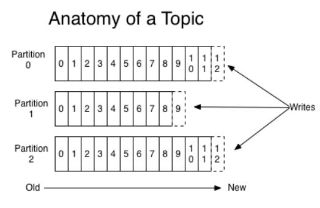
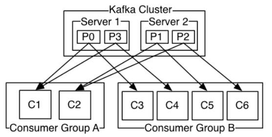

#

# Introduction

### Kafka是一种分布式流处理平台

1. 流平台的三个核心能力
	
	1. 发布和订阅流记录, 类似于消息队列和企业消息系统
	2. 用一种容错的持久化方式存储流记录
	3. 当流记录到达的时候能够处理它们
2. Kafka通常被用于两大类应用
     1. 构建实时流数据管道, 支持可靠地在系统或应用之间获取数据
   2. 构建实时流应用, 能够转换或响应流数据
  3. 构建实时流应用, 能够转换或响应流数据
4. 几个概念
     1. Kafka以一个或多个服务器的集群运行, 可以扩展到多个数据中心
     2. Kafka集群按分类(topics)的方式存储流记录
     3. 每个记录由 `(key, value, timestamp)` 组出
5. 四个核心APIs
     1. Producer API: 允许一个应用发布一个流记录到一个或多个topics
     2. Consumer API: 允许一个应用订阅一个或多个主题, 并且处理它们产生的流记录
     3. Streams API: 允许一个应用作为一个stream processor, 消费从一个或多个主题产生的流, 并且产生输出到一个或多个输出主题, 有效地将输入流转换为输出流
     4. Connector API: 允许构建和运行可复用的生产者和消费者, 用于连接Kafka主题到已经存在的应用或数据系统. 例如, 一个用于关系型数据库的connector可以捕获一张表中的每一个修改.
6. 在Kafka中, 客户端和服务器间的通信使用一种简单的 高性能的 语言无关的TCP协议. 该协议经过版本控制，并保持与旧版本的向后兼容性 

### Topics and Logs

1. topic:  是记录发布到的类别或提要名称.  Kafka中的主题始终是多订阅者的;也就是说，一个主题可以有0个、1个或多个订阅其所写入数据的使用者。

2.  对于每个主题，Kafka集群维护一个分区日志 

3. 每个分区是有序的 不可变的记录序列, 被不断追加到一种结构化的commit log. 分区中的每个记录都被赋予了一个顺序的id, 称之为offset, 用于唯一标识一个分区里的记录

4. Kafka集群定期的持久化所有发布的记录---无论他们是否被消费(基于配置的保存策略).  Kafka的性能在数据大小方面是稳定的，所以长时间存储数据不是问题。 

5.  在每个消费者保留的唯一元数据是该消费者在日志中的偏移量或位置。此偏移由消费者控制: 通常，消费者在读取记录时将线性地推进其偏移，但实际上，由于位置由消费者控制，因此它可以按自己喜欢的任何顺序使用记录 

6. 日志中分区的用途

   1.  允许日志扩展到一个服务器所能容纳的范围之外。每个单独的分区必须适合承载它的服务器，但是一个主题可能有多个分区，因此它可以处理任意数量的数据。
   2. 其次，它们充当平行的单位——在这一点上稍微多一点。 

###  Distribution

1.  日志的分区分布在Kafka集群中的服务器上，每个服务器处理数据和共享分区的请求。为了容错，每个分区被复制到大量可配置的服务器上。 
2.  每个分区有一个充当"leader"的服务器和零个或多个充当"follower"的服务器。  leader处理分区的所有读和写请求，而follower被动地复制leader.  如果"leader"失败，其中一个"follower"将自动成为新的"leader"。每个服务器充当它的一些分区的"leader"和其他分区的"follower"，因此集群内的负载非常平衡。 

### Geo-Replication

1.  Kafka MirrorMaker为集群提供地理复制支持。使用MirrorMaker，消息可以跨多个数据中心或云区域进行复制。您可以在用于备份和恢复的主动/被动场景中使用它; 或者在主动/主动场景中，将数据放置到离用户更近的地方，或者支持数据位置需求。 

### Producers

1.  生产者将数据发布到他们选择的主题。生产者负责选择将哪个记录分配给主题中的哪个分区。这可以以循环的方式完成，只是为了平衡负载，也可以根据某种语义划分函数(比如基于记录中的某个键)来完成 

### Consumers

1.  消费者使用消费者组名称标记自己，发布到主题的每个记录将传递到每个订阅消费者组中的一个消费者实例。 消费者实例可以在单独的进程中，也可以在单独的机器上。 
2.  如果所有消费者实例具有相同的消费者组，那么记录将有效地在消费者实例上进行负载平衡。 
3.  如果所有消费者实例都有不同的消费者组，那么每个记录将被广播到所有使用者进程。 
4.  消费者组的消费者每个负责一部分partition 
5.  Kafka只提供分区内记录的总顺序，而不提供主题中不同分区之间的总顺序。  但是，如果需要记录的总顺序，则可以使用只有一个分区的主题来实现这一点，尽管这意味着每个消费者组只有一个消费者进程。

### Multi-tenancy

1.  可以将Kafka部署为多租户解决方案。通过配置哪些主题可以生成或使用数据，可以启用多租户。还有对限额的操作支持。管理员可以对请求定义和强制配额，以控制客户端使用的代理资源 

### [Guarantees](http://kafka.apache.org/intro#intro_guarantees)

1. 在 在高层Kafka给出了以下保证: 
   1. 发送者发送到特定的主题分区上的消息, 将按照他们被发送的顺序追加. 也就是说,  如果记录M1是由与记录M2相同的生产者发送的，并且M1是首先发送的，那么M1的偏移量将比M2低，并出现在日志的前面。 
   2.  消费者实例按记录在日志中存储的顺序查看记录。 
   3.  对于具有复制因子N的主题，我们将容忍至多N-1个服务器故障，而不会丢失提交到日志的任何记录。 

### [Kafka as a Messaging System](http://kafka.apache.org/intro#kafka_mq)

1.  传统的消息传递有两种模式: 排队和发布-订阅 ( [queuing](http://en.wikipedia.org/wiki/Message_queue) and [publish-subscribe](http://en.wikipedia.org/wiki/Publish–subscribe_pattern))。 

2. Kafka中的消费者组的概念

   1. 泛化了 [queuing](http://en.wikipedia.org/wiki/Message_queue) and publish-subscribe的概念
   2. 和queue一样, 消费者组允许划分会理到处理器的集合上; 和publish-subscribe一样, Kafka允许广播消息到多个消费者组上

3.  Kafka也比传统的消息传递系统有更强的顺序保证。 

   1.  传统队列在服务器上按顺序保留记录，如果多个使用者从队列中消费，则服务器按存储记录的顺序分发记录。然而，尽管服务器按顺序分发记录，但这些记录是异步传递给使用者的，因此它们可能在不同的使用者上不按顺序到达。这实际上意味着记录的顺序在并行使用时丢失。消息传递系统通常通过“独占消费者”的概念来解决这个问题，该概念只允许一个进程从队列中消费，当然这意味着处理过程中没有并行
   2.  Kafka做得更好。通过主题中的分区中的并行的概念，Kafka能够在用户进程池上提供排序保证和负载平衡 .   这是通过将主题中的分区分配给消费者组中的消费者来实现的，这样每个分区正好由组中的一个消费者使用。 由于有许多分区，这仍然可以在许多消费者实例上平衡负载。但是请注意，在一个消费者组中不能有比分区更多的消费者实例。  

   ### Kafka as a Storage System

1.  任何允许发布消息与使用消息解耦的消息队列都有效地充当了动态消息的存储系统。Kafka的不同之处在于它是一个非常好的存储系统。 
2.  写入Kafka的数据被写入磁盘并复制，以保证容错。Kafka允许生产者等待确认，直到完全复制才会认为写入完成, 并保证持久化,即使写入的服务器失败,。 

3.  For details about the Kafka's commit log storage and replication design, please read [this](https://kafka.apache.org/documentation/#design) page. 

### Kafka for Stream Processing

1.  在Kafka中，流处理器是指从输入主题中获取连续的数据流，对这个输入执行一些处理，并产生连续的数据流到输出主题。 
2.  可以直接使用 producer api 和 consumer api 进行简单的处理。然而，对于更复杂的转换，Kafka提供了一个完全集成的 Streams API。这允许构建大规模处理程序，这些处理程序可以将流聚合或将流连接在一起。 
3.  streams API 构建在Kafka提供的核心原语之上: 它使用 producer api 和 consumer api 用于输入，使用Kafka进行有状态存储，并在流处理器实例之间使用相同的组机制进行容错。 

### Putting the Pieces Together

1. HDFS之类的分布式文件系统允许存储静态文件用于批处理.  实际上，这样的系统允许存储和处理来自过去的历史数据。 
2.  传统的企业消息传递系统允许处理订阅后到达的未来消息。以这种方式构建的应用程序在未来的数据到达时进行处理。 

3. Kafka结合了这两种功能，这种结合对于Kafka作为流应用程序的平台和流数据管道来说都是至关重要的。 
4.  通过结合存储和低延迟订阅，流应用程序可以以相同的方式处理过去和未来的数据。  也就是说，单个应用程序可以处理历史的、存储的数据，并不是在到达最后一条记录时结束，而是在未来的数据到达时继续处理。这是流处理的一个通用概念，包括批处理和消息驱动的应用程序。 
5.  类似地，对于流数据管道，结合实时事件订阅使得在非常低延迟的管道中使用Kafka成为可能; 但是，可靠地存储数据的能力使其能够用于必须保证数据交付的关键数据，或者与只定期加载数据的离线系统集成 , 或者可能会因为长时间的维护而停机。流处理设施使得在数据到达时转换数据成为可能。 

# Quickstart

[案例为主， 直接看官网]( http://kafka.apache.org/quickstart )

# Use cases

#### [Messaging](http://kafka.apache.org/uses#uses_messaging)

Kafka可以很好地替代更传统的消息代理。有很多原因需要使用消息代理，例如：将数据处理从数据生产者中解耦处理、缓存未处理的数据等。与大多数消息系统相比，Kafka有更好的吞吐量、内建的分区/副本/容错， 使其成为大型消息处理应用程序的良好解决方案。 

在我们的经验中，消息传递的使用通常是相对低吞吐量的，但是可能需要较低的端到端延迟，并且通常依赖于的强大持久性保证(Kafka可以提供)。 

在这个领域，Kafka可与ActiveMQ或RabbitMQ等传统消息传递系统相媲美。 

#### [Website Activity Tracking](http://kafka.apache.org/uses#uses_website)

Kafka最初的用例是能够将用户活动跟踪管道重建为一组实时发布-订阅feeds。  这意味着站点活动(页面查看、搜索或用户可能采取的其他操作)被发布到中心主题，每个活动类型有一个主题。  这些feeds可供一些列使用场景订阅，包括实时处理、实时监视和加载到Hadoop或离线数据仓库系统以进行离线处理和报告。 

活动跟踪的数据量通常很大，因为每个用户页面查看都会生成许多活动消息。 

#### [Metrics](http://kafka.apache.org/uses#uses_metrics)

 Kafka is often used for operational monitoring data. 这涉及到聚合来自分布式应用程序的统计信息，以生成 centralized feeds of operational data 。 

#### [Log Aggregation](http://kafka.apache.org/uses#uses_logs)

许多人使用Kafka作为日志聚合解决方案的替代品。  日志聚合通常从服务器收集物理日志文件，并将它们放在中心节点(可能是文件服务器或HDFS)进行处理。  Kafka抽象了文件的细节，并将日志或事件数据作为消息流进行了更清晰的抽象。  这使得处理延迟更低，并且更容易支持多个数据源和分布式数据消费。 与Scribe或Flume等以日志为中心的系统相比，Kafka提供了同样好的性能、由于存在副本机制而提供了更强的持久性保证以及更低的端到端延迟。 

#### [Stream Processing](http://kafka.apache.org/uses#uses_streamprocessing)

很多Kafka用户在由多个阶段组成的处理管道中处理数据。原始数据从Kafka主题中被消费，然后被聚合、增强或者转化到新的主题用于进一步消费或者后续处理。例如：用于推荐新文章的处理管理很可能从RSS feeds爬取文章内容，并且将它发布到“articles”主题，进一步的处理可能是规范化或去重内容并将清洗的文章发布到一个新的主题，最后的处理阶段是向用户推荐文章。 这种处理管道根据各个主题创建实时数据流图。 

Starting in 0.10.0.0, a light-weight but powerful stream processing library called [Kafka Streams](http://kafka.apache.org/documentation/streams) is available in Apache Kafka to perform such data processing as described above. Apart from Kafka Streams, alternative open source stream processing tools include [Apache Storm](https://storm.apache.org/) and [Apache Samza](http://samza.apache.org/). 

#### [Event Sourcing](http://kafka.apache.org/uses#uses_eventsourcing)

[Event sourcing](http://martinfowler.com/eaaDev/EventSourcing.html) is a style of application design where state changes are logged as a time-ordered sequence of records. Kafka's support for very large stored log data makes it an excellent backend for an application built in this style. 

#### [Commit Log](http://kafka.apache.org/uses#uses_commitlog)

Kafka can serve as a kind of external commit-log for a distributed system. The log helps replicate data between nodes and acts as a re-syncing mechanism for failed nodes to restore their data. The [log compaction](http://kafka.apache.org/documentation.html#compaction) feature in Kafka helps support this usage. In this usage Kafka is similar to [Apache BookKeeper](https://bookkeeper.apache.org/) project. 

# Documentation

[官网很详细，直接看官网]( http://kafka.apache.org/documentation/#design_quotas )

