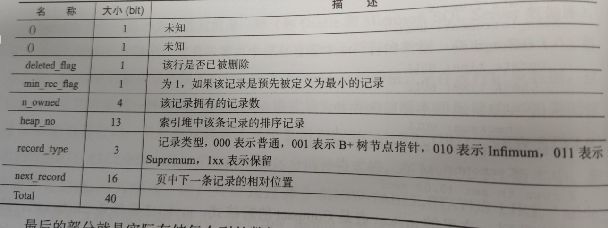
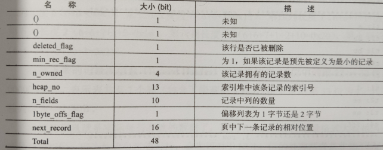

# 第 3 章    文件

MySQL包含的文件: 参数文件、日志文件、socket文件、pid文件、MySQL表结构文件、存储引擎文件

1. 参数文件
   1. 通过命令`mysql --help | grep my.cnf`查看优先级
   2. MySQL启动可以不指定参数文件， 因为存在默认值。 但是如果MySQL实例在默认的数据库目录下找不到MySQL架构， 同样会启动失败
   3. 参数类型
      1. 动态参数： 可以在MYSQL实例中进行更改， 通过SET命令
      2. 静态参数： 在整个实例生命周期内都不得更改
   
2. 日志文件
   1. 类型
      1. 错误日志 (error log)
      2. 二进制日志 （binlog)
      3. 慢查询日志 （slow query log)
      4. 查询日志 （log)
   2. 错误日志
      1. 对MySQL的启动、运行、关闭过程进行了记录
      2. `SHOW VARIABLES LIKE 'log_error'`
   3. 慢查询日志
      1. 帮助DBA定位可能存在问题的SQL语句， 从而进行SQL语句层面的优化
      2. 阈值通过参数`long_query_time`来设置， 默认为10(s). 等于阈值的不会被记录
      3. MySQL默认不开启慢查询日志， 需要手动设置为ON
      4. 从MySQL5.1开始， `long_query_time`的单位是微秒
      5. 另一个与慢查询日志有关的参数`log_queries_not_using_indexes`， 如果运行的SQL语句没有使用索引， 则MySQL数据库同样将这条SQL语句记录到慢查询日志
      6. MySQL 5.6.5开始新增了一个参数`log_throttle_queries_not_using_indexes`来表示每分钟允许记录到  slow log的且未使用索引的SQL语句次数。 默认为0， 表示没有限制
      7. `mysqldumpslow`命令
   4. 查询日志
      1.  记录了所有对MySQL数据库请求的信息， 无论这些请求是否得到了执行。 默认文件名为：主机名.log
      2. MySQL 5.1开始， 可以将查询日志的记录放入mysql架构下的general_log表中
   5. 二进制日志
      1. 记录了对MySQL数据库执行更改的所有操作， 但是不包括SELECT和SHOW这类操作。若操作本身并没有数据库发生变化，该操作也可能会写入二进制日志
      2. 二进制日志的作用
         1. 恢复： 例如， 在一个数据全备文件恢复后， 用户可以通过二进制日志进行point-in-time的恢复
         2. 复制：通过复制和执行二进制日志使一台远程的MySQL数据库与一台MySQL数据库进行实时同步
         3. 审计： 用户可以通过二进制日志中的信息来进行审计， 判断是否有对数据库进行的注入攻击
      3. 通过配置参数`log-bin[=name]`可以启动二进制日志。 如果不指定name， 则默认二进制日志文件名为主机名， 后缀名为二进制日志的序列号， 所在路径为数据库所在目录。
      4. 影响二进制日志的参数
         1. max_binlog_size
         2. binlog_cache_size
         3. sync_binlog
         4. binlog-do-db
         5. binlog-ignore-db
         6. log-slave-update
         7. binlog_format
      5. 二进制文件需要使用MySQL提供的工具`mysqlbinlog`来查看
   
3. 套接字文件： Unix系统下本地连接MySQL可以采用Unix域套接字方式， 这种方式需要一个套接字文件。 套接字文件可由参数socket控制， 一般在`/tmp/mysql.sock`

4. pid 文件

   1. 当MySQL实例启动时， 会将自己的进程ID写入一个文件中， 即pid文件。 该文件可由参数`pid_file`控制， 默认位于数据库目录下， 文件名为 `主机名.pid`

5. 表结构定义文件

   1. MySQL数据存储是根据表进行的， 与存储引擎有关
   2. 统一的是， 都有一个以`frm`为后缀名的文件， 该文件定义了表结构
   3. `frm`还用来存放视图的定义
   4. 该文件是文本文件， 可以直接使用`cat`命令查看

6. InnoDB存储引擎文件

   1. 表空间文件

      1. 共享表空间
      2. 独立表空间
         1. 通过参数 `innodb_file_per_table=ON`设置
         2. 单独表空间文件仅存储该表的数据、索引和插入缓冲BITMAP等信息， 其与信息还是放在默认表空间中

   2. 重做日志文件

      1. Innodb存储引擎的数据目录下有两个名为`ib_logfile0`和`ib_logfile1`的文件

      2. 记录了对于Innodb存储引擎的事务日志

      3. 当实例或介质失败时， 重做日志就能派上用场

      4. 重做日志文件的大小对性能有很大影响

         1. 不能设置得太大： 如果设置得很大， 在恢复时可能需要很长时间
         2. 不能设置得太小： 
            1. 可能导致一个事务的日志需要多次切换重做日志文件
            2. 会导致频繁地发生 `async checkpoint`，导致西能抖动

      5. 重做日志文件和二进制日志的区别

         1. 二进制日志会记录所有与MySQL数据库有关的日志记录， 包括 Innodb、 MyISAM、Heap等其他存储引擎的日志。 而InnoDB的重做日志文件只记录有关该存储引擎本身的事务日志
         2. 记录的内容不同。无论用户将二进制日志文件记录的格式设置为 `STATEMENT`还是 `ROW`， 又或者是 `MIXED`， 其记录的都是关于一个事务的具体操作内容， 即该日志是逻辑日志。而InnoDB存储引擎的重做日志文件记录的是关于每个(Page)的更改的物理情况
         3. 写入时间不同。二进制日志文件仅在事务提交前进行提交， 即只写磁盘一次， 不论这时该事务多大。 而在事务进行的过程中，却不断有重做日志条目(entry)被写到重做日志文件中

      6. 重做日志条目的结构

         | redo_log_type | space | page_no | redo_log_body |
         | ------------- | ----- | ------- | ------------- |
         |               |       |         |               |

      7. 写入重做日志文件的操作不是直接写， 而是先写入一个重做日志缓冲， 然后按照**一定的条件**顺序地写入日志文件

         1. 主线程每秒会将重做日志缓冲写入磁盘日志文件中，不论事务是否已经提交
         2. 参数`innodb_flush_log_at_trx_commit`控制在提交操作时， 处理重做日志的方式，有效值为0,1,2
            1. 0： 表示当事务提交时， 不将事务的重做日志写入到磁盘上的日志文件， 而是等待主线程每秒的刷新
            2. 1：表示执行commit时， 将重做日志缓冲同步写到磁盘， 即伴有fsync的调用
            3. 2： 表示将重做日志异步写到磁盘， 即写到文件系统缓存中。因此不能完全保证在执行commit时肯定会写入重做日志文件，只是有这个动作发生

      8. 从重做日志缓冲往磁盘写入时， 是按512个字节，也就是一个扇区的大小进行写入。因为扇区是写入的最小单位， 因此可以保证写入必定是成功的。因此在重做日志写入过程中不需要有doublewrite

# 第 4 章    表

1. 索引组织表

   1. 在InnoDB存储引擎中， 表都是根据主键顺序组织存放的， 这种存储方式的表称为索引组织表
   2. 如果没有定义主键， 默认选择或创建策略
      1. 首先判断表中是否有非空唯一索引(Unique NOT NULL), 如果有， 则该列为主键。 如果存在多个， 选择第一个定义的非空唯一索引(是定义索引的顺序， 不是建表时列的顺序)
      2. 如果不符合上述条件， InnoDB存储引擎自动创建一个6字节大小的指针
   3. `_rowid`可以显示表的主键， 但是只能用于查看单个列为主键的情况， 对于多列组成的主键无能为力

2. InnoDB 逻辑存储结构

   从 InnoDB存储引擎的逻辑存储结构来看， 所有数据都被逻辑地放在一个空间中， 称之为表空间。表空间又由段(segment)、区(extent)、页(page)/块(block)组成.

   1. 表空间
      1. 共享表空间 ibdata1
      2. 独立表空间： 
         1. 由参数`innodb_file_per_table`控制
         2. 存放的知识数据、索引和插入缓冲Bitmap页， 其他数据，如回滚信息、插入缓冲页、系统事务信息、二次缓冲写等还是放在原来的共享表空间中
   2. 段
      1. 表空间由各个段组成， 常见的段有数据段、索引段、回滚段等
      2. InnoDB存储引擎是索引组织的， 因此数据即索引， 索引即数据。 数据段即为B+树的叶子节点， 索引段即为B+树的非叶子节点
   3. 区
      1. 区是由连续的页组成的空间， 在任何情况下每个区的大小都是1MB。 一个区中有64个连续的页(通常页大小16KB)
      2. 1.0.x 开始引入压缩页， 可以通过参数`KEY_BLOCK_SIZE`将页大小设置为2K、4K、8K， 则每个区对应的页数量就是512、256、128
      3. 1.2.x 新增参数`innodb_page_size`，可以将默认页大小设置为4k、8K， 但是页中数据不是压缩的。
   4. 页
      1. 也可以称之为“块”, 是InnoDB磁盘管理的最小单位。默认16KB
      2. 常见的页类型
         1. 数据页 (B-tree Node)
         2. undo 页 (undo Log Page)
         3. 系统页 (System Page)
         4. 事务数据页 (Transaction system Page)
         5. 插入缓冲位图页 (Insert Buffer Bitmap)
         6. 插入缓冲空闲列表页 (Insert Buffer Free List)
         7. 未压缩的二进制大对象页 (Uncompressed BLOB Page)
         8. 压缩的二进制大对象页 (compressed BLOB Page)
   5. 行
      1. InnoDB存储引擎是面向行的， 按行存放
      2. 每个页最多允许存放 `16KB / 2 - 200`行记录， 即7992行

3. InnoDB 行记录格式

   1. Compact 行记录 (since 5.0), 设计目标是高效地存储数据

      1. 格式

         | 变长字段长度列表 | NULL标志位 | 记录头信息 | 列1数据 | 列2数据 | …….. |
         | ---------------- | ---------- | ---------- | ------- | ------- | ---- |
         |                  |            |            |         |         |      |

          1. 变长字段长度列表

              	1. 存储
                  - 按照列的顺序逆序放置
                  - 若列的长度小于255字节， 用1字节表示
                  - 若大于255个字节， 用2字节表示
                 	2. 最大长度不超过2字节， 与VARCHAR类型的最大长度限制在65535相关

         	2. NULL标志位： 指示该行数据中是否有NULL值， 有就用1表示，占1字节

         	3. 记录头信息：固定占用5字节

             

      2. *注意： 每行数据除了用户定义的列外， 还有两个隐藏列， 事务ID和回滚指针列， 分别为6字节和7字节大小。若InnoDB表没有主键， 每行还会增加一个6字节的rowid列*

   2. Redundant 行记录格式， 5.0之前的存储方式， 5.0支持Redundant是为了兼容之前版本的页格式

      1. 格式

         | 变长字段长度列表  | 记录头信息 | 列1数据 | 列2数据 | …….. |
         | ---------------- | ---------- | ---------- | ------- | ------- | ---- |
         |                  |            |            |         |         |      |
      
   1. 变长字段长度列表同compact格式
         2. 记录头信息占用6字节 
         
         
         
      2. 对于VARCHAR类型的NULL值， Redundant行记录格式同样不占用任何存储空间，而对于CAHR类型的NULL值需要占用空间(会占用可能存放的最大值字节数， 对于utf8， 每个字符会占用3个字节)
      
   3. 行溢出数据
   
      1. InnoDB存储引擎可以将一条记录中的某些数据存储在真正的页面之外。 一般认为BLOB、LOB这类的大对象列类型会把数据存放在页面之外。*BLOB可以不将数据溢出页面， VARCHAR也可以溢出*
   
      2. VARCHAR(N) 中的 N 指的是字符串长度， 而文档中说明的VARCHAR类型最大支持65535， 单位是字节
   
      3. MySQL官方手册中定义的65535长度指的是所有VARCHAR列的长度总和， 如果列的长度总和超出这个长度， 依然无法创建
   
      4. InnoDB村引擎页的大小为16KV， 即16384字节， 为什么能65532字节呢？
   
         一般情况下， InnoDB存储引擎的数据都是存放在页类型为B-tree node中， 但是当发生行溢出时， 数据存放在UNcompress BLOB页中
   
      5. 多长的VARCHAR是保存在单个数据页中， 从多长开始又会保存在BLOB页呢？
   
         InnoDB存储引擎是索引组织的， 即B+Tree的结构， 这样每个页中至少应该有两条行记录(否则失去了B+Tree的意义， 变成链表了)。因此， 如果页中只能存放下一条记录， 那么InnoDB存储引擎会自动将行数据存放到溢出页中。
   
   4. Compressed 和 Dynamic 行记录格式
   
      1. since 1.0.x
      2. 新的两种记录格式对于存放在BLOB中的数据采用了完全的行溢出方式， 在数据页中只存放20个字节的指针， 实际的数据都存放在Off Page中， 而之前的Compact 和 Redundant两种格式会存放768个前缀字节
      3. Compress 行记录的另一个功能， 存储在其中的行数据会以zlib的算法进行压缩，  因此对于BLOB、TEXT、VARCHAR这类大长度类型的数据都够有效存储
   
   5. CHAR 的行结构存储
   
      1. 对于CHAR类型在**多字节字符集**类型的存储， CHAR类型被明确视为了变长字符类型， 对于未能占满长度的字符还是填充 0x20. 可以认为在多字节字符集的情况下， CHAR和VARCHAR的实际行存储基本是没有区别的
   
4. InnoDB 数据页结构

   由7个部分组成：File Header(文件头)、Page Header(页头)、Infimun 和 Supremum、User Records(用户记录，即行记录)、Free Space(空闲空间)、Page Directory(页目录)、File Trailer(文件结尾信息)
   
   1. File Header：用来记录一些头信息， 由8个部分组成，共占用38个字节(P121)
   2. Page Header: 用来记录数据页的状态信息， 由14个部分组成， 共占用56个字节(P122)
   3. Infimum 和 Supremum Record： 在InnoDB存储引擎中， 每个数据页中有两个虚拟的行记录， 用来限定记录的边界。Infimum记录是比该页中任何主键值都要小的值， Supremum指比任何可能值都要大的值。这两个值在页创建时被建立，并且在任何情况下不会被删除。在Compact 和 Redundant行格式下， 两者占用的字节数各不相同
   4. User Record 和 Free Space
      1. User Record是实际存储记录的内容
      2. Free Space是空闲空间， 是个链表的数据结构
   5. Page Directory (TODO P124 不是很清楚)
   6. File Trailer: 用于检测页是否已经完整地写入磁盘
      1. File Trailer 只有一个FIL_PAGE_END_LSN部分， 占用8字节。 前4字节代表该页的checksum值， 后4字节和FILE Header中的FIL_PAGE_LSN相同(说的可能是对应于那个值， 如果相同还有比较的意义吗)
      2. 将这两个值与FILE Header中的FIL_PAGE_SPACE_OR_CHECKSUM和FIL_PAGE_LSN进行比较， 看是否已知
   
5. Named File Formats 机制

6. 约束

   1. 数据完整性
      1. 分类
         1. 实体完整性： 保证表中有一个主键
         2. 域完整性： 保证数据每列的值满足特定的条件。有如下途径来保证：
            1. 选择合适的数据类型确保一个数据值满足特定条件
            2. 外键约束
            3. 编写触发器
            4. 还可以考虑yogaDEFAULT约束作为域完整性的一个方面
         3. 参照完整性： 保证两张表之间的关系。 实施方式可以通过外键或者触发器
      2. InnoDB存储引擎提供的约束
         1. Primary Key
         2. Unique Key
         3. Foreign Key
         4. Default
         5. NOT NULL
   2. 约束的创建和查找
      1. 创建方式
         1. 表建立时就进行约束定义
         2. 利用 `ALTER TABLE`命令创建约束
   3. 索引和约束的异同
      1. 创建了一个唯一索引就是创建了一个唯一的约束
      2. 约束更是一个逻辑概念， 用于保证数据完整性， 而索引是一个数据结构， 既有逻辑上的概念， 在数据库中还代表着物理存储方式
   4. 对错误数据的约束
      1. 通过设置参数`sql_mode`的值为`STRI T_TRANS_TABLES`，可以对输入值的合法性进行约束。
   5. ENUM 和 SET 约束
      1. MySQL 数据库不支持传统的CHECK约束， 但是可以通过ENUM和SET类型解决部分这样的需求
      2. 只限于对离散数值的约束， 对于传统的CHECK约束支持的连续值的范围约束或更复杂的约束， ENUM和SET类型还是无能为力， 需要通过触发器实现
   6. 触发器与约束
      1. 触发器的作用是在执行 INSERT、DELETE 和 UPDATE 命令之前或之后自动调用的 SQL 命令或存储过程
   7. 外键约束
      1. 在Oracle数据库中， 对于建立外键的列， 一定不要忘记给这个列加上一个索引。 而InnoDB存储引擎会在外键建立时自动地对该列添加索引。该方式可以很好地避免外键列上无索引而导致的死锁问题的产生。
      2. MySQL的外键是及时检查的。因此在导入时外键检查会导致花费大量时间， 导入过程中可以临时忽略

7. 视图

   1. 作用
      1. 抽象
      2. 安全
   2. 物化视图

8. 分区表

#  第 5 章    索引与算法

## 5.1 InnoDB 存储引擎索引概述

1. MySQL存储支持的索引类型
   - B+ 树索引
   - 全文索引
   - 哈希索引
2. InnoDB存储引擎支持的哈希索引时自适应的， 会根据表的使用情况自动生成， 不能人为干预是否在一张表中生成哈希索引
3. **B+ 树索引并不能找到一个给定键值的具体行。 B+树索引能找到的只是被查找数据行所在的页**。然后数据库通过把页读入到内存， 再在内存中进行查找， 最后得到要查找的数据

## 5.2 数据结构和算法

### 5.2.1 二分查找法

1. 每页Page Directory中的槽是按照主键的顺序存放的， 对于某一条具体记录的查询是通过对Page Directory进行二分查找得到的

5.2.2 二叉查找和平衡二叉树

## 5.3 B+ 树

1. 小于放左边， 大于等于放右边

## 5.4 B+ 树索引

### 5.4.1 聚集索引

1. 聚集索引并非物理上连续， 而是逻辑上连续

   如果聚集索引必须按照特定顺序存放物理记录， 则维护成本非常之高。所以， 聚集索引的存储并不是物理上连续的， 而是逻辑上连续， 原因如下

   1. 页通过双向链表链接， 页按照主键的顺序排序
   2. 每个页中的记录也是通过双向链表进行维护的，物理存储上可以同样不按照主键存储

2. 聚集索引的另一个好处： 对于主键的排序查找和范围查找速度非常快， 叶子节点的数据就是用户所要查询的数据

### 5.4.2 辅助索引

1. 对于辅助索引， 叶子节点并不包含行记录的全部数据， 保存的是行数据的聚集索引键

### 5.4.3 B+树索引的分裂

1. 并不总是从中间分裂

5.4.4 B+树索引的管理

1. 索引管理
   1. ALTER TABLE
   2. CREATE/DROP INDEX
2. Fast Index Creation (FIC)
   1. 仅限于辅助索引， 对于主键的创建和删除同样需要重建一张表
   2. 临时表的创建路径是通过参数 `tmpdir`进行设置的。 用户必须保证tmpdir 有足够的空间可以存放临时表， 否则会导致索引创建失败
3. Oline Schema Change (OSC)
   1. 部分解决了索引创建时会阻塞表上DML操作的问题
4. Online DDL
   1. 意义： 允许辅助索引创建的同时，还允许其他诸如 `INSERT`、 `UPDATE`、 `DELETE` 这类DML操作
   2. 支持的操作
      1. 辅助索引的创建与删除
      2. 改变自增长值
      3. 添加或删除外键约束
      4. 列的重命名
   3. 实现原理：在执行创建或者删除操作的同时，将`INSERT`、 `UPDATE`、 `DELETE` 这类DML操作日志写到一个缓存中。待完成索引创建后再将重做应用到表上，以达到数据的一致性这个缓存的大小由参数`innodb_online_alter_log_max_size`控制，默认大小为128M。若用户更新的表比较大， 并且创建过程中伴有大量写事务，若缓存空间不能存放日志时， 会报错
   4. 注意：由于Online DDL在创建索引完成后再通过重做日志达到数据一致性，这意味着在索引创建过程中，SQL优化器不会选择正在创建中的索引

## 5.5 Cardinality

### 5.5.1 什么是Cardinality

1. 反应的是索引的选择性，表示索引中不重复记录的预估值
2. 对于索引列，cardinality / n_rows_in_table 应该尽可能接近1

### 5.5.2 InnoDB存储引擎的Cardinality统计

1. 由存储引擎层统计，不同的存储引擎实现不同
2. 数据库对于Cardinality的统计都是通过采样的方法完成, 不用全量统计的原因
   1. 会增加数据库系统的负荷
   2. 对于大表的统计，时间上不允许
3. 在InnoDB存储引擎中， Cardinality统计信息的更新发生在两个操作中：`INSERT`和`UPDATE`, 更新策略为：
   1. 表中 1/16 的数据已经发生过变化: 自从上次统计信息后，表中 1/16 的数据发生过变化
   2. `stat_modified_counter > 2 000 000 000`： 发生变化次数超过一定值， 应对的情景是 对表中某一行数据频繁地进行更新操作， 这是表中数据实际并没有增加， 实际发生变化的还是这一行数据， 此时，策略1无法满足
4. InnoDB存储引擎内部统计采用的采样方案(默认对8个叶子节点进行采样)：
   1. 取得B+ 树索引中的叶子节点的数量，记为A
   2. 随机取得B+树索引中的8个叶子节点。统计每个页不同记录的个数，记为P1, P2, …, P8
   3. 根据采样信息给出Cardinality的预估值：`Cardinality = (P1 + P2 + ... + P8) * A / 8`
5. 会触发Cardinality重新计算的操作
   1. `ANALYZE TABLE`
   2. `SHOW TABLE STATUS`
   3. `SHOW INDEX`
   4. 访问`INFORMATION_SCHEMA`架构下的表`TABLES` 和 `STATISTICS`

## 5.6 B+树索引的使用

### 5.6.1 不同应用中B+树索引的使用

1. OLTP
2. OLAP

### 5.6.2 联合索引

1. 联合索引是指对表上的多个列进行索引
2. 联合索引已经对第二个键值进行了排序处理，很多情况下可以避免排序操作

### 5.6.3 覆盖索引

1. 覆盖索引： 从辅助索引中就可以得到查询的记录，而不需要查询聚集索引中的记录。好处是辅助索引不包含整行记录的所有信息，故其大小要远小于聚集索引，因此可以减少大量IO操作
2. 在通常情况下，诸如 (a, b)的联合索引，一般是不可以选择列 b 中所谓的查询条件。 但是如果是统计操作，并且是覆盖索引的，则优化器会进行选择。(P219 ???)

### 5.6.4 优化器选择不使用索引的情况

1. 在某些情况下， 当执行 EXPLAIN 命令进行SQL语句分析时，会发现优化器并没有选择索引去查找数据，而是通过扫描聚集索引，也就是直接进行权标的扫描来得到数据。这种情况多发生与范围查找、JOIN连接操作等情况下。

2. 对于不能使用索引覆盖的情况， 优化器选择辅助索引的情况是，通过辅助索引查找的数据是少量的。这是由当前传统机械硬盘的特性所决定的，即利用顺序读来替换随机读的查找。若用户使用的是固态硬盘，随机读操作非常快，同时有足够的自信来确认使用辅助索引可以带来更好的性能，那么可以使用关键字 `FORCE INDEX`来强制使用某个索引

   ```sql
   SELECT * FROM orderdetails FORCE INDEX(OrderID) WHERE orderid>10000 AND orderid<10200
   ```

   

### 5.6.5 索引提示

1. MySQL 数据库支持索引提示(INDEX HINT)， 显式地告诉优化器使用哪个索引。两种情况可能用到：
   1. MySQL 数据库的优化器错误地选择了某个索引，导致SQL语句运行得很慢
   2. 某SQL语句可以选择的索引非常多，这时优化器选择执行计划的时间开销可能会大于SQL语句本身

### 5.6.6 Multi-Range Read 优化

1. Multi-Range Read 优化 的目的是为了减少磁盘的随机访问，并将随机访问转化为较为顺序的数据访问，这对于 IO-bound 类型的SQL查询语句可带来极大的性能提升。Multi-Range Read 优化可适用于range、ref、eq_ref类型的查询
2. MRR优化的好处
   1. MRR使数据访问变得较为顺序。在查询辅助索引时，先根据得到的查询结果，按照主键进行排序，并按照排序的顺序进行书签查找
   2. 减少缓冲池中页被替换的次数
   3. 批量处理对键值的查询操作
3. 对于InnoDB 和 MyISAM 存储引擎的范围查询和 JOIN 查询操作， MRR的工作方式如下：
   1. 将查询得到的辅助索引键值存放于一个缓存中， 这时缓存中的数据是根据辅助索引键值排序的
   2. 将缓存中的键值根据RowID进行排序
   3. 根据RowID的排序顺序来访问实际的数据文件

### 5.6.7 Index Condition Pushdown（ICP）优化

1. 支持ICP后， MySQL数据库会在取出索引的同时，判断是否可以进行WHERE条件的过滤，也就是将WHERE的部分过滤操作放在了存储引擎层。在某些查询下， 可以大大减少上层SQL层对记录的索取(fetch), 从而提高数据库的整体性能
2. ICP优化支持 range、ref、eq_ref、ref_or_null类型的查询，当前支持MyISAM 和 InnoDB存储引擎
3. 当优化器选择 ICP优化时， 可以在执行计划的 Extra 列看到 Using index condition的提示

## 5.7 哈希算法

### 5.7.1 哈希表

### 5.7.2 InnoDB 存储引擎中的哈希算法

1. InnoDB 存储引擎使用哈希算法来对字典进行查找， 其冲突机制采用链表方式， 哈希函数采用除法散列方式。
2. 对于除法散列， m的取值为略大于2倍的缓冲池页数量的质数。例如： 当前参数 `innodb_buffer_pool_size`的大小为10M， 则共有640个16KB的页。对于缓冲池页内存的哈希表来说，需要分配`640*2=1280`个槽，但是由于1280不是质数，需要取比1280略大的一个质数，应该是1399，所以会在启动时分配1399个槽的哈希表，用来哈希查询所在缓冲池中的页
3. 关键字计算：`K = space_id << 20 + space_id + offset`

### 5.7.3 自适应哈希索引

## 5.8 全文检索

### 5.8.1 概述

1. B+树索引检索字符串只能根据最左前缀匹配，左边不能是模糊的
2. 全文检索是将存储于数据库中的整本书或整篇文章中的任意内容信息查找出来的技术。
3. InnoDB 支持全文所以since 1.2.x

### 5.8.2 倒排索引

1. 倒排索引是一种数据结构，它在辅助表(Auxiliary Table)中存储了单词与单词自身在一个或多个文档中所在位置之间的映射。这通常利用关联数组实现，其拥有两种表现形式：
   1. inverted file index，其表现形式为 {单词，单词所在文档的ID}
   2. full inverted index，其表现形式为 {单词，(单词所在文档的ID， 在具体文档中的位置)}

### 5.8.3 InnoDB 全文检索

1. 采用的是full inverted index的方式
2. 在InnoDB引擎中，将 (DocumentId， Position) 视为一个 “ilist”。因此在全文检索表中， 有两个列，一个是word字段，另一个是ilist字段，并且在word字段上设有索引。此外，由于InnoDB存储引擎在ilist字段中存放了Position信息， 故可以进行Proximity Search， 而MyISAM不支持该特性
3. 在InnoDB存储引擎中，为了提高全文检索的并行性能，共有6张Auxiliary Table，目前每张表根据word的Latin编码进行分区
4. Auxiliary Table是持久的表，存放于磁盘上。使用FTS Index Cache (全文检索索引缓存) 来提高全文检索的性能
5. FTS Index Cache
   1. 红黑树结构，根据(word, ilist)进行排序
   2. 批量更新Auxiliary Table， 而不是每次插入后更新一次Auxiliary Table
   3. 当对全文检索进行查询是，Auxiliary Table首先会将在FTS Index Cache中对应的word字段合并到Auxiliary Table，然后再进行查询。该merge操作和Inser Buffer类似，不同的是Insert Buffer是一个持久的对象，并且是B+树结构。
   4. FTS Index Cache的作用和Insert Buffer类似，它提高了InnoDB存储引擎的性能，并且由于其根据红黑树排序后进行批量插入，其产生的Auxiliary Table相对较小
6. FTS Document ID
   1. 在InnoDB引擎中， 为了支持全文检索，必须有一个列与word进行映射，在InnoDB中这个列被命名为FTS_DOC_ID，其类型必须是BIGINT UNSIGNED NOT NULL， 并且InnoDB存储引擎会自动在该列上加入一个名为FTS_DOC_ID_INDEX的Unique
7. 文档中分词的插入操作是在事务提交时完成，然而对于删除操作，其在事务提交时，不删除磁盘Auxiliary Table中的记录，而只是删除FTS Index Cache中的记录。对于Auxiliary Table中被删除的记录，InnoDB存储引擎会记录其FTS Document ID， 并将其保存在DELETE Auxiliary Table中。
8. OPITMIZE TABLE可以执行真正的删除操作， 但是这个操作会进行一些其他操作，如Cardinality重新统计，如果希望只对倒排索引进行操作，可以通过设置`innodb_optimize_fulltext_only=1`。若被删除的文档非常多，OPITMIZE TABLE操作可能会非常耗时，可以通过参数`innodb_ft_num_word_optimize`来限制每次实际删除的分词数量，该值默认为2000
9. stopword table
10. InnoDB 存储引擎的全文检索存在的限制
    1. 每张表智能有一个全文检索的索引
    2. 由多列组合而成的全文索引的索引列必须使用相同的字符集和排序规则
    3. 不支持没有单词界定符(delimiter)的语言，如中文、日语、韩语等

### 5.8.4 全文检索


 


