### TCP-IP详解卷1

#### 概述
1. TCP/IP协议族的四个层次
   1. 链路层: 有时也称作数据链路层或网络接口层，通常包括操作系统中的设备驱动程序和计算机中对应的网络接口卡。它们一起处理与电缆（或其他任何传输媒介）的物理接口细节。
   2. 网络层: 有时也称作互联网层，处理分组在网络中的活动，例如分组的选择
   3. 运输层: 主要为两台主机上的应用程序提供端到端的通信
   4. 应用层负责处理特定的应用程序细节
2. 局域网上运行FTP的两台主机通信过程 \
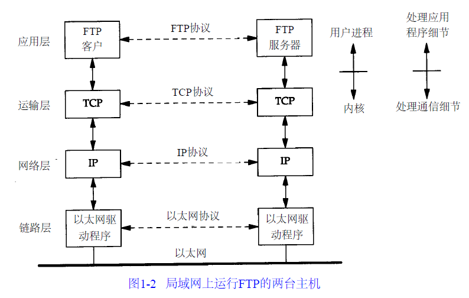
3. 从表面上看，网络层和运输层之间的区别不那么明显。为什么要把它们划分成两个不同的层次呢? \
在TCP/IP协议族中，网络层IP提供的是一种不可靠的服务。也就是说，它只是尽可能快地把分组从源结点送到目的结点，但是并不提供任何可靠性保证。而另一方面， TCP在不可靠的I P层上提供了一个可靠的运输层。为了提供这种可靠的服务，  TCP采用了超时重传、发送和接收端到端的确认分组等机制。由此可见，运输层和网络层分别负责不同的功能。
4. 连接网络的另一个途径是使用网桥。网桥是在链路层上对网络进行互连，而路由器则是在网络层上对网络进行互连。网桥使得多个局域网(LAN)组合在一起，这样对上层来说就好像是一个局域网。
5. 以太网数据帧的物理特性是其长度必须在46-1500字节之间
6. 数据进入协议栈时的封装过程 \
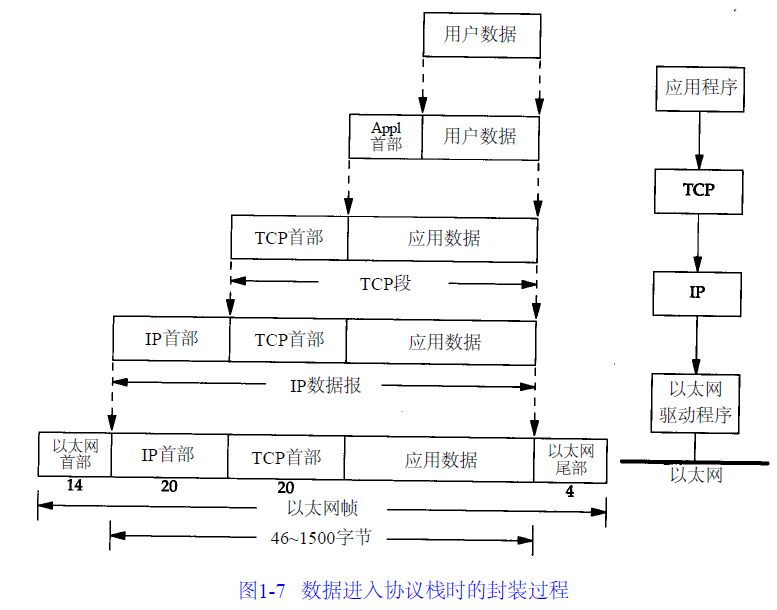
7. UDP数据与TCP数据基本一致。唯一的不同是TDP传给IP的信息单元称作UDP数据报(UDP datagram)，而且UDP的首部长为8字节。
8. 由于TCP、UDP、I C M P和I G M P都要向I P传送数据，因此I P必须在
生成的I P首部中加入某种标识，以表明数据属于哪一层。为此， I P在首部中存入一个长度为8 b i t的数值，称作协议域。1表示为I C M P协议， 2表示为I G M P协议， 6表示为T C P协议， 1 7表
示为U D P协议。
9. 许多应用程序都可以使用T C P或U D P来传送数据。运输层协议在生成报文首部
时要存入一个应用程序的标识符。T C P和U D P都用一个1 6 b i t的端口号来表示不同的应用程序。T C P和U D P把源端口号和目的端口号分别存入报文首部中。
10. 网络接口分别要发送和接收I P、A R P和R A R P数据，因此也必须在以太网的帧首部中加入某种形式的标识，以指明生成数据的网络层协议。为此，以太网的帧首部也有一个16 bit的帧类型域。
11. 分用
    1.  当目的主机收到一个以太网数据帧时，数据就开始从协议栈中由底向上升，同时去掉各层协议加上的报文首部。每层协议盒都要去检查报文首部中的协议标识，以确定接收数据的上层协议。这个过程称作分用（ D e m u l t i p l e x i n g），
    2.  以太网数据帧的分用过程 \
    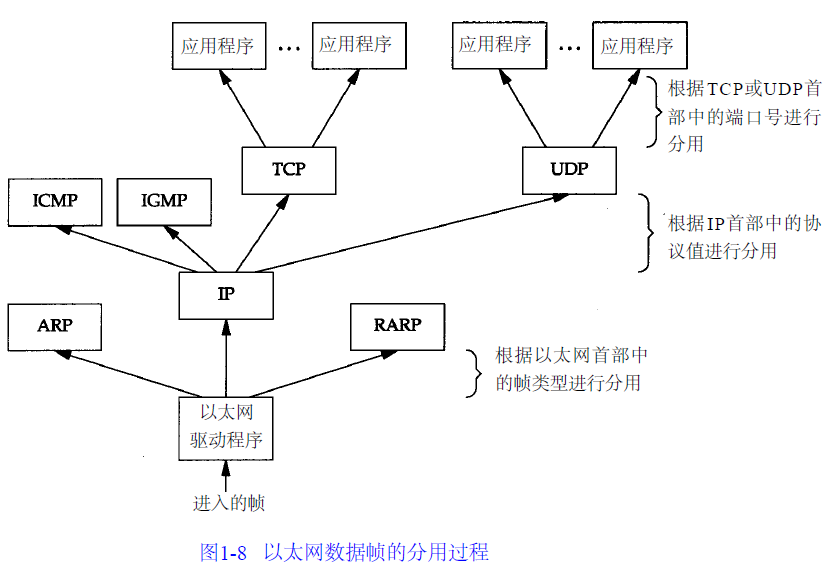
    1. 为协议I C M P和I G M P定位一直是一件很棘手的事情。图中把它们与IP放在同一层上，那是因为事实上它们是IP的附属协议。但是在这里，我们又把它们放在IP层的上面，这是因为ICMP和IGMP报文都被封装在IP数据报中。
    2. 对于A R P和R A R P，我们也遇到类似的难题。在这里把它们放在以太网设备驱动程序的上方，这是因为它们和IP数据报一样，都有各自的以太网数据帧类型。在图中，我们又把A R P作为以太网设备驱动程序的一部分，放在IP层的下面，其原因在逻辑上是合理的。
12. 客户-服务器模型: 阻塞/非阻塞
13. 端口号
    1. 服务器一般都是通过知名端口号来识别的。例如，对于每个TCP / IP实现来说， FTP服务器的TCP端口号都是21，每个Telnet服务器的T C P端口号都是23，每个T F T P (简单文件传送协议)服务器的U D P端口号都是69
14. 不同的BSD版及其重要的TCP/IP特性 \
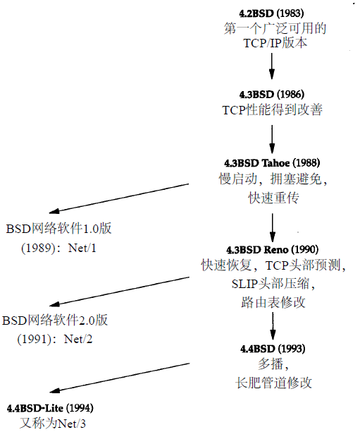

### IP: 网际协议
1. IP协议的两大特点
   1. 不可靠（ u n r e l i a b l e）的意思是它不能保证IP数据报能成功地到达目的地。IP仅提供最好的传输服务。如果发生某种错误时，如某个路由器暂时用完了缓冲区， I P有一个简单的错误处理算法：丢弃该数据报，然后发送ICMP消息报给信源端。任何要求的可靠性必须由上层来提供（如TCP）。
   2. 无连接（ c o n n e c t i o n l e s s）这个术语的意思是I P并不维护任何关于后续数据报的状态信息。每个数据报的处理是相互独立的。这也说明， I P数据报可以不按发送顺序接收。如果一信源向相同的信宿发送两个连续的数据报（先是A，然后是B），每个数据报都是独立地进行路由选择，可能选择不同的路线，因此B可能在A到达之前先到达。
2. IP数据报格式及首部中的各字段 \
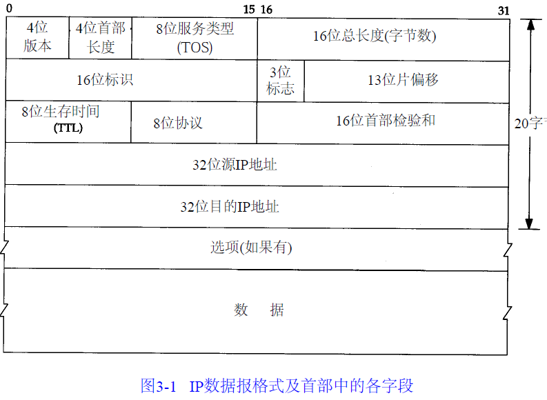
    1. 首部长度指的是首部占32 bit字(4个字节)的数目，包括任何选项。由于它是一个4比特字段，因此首部最长为6 0个字节(4*15). 普通IP数据报（没有任何选择项）字段的值是5。
    2. 服务类型字段推荐值(TOS) \
    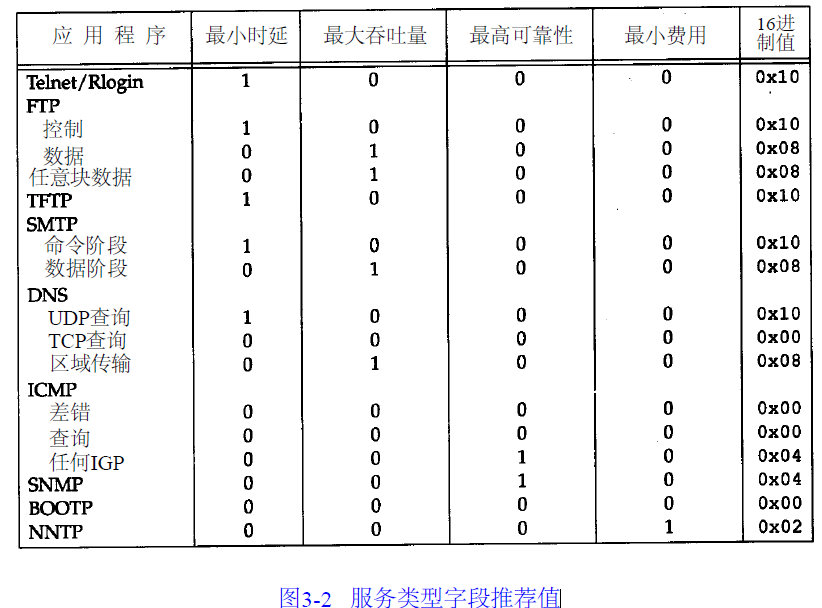
    3. 总长度字段是指整个IP数据报的长度，以字节为单位。利用首部长度字段和总长度字段，就可以知道I P数据报中数据内容的起始位置和长度。**由于该字段长16比特，所以IP数据报最长可达65535字节**（回忆图2 - 5，超级通道的MTU为65535。它的意思其实不是一个真正的MTU—它使用了最长的IP数据报）。当数据报被分片时，该字段的值也随着变化
    4. 尽管可以传送一个长达6 5 5 3 5字节的I P数据报，但是大多数的链路层都会对它进行分片。而且，主机也要求不能接收超过5 7 6字节的数据报。由于T C P把用户数据分成若干片，因此一般来说这个限制不会影响T C P。在后面的章节中将遇到大量使用U D P的应用（ R I P，T F T P，B O O T P，D N S，以及S N M P），它们都限制用户数据报长度为5 1 2字节，小于5 7 6字节。但是，事实上现在大多数的实现（特别是那些支持网络文件系统N F S的实现）允许超过8 1 9 2字节的I P数据报。
    5. T T L（t i m e - t o - l i v e）生存时间字段设置了数据报可以经过的最多路由器数。它指定了数据报的生存时间。T T L的初始值由源主机设置（通常为3 2或6 4），一旦经过一个处理它的路由器，它的值就减去1。当该字段的值为0时，数据报就被丢弃，并发送I C M P报文通知源主机。
    6. 首部检验和字段是根据I P首部计算的检验和码。它不对首部后面的数据进行计算。I C M P、I G M P、U D P和T C P在它们各自的首部中均含有同时覆盖首部和数据检验和码。
    7. 
1. 网络字节序: 4个字节的32 bit值以下面的次序传输：首先是0～7 bit，其次8～15 bit,然后1 6～23 bit，最后是24~31 bit。这种传输次序称作big endian字节序。由于T C P / I P首部中所有的二进制整数在网络中传输时都要求以这种次序，因此它又称作网络字节序。以其他形式存储二进制整数的机器，如little endian格式，则必须在传输数据之前把首部转换成网络字节序。
2. IP的路由选择     \
   1. IP路由选择是简单的，特别对于主机来说。如果目的主机与源主机直接相连（如点对点链路）或都在一个共享网络上（以太网或令牌环网），那么I P数据报就直接送到目的主机上。否则，主机把数据报发往一默认的路由器上，由路由器来转发该数据报。大多数的主机都是采用这种简单机制。
   

### ARP: 地址解析协议
1. ARP高速缓存
   1. A R P高效运行的关键是由于每个主机上都有一个A R P高速缓存。这个高速缓存存放了最近I n t e r n e t地址到硬件地址之间的映射记录。高速缓存中每一项的生存时间一般为2 0分钟，起始时间从被创建时开始算起

### ICMP: Internet控制报文协议
1. I C M P经常被认为是I P层的一个组成部分。它传递差错报文以及其他需要注意的信息.ICMP报文通常被IP层或更高层协议(TCP或UDP)使用。一些ICMP报文把差错报文返回给用户进程。
2. ICMP封装在IP数据报内部   \
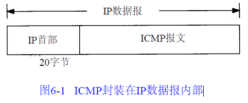
3. ICMP报文的类型
   1. 当发送一份I C M P差错报文时，报文始终包含I P的首部和产生I C M P差错报文的I P数据报的前8个字节。这样，接收I C M P差错报文的模块就会把它与某个特定的协议（根据I P数据报首部部中的协议字段来判断）和用户进程（根据包含在I P数据报前8个字节中的T C P或U D P报文首部中的T C P或U D P端口号来判断）联系起来

### Ping程序
1. 目的是为了测试另一台主机是否可达。该程序发送一份I C M P回显请求报文给主机，并等待返回I C M P回显应答
2. 我们称发送回显请求的p i n g程序为客户，而称被p i n g的主机为服务器。大多数的T C P / I P实现都在内核中直接支持P i n g服务器----这种服务器不是一个用户进程
3. ICMP回显请求和回显应答报文格式   \
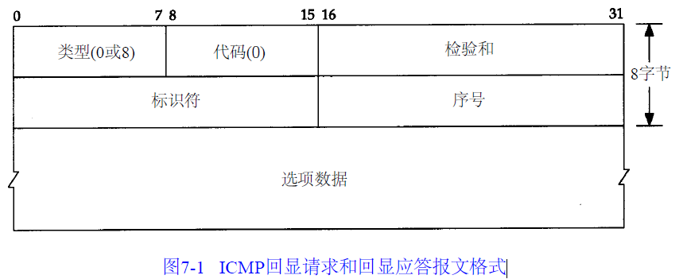

### Traceroute程序
1. Tr a c e r o u t e程序是一个能更深入探索T C P / I P协议的方便可用的工具。
尽管不能保证从源端发往目的端的两份连续的I P数据报具有相同的路由，但是大多数情况下
是这样的。Tr a c e r o u t e程序可以让我们看到I P数据报从一台主机传到另一台主机所经过的路由。Tr a c e r o u t e程序还可以让我们使用I P源路由选项。

### TCP: 传输控制协议
1. T C P通过下列方式来提供可靠性
   1. 应用数据被分割成T C P认为最适合发送的数据块
   2. 超时重传. 当T C P发出一个段后，它启动一个定时器，等待目的端确认收到这个报文段。如果不能及时收到一个确认，将重发这个报文段。
   3. 消息确认. 当T C P收到发自T C P连接另一端的数据，它将发送一个确认。这个确认不是立即发送，通常将推迟几分之一秒
   4. T C P将保持它首部和数据的检验和
   5. 数据排序. 既然T C P报文段作为I P数据报来传输，而I P数据报的到达可能会失序，因此T C P报文段的到达也可能会失序。如果必要， T C P将对收到的数据进行重新排序，将收到的数据以正确的顺序交给应用层。
   6. 既然I P数据报会发生重复， T C P的接收端必须丢弃重复的数据。
   7. T C P还能提供流量控制
2. 两个应用程序通过T C P连接交换8 bit字节构成的字节流。T C P不在字节流中插入记录标识符。我们将这称为字节流服务（ byte stream service）。如果一方的应用程序先传1 0字节，又传2 0字节，再传5 0字节，连接的另一方将无法了解发方每次发送了多少字节。收方可以分4次接收这8 0个字节，每次接收2 0字节。一端将字节流放到T C P连接上，同样的字节流将出现在T C P连接的另一端。
3. 另外，T C P对字节流的内容不作任何解释。T C P不知道传输的数据字节流是二进制数据，还是A S C I I字符、E B C D I C字符或者其他类型数据。对字节流的解释由T C P连接双方的应用层解释。
4. TCP数据在IP数据报中的封装    \
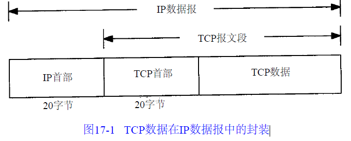
5. TCP包首部 \
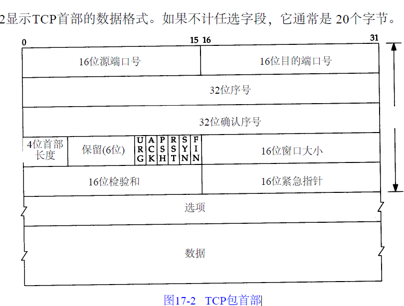
6. 序号用来标识从T C P发端向T C P收端发送的数据字节流，它表示在这个报文段中的的第一个数据字节。如果将字节流看作在两个应用程序间的单向流动，则T C P用序号对每个字节进
行计数。序号是32 bit的无符号数，序号到达23 2－1后又从0开始。
7. T C P为应用层提供全双工服务。这意味数据能在两个方向上独立地进行传输。因此，连
接的每一端必须保持每个方向上的传输数据序号。

### TCP连接的建立与终止
1. 最大报文段长度(MSS)
   1. 最大报文段长度（ M S S）表示T C P传往另一端的最大块数据的长度。当一个连接建立时，连接的双方都要通告各自的M S S。我们已经见过M S S都是1 0 2 4。这导致I P数据报通常是4 0字节长：2 0字节的T C P首部和2 0字节的I P首部。
2. 2MSL(Maximum Segment Lifetime)等待状态
   1. 每个具体T C P实现必须选择一个报文段最大生存时间M S L（Maximum Segment Lifetime）。它是任何报文段被丢弃前在网络内的最长时间。我们知道这个时间是有限的，因为T C P报文段以I P数据报在网络内传输，而I P数据报则有限制其生存时间的T T L字段。
   2. 作用
      1. 这样可让T C P再次发送最后的A C K以防这个A C K丢失（另一端超时并重发最后的F I N）
      2. 这种2 M S L等待的另一个结果是这个T C P连接在2 M S L等待期间，定义这个连接的插口（客户的I P地址和端口号，服务器的I P地址和端口号）不能再被使用。这个连接只能在2 M S L结束后才能再被使用。
      3. 在连接处于2 M S L等待时，任何迟到的报文段将被丢弃。因为处于2 M S L等待的、由该插口对(socket pair)定义的连接在这段时间内不能被再用，因此当要建立一个有效的连接时，来自该连接的一个较早替身（ i n c a r n a t i o n）的迟到报文段作为新连接的一部分不可能不被曲解（一个连接由一个插口对来定义。一个连接的新的实例（ i n s t a n c e）称为该连接的替身）。
   3. 2MSL的困惑 \
   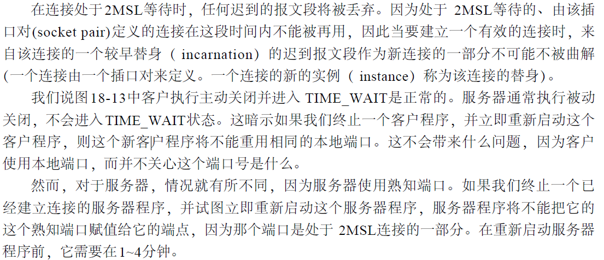
3. FIN_WAIT_2 状态  \
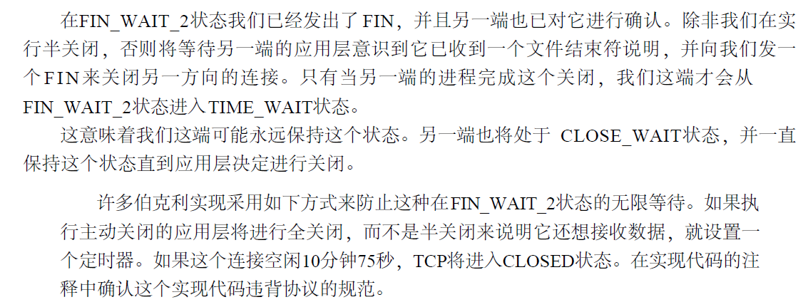
4. 检测半打开连接
   1. 如果一方已经关闭或异常终止连接而另一方却还不知道，我们将这样的T C P连接称为半打开（H a l f - O p e n）的。任何一端的主机异常都可能导致发生这种情况。只要不打算在半打开连接上传输数据，仍处于连接状态的一方就不会检测另一方已经出现异常。
5. 同时打开
   1. T C P是特意设计为了可以处理同时打开，对于同时打开它仅建立一条连接而不是两条连接
   2. 同时打开期间报文段的交换 \
   
   3. 一个同时打开的连接需要交换4个报文段，比正常的三次握手多一个。此外，要注意的是我们没有将任何一端称为客户或服务器，因为每一端既是客户又是服务器
6. 同时关闭
   1. 当应用层发出关闭命令时，两端均从E S TA B L I S H E D变为F I N _ WA I T _ 1。这将导致双方各发送一个F I N，两个F I N经过网络传送后分别到达另一端。收到F I N后，状态由F I N _ WA I T _ 1变迁到C L O S I N G，并发送最后的A C K。当收到最后的A C K时，状态变化为T I M E WA I T
   2. 同时关闭期间的报文段交换  \
   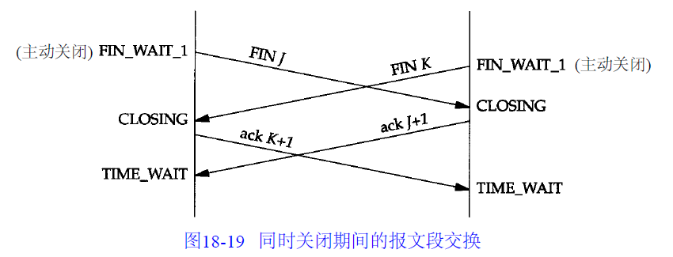
   3. 同时关闭与正常关闭使用的段交换数目相同
7. 