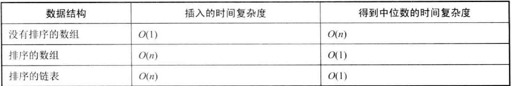
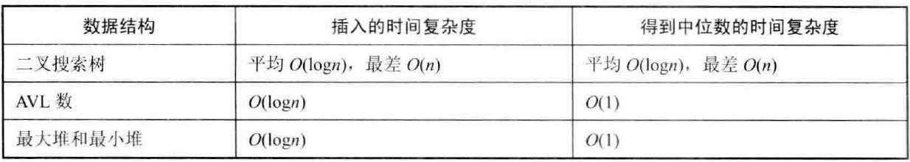

7. 重建二叉树
```java
public class Main {
	
	public TreeNode rebuild (int [] preorder, int [] inorder) {
		int len = preorder.length;
		
		if (len == 0) {
			return null;
		}
		
		return rebuild(preorder, 0, len-1, inorder, 0, len-1);
	}
	
	public TreeNode rebuild (int [] preorder, int pl, int pr, int [] inorder, int ol, int or) {
		
		if (pl > pr) {
			return null;
		}

		if (pl == pr) {
			return new TreeNode(preorder[pl]); 
		}
		
		int split = 0;
		for (int i = ol; i<=or; i++) {
			if (inorder[i] == preorder[pl]) {
				split = i;
				break;
			}
		}
		
		TreeNode node = new TreeNode(preorder[pl]);
		
		node.left = rebuild(preorder, pl+1, pl+(split-ol), inorder, ol, split-1);
		node.right = rebuild(preorder, pl+(split-ol) + 1, pr, inorder, split+1, or);

		return node;
	}
}
```

9. 用两个栈实现队列
```java
public class Main {

	Stack<Integer> stack1 = new Stack<>();
	Stack<Integer> stack2 = new Stack<>();

	public void push(int e) {
		stack1.push();
	}

	public int pop() {
		
		if (!stack2.isEmpty()) {
			return stack2.pop();
		}

		if (stack1.isEmpty()) {
			return -1;
		}
		while (!stack1.isEmpty()) {
			stack2.push(stack1.pop());
		}	
		return stack2.pop();
	}
}

```

11. 旋转数组的最小数字

14. 剪绳子

15. 二进制中1的个数
```java
// (n-1) & n: 可以把最右边的1变成0
public class Main {

	public int count1Bits (int n) {

		int count = 0;

		while (n != 0) {
			count++;
			n = n & (n-1);
		}
		return count;
	}

}
```

16. 数值的整数次方
```java

```

17. 打印从1到最大的n位数\
*字符串模拟/全排列*

18. 删除链表节点 
    1.  O(1)时间复杂度删除给定节点
    2.  删除重复节点
19. 正则表达式匹配
20. 表示数值的字符串
21. 调整数组顺序使奇数位于偶数前面
    1. 不考虑稳定性: 双指针
	2. 考虑稳定性
22. 链表中倒数第k个结点: 双指针解法
23. 链表中环的入口节点
24. 反转链表(递归)
25. 合并两个排序的链表(递归/迭代)
26. 树的子结构
27. 二叉树的镜像(递归/循环)
28. 对称二叉树
29. 顺时针打印矩阵
30. 包含min函数的栈
31. 栈的压入、弹出序列
32. 从上到下打印二叉树	
    1.  二叉树层次遍历
    2.  分行从上到下打印二叉树
    3.  之字形打印二叉树
33. 二叉搜索树后序遍历序列
    1.  二叉搜索树后序遍历序列
34. 二叉树中和为某一值的路径 (前序遍历的方式来做)
35. 复杂链表的复制 (可以不用map,做到O(n))
36. 二叉搜索树与双向链表
37. 序列化二叉树
38. 字符串的排列
    1.  如果是求组合呢
    2.  输入一个含有8个数字的数组, 判断有没有可能把这8个数字分别放到正方体的8个顶点上, 使得正方体上三组相对的面上的4个顶点的和都相等.
    3.  8皇后问题
39. 数组中出现次数超过一半的数字
    1.  基于快排的算法(时间复杂度O(n))
    2.  基于计数
40. 最小的k个数
41. 数据流中的中位数(解法很多) \
	 \
	
42. 连续子数组的最大和
43. 1-n整数中1出现的次数 (统计1在每一个数位上出现的次数)
44. 数字序列中某一位的数字
45. 把数组排成最小的数
46. 把数字翻译成字符串 (动态规划, 从后往前做)
47. 礼物的最大价值
48. 最长不含重复字符串的子串(动态规划)
49. 丑数
50. 第一个只出现一次的字符
    1.  字符流中第一个只出现一次的字符
51. 数组中的逆序对
52. 两个链表的第一个公共节点
53. 查找排序数字
    1.  数字在排序数组中出现的次数
    2.  0到n-1中缺失的数字(递增排序的数组)
    3.  数组中数值和下标相等的元素(递增数组)
54. 二叉搜索树的第k大节点(中序遍历)
55. 二叉树的深度
    1.  二叉树的深度
    2.  平衡二叉树(递归法重复太多, 基于后序遍历的解法最优)
56. 数组中数字出现的次数
    1.  数组中只出现一次的两个数字(两个数字出现一次,其他出现两次)
    2.  数组中唯一只出现一次的数字(一个数字出现一次, 其他出现三次)
57. 和为S的数字
    1.  递增数字中和为S的数字
    2.  和为S的连续整数序列
58. 翻转字符串
    1.  翻转单词的顺序 (翻转一部分串)
    2.  左旋转字符串 (三次翻转)
59. 队列的最大值
    1.  滑动窗口最大值
    2.  队列的最大值
60. n个骰子的点数
61. 扑克牌中的顺子
62. 约瑟夫环
63. 股票最大利润
64. 求 1 + 2 + ... + n
65. 不用加减乘除做加法
66. 构建乘积数组
