1. 在FTP进行文件传输是需要建立两个TCP连接, 分别是发出传输请求时所要用到的控制连接和实际传输数据时所需要的数据连接
2. 交换机自动学习mac和端口的映射
3. IP层的作用: 寻址, 路由, 分包与组包
4. 不同的数据链路的MTU不同, 以太网1500
5. IP无连接: 简化 + 提速
6. IP分片
   1. 数据链路不同, MTU相异
   2. 为什么通常分片由路由器做, 但是重组却在目标主机做
      1. 无法保证IP数据报是否经由同一个路径送达
      2. 拆分之后的每个分片有可能在途中丢失
      3. 即使在途中某一处被重新组装, 在经过其他路由器时有可能又被分片
   3. 根据IP首部中的片偏移和是否有后续分片, 进行重组
7. 路径MTU发现主机使用路径MTU最小值分片发送, 避免路由器分片
   1. UDP路径MTU发现 \
    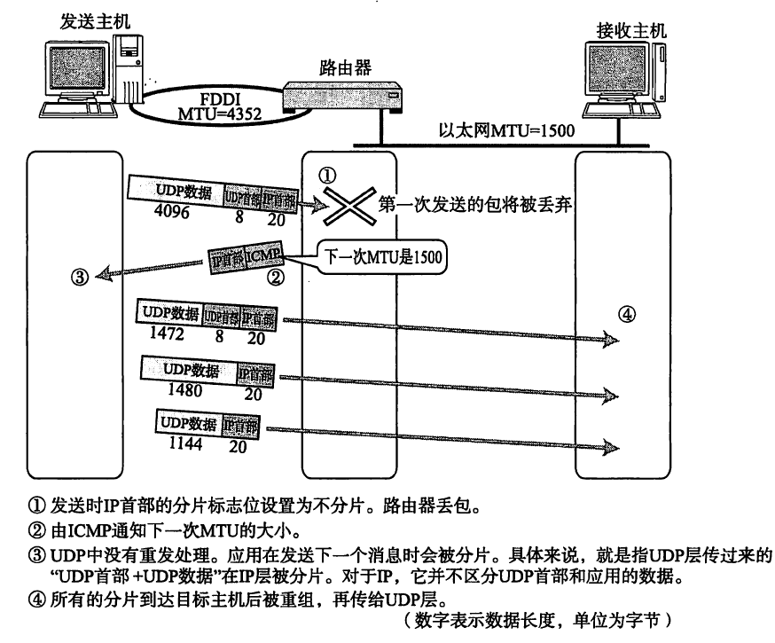
   2. TCP路径MTU发现 \
   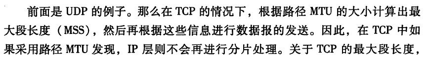 \
   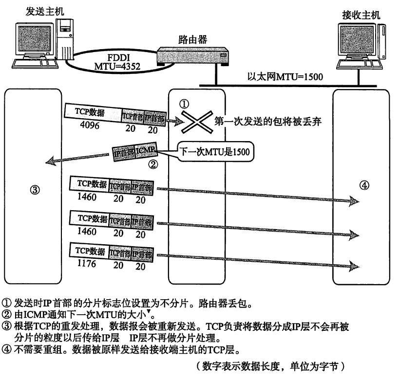
8. IPV6的特点 \
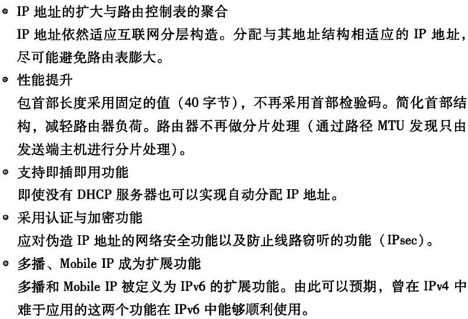
9. 为什么既需要IP地址又需要MAC地址
10. 代理ARP: 通常ARP包会被路由器隔离, 但是采用代理ARP的路由器可以将ARP请求转发给邻近的网络. 由此, 两个以上网段的节点可以像在同一个网段中一样进行通信.
11. ICMP的主要功能
    1.  确认IP包是否成功送达目标地址
    2.  通知在发送过程当中IP包被废弃的具体原因
    3.  改善网络设置
12. ICMP的常见消息类型
    1.  重定向消息
    2.  超时消息(traceroute)
    3.  回送消息(ping) \
    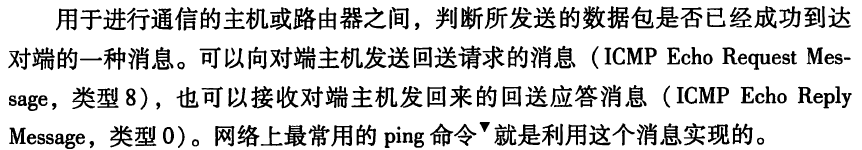
13. DHCP服务器的要求 \

14. NAT的潜在问题 \
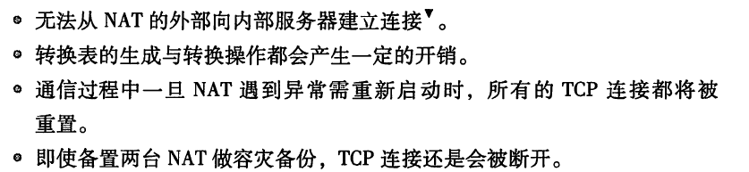
15. 组播中IGMP的作用 \
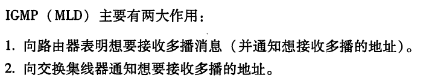
16. IP任播: 为提供同一服务的服务器配置相同的IP地址 (DNS可以使用任播)
17. 通信质量RSVP \
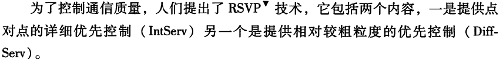 \
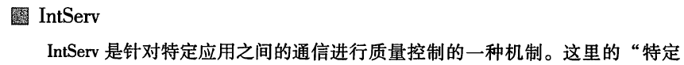 \
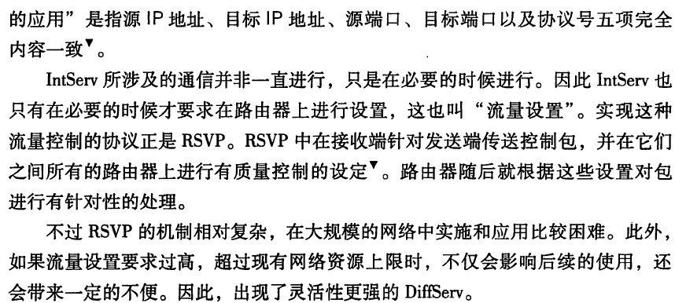 \
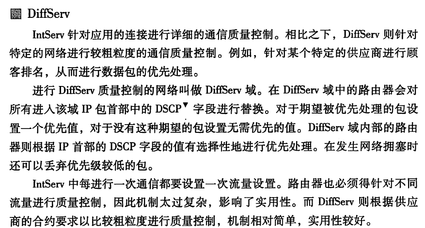
18. 可靠传输需要考虑的: 数据的破坏, 丢包, 重复, 分片顺序混乱
19. TCP实现可靠传输: 检验和, 序列号, 确认应答, 重发控制, 连接管理, 窗口控制, 流量控制, 拥塞控制
20. 超时重传 \
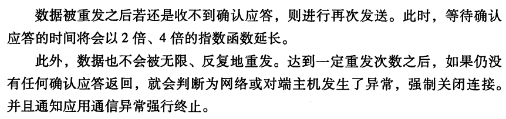
21. MSS (TCP层的)
22. 一个分组一个确认效率低, 利用窗口提高效率
