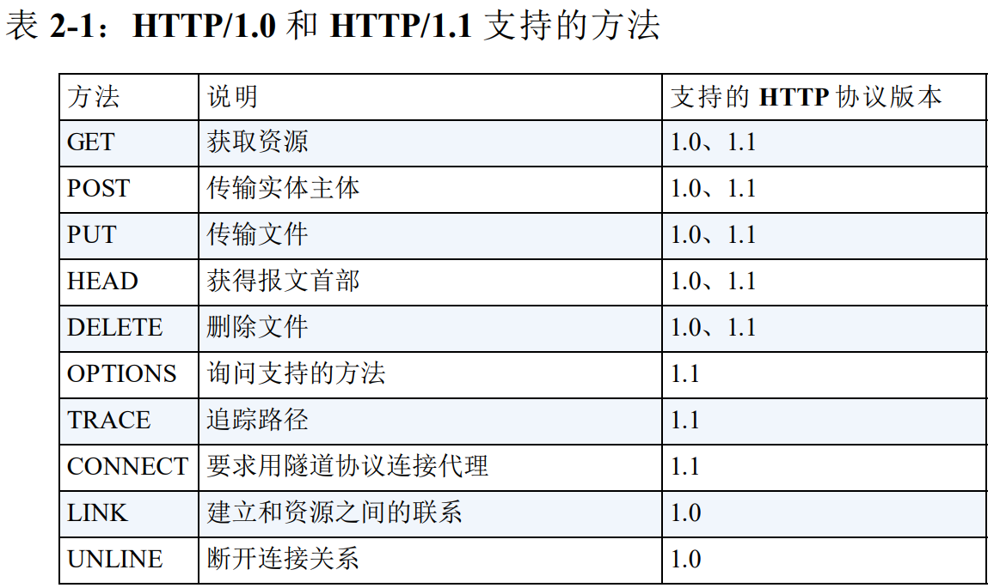
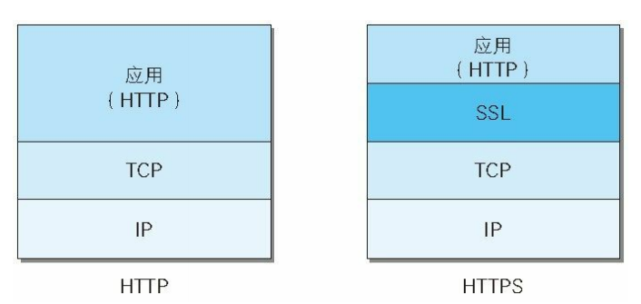
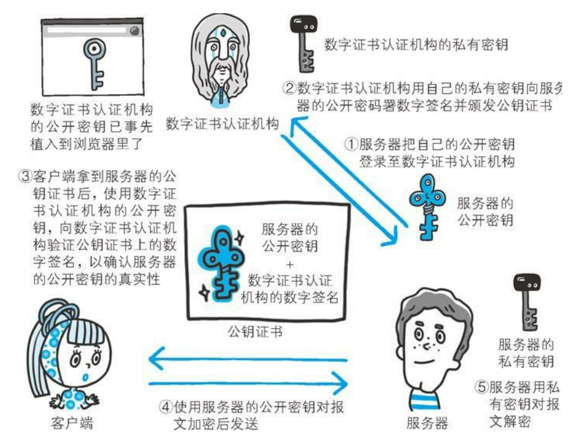

1. 请求方法: GET POST HEAD OPTIONS PUT DELETE TRACE(和trace route实现类似, 有个Max-Forwards参数) CONNECT(要求用隧道协议连接代理)    \

2. 持久连接节省通信量
   1. 持久连接
      1. 持久连接的特点是，只要任意一端没有明确提出断开连接，则保持 TCP 连接状态。
   2. 管线化(pipelining)
      1. 持久连接使得多数请求以管线化（pipelining）方式发送成为可能。从前发送请求后需等待并收到响应，才能发送下一个请求。管线化技术出现后，不用等待响应亦可直接发送下一个请求。
3. 使用 Cookie 的状态管理
4. 一般有 4 种首部，分别是：通用首部、请求首部、响应首部和实体首
部
5. 报文主体和实体主体的差异
   1. 报文（message）是 HTTP 通信中的基本单位，由 8 位组字节流（octet sequence，其中 octet 为 8 个比特）组成，通过 HTTP 通信传输。
   2. 实体（entity）作为请求或响应的有效载荷数据（补充项）被传输，其内容由实体首部和实体主体组成。\
   *HTTP 报文的主体用于传输请求或响应的实体主体。*
6. 出现403的原因: 未获得文件系统的访问授权，访问权限出现某些问题（从未授权的发
送源 IP 地址试图访问）等列举的情况都可能是发生 403 的原因。
7. HTTP的缺点
   1. 通信使用明文（不加密），内容可能会被窃听
   2. 不验证通信方的身份，因此有可能遭遇伪装
   3. 无法证明报文的完整性，所以有可能已遭篡改
8. HTTP+ 加密 + 认证 + 完整性保护
=HTTPS \

9. 证明公开密钥正确性的证书
   1. 公开密钥加密方式还是存在一些问题的。那就是无法证明公开密钥本身就是货真价实的公开密钥。
   2. 为了解决上述问题，可以使用由数字证书认证机构（CA，Certificate Authority）和其相关机关颁发的公开密钥证书。
10. 数字证书认证机构的业务流程
    1.  首先，服务器的运营人员向数字证书认证机构提出公开密钥的申请。
    2.  数字证书认证机构在判明提出申请者的身份之后，会对已申请的公开密钥做数字签名，然后分配这个已签名的公开密钥，并将该公开密钥放入公钥证书后绑定在一起。
    3.  服务器会将这份由数字证书认证机构颁发的公钥证书发送给客户端，以进行公开密钥加密方式通信。公钥证书也可叫做数字证书或直接称为证书。
    4.  接到证书的客户端可使用数字证书认证机构的公开密钥，对那张证书上的数字签名进行验证，一旦验证通过，客户端便可明确两件事：一，认证服务器的公开密钥的是真实有效的数字证书认证机构。二，服务器的公开密钥是值得信赖的。\
    
11. HTTPS 的安全通信机制 \

12. SSL慢的原因
    1.  一种是指通信慢: 和使用 HTTP 相比，网络负载可能会变慢 2 到 100 倍。除去和TCP 连接、发送 HTTP 请求响应以外，还必须进行 SSL 通信，因此整体上处理通信量不可避免会增加。
    2.  另一种是指由于大量消耗CPU 及内存等资源，导致处理速度变慢: 在服务器和客户端都需要进行加密和解密的运算处理。因此从结果上讲，比起 HTTP 会更多地消耗服务器和客户端的硬件资源，导致负载增强。

