### Mysql 架构与历史
1. mysql的默认隔离级别是可重复读

### Schema与数据类型优化
1. 选择优化的数据类型
   1. 选择原则
      1. 更小的通常更好
      2. 简单就好
      3. 尽量避免NULL
   2. timestamp 和 datetime
      1. 存储日期和时间, 精确到秒
      2. timestamp只用datetime一半的存储空间, 并且可以根据时区变化
      3. timestamp允许的时间范围比datetime小得多

### 创建高性能索引
1. 索引基础
   1. MySQL支持的索引类型
         1. B-Tree索引
            1. 存储引擎决定索引的实现 \
            
            1. B+Tree索引 \
            
            1. 联合索引图 \
            
            1. B-tree索引适用场景 \
            
            1. B-tree索引的限制 \
            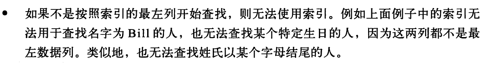 \
            
            注意: 这些限制并不是B-tree本身导致的, 而是MySQL优化器和存储引擎使用索引的方式导致的
         2. Hash索引
            1. 基于哈希表实现, 只能精确匹配索引所有的列的查询才有效
            2. Hash索引在引擎中的实现 \
            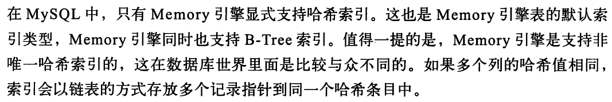
            3. Hash索引的限制 \
            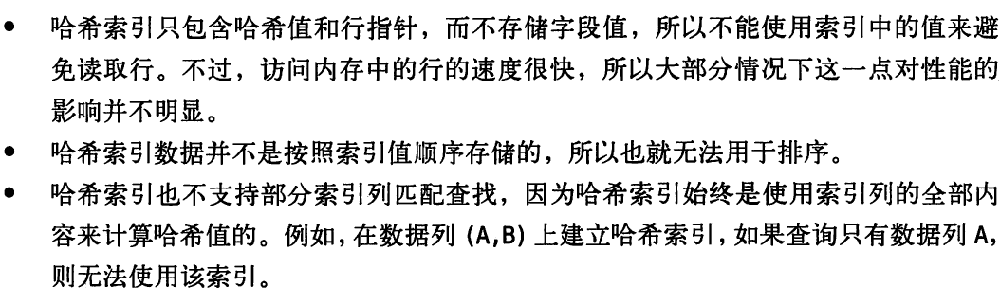 \
            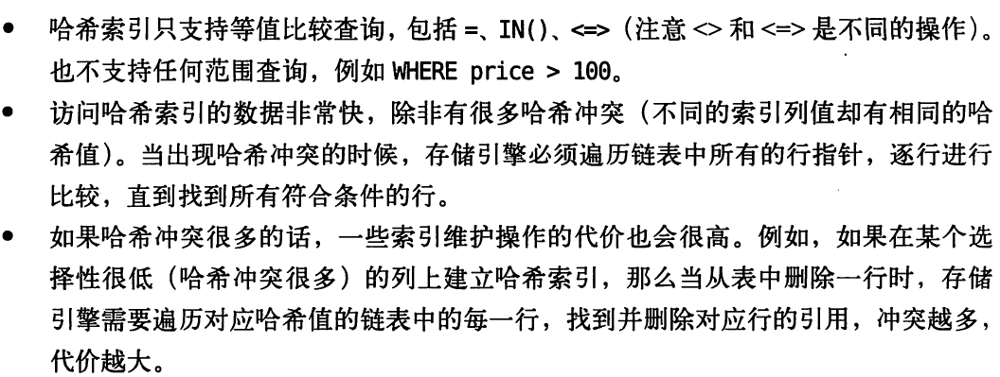 
            4. 哈希索引的适用场景 \
            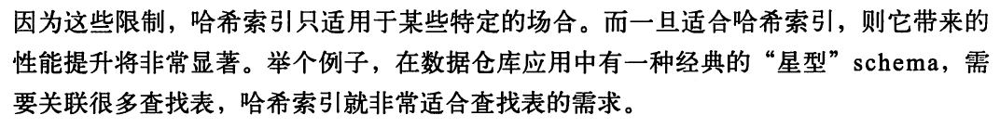
            5. innodb自适应哈希 \
            
            6. 创建自定义哈希索引 \
            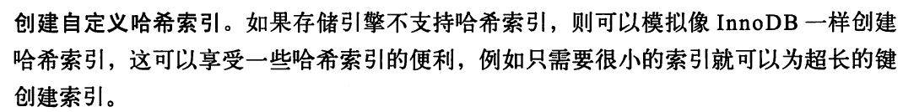
            7. 一个对字符串添加crc32哈希索引的例子 (不用Md5, sha1因为很长)
               1. 避免hash冲突的方法 \
               
         3. 空间数据索引R-Tree \
         
         4. 全文索引
         5. 其他索引类别 \
         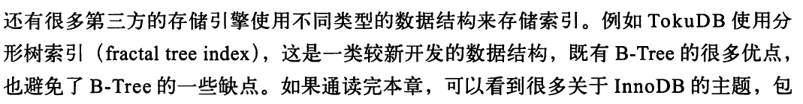 \
         
   2. 索引的三大优点 \
    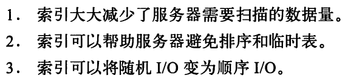
      1. 索引时最好的解决方案吗 \
      
      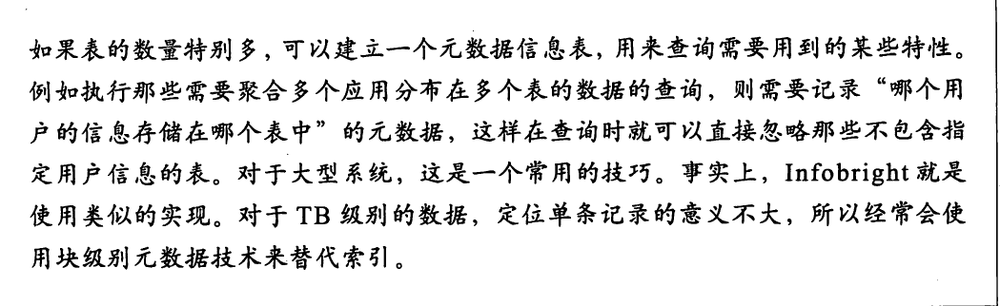
      1. ORM是否需要加索引 \
      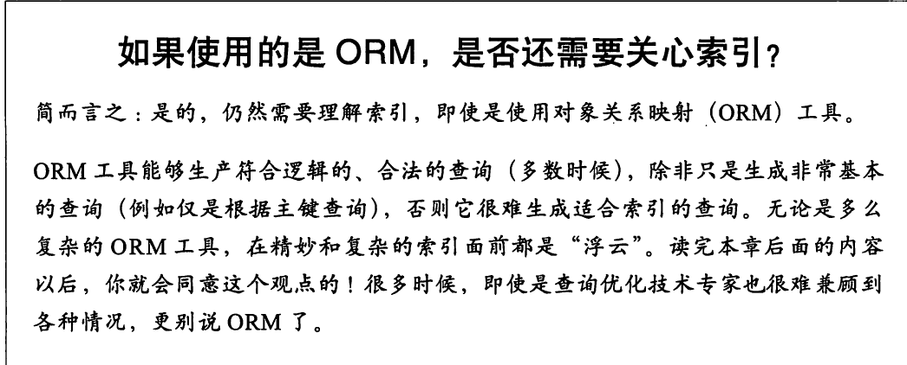
    1. 高性能的索引策略
       1. 独立的列
       2. 前缀索引与索引选择性 \
          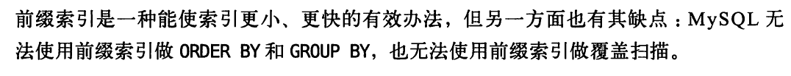
          1. 一个常见的常见是针对很长的十六进制唯一ID做前缀索引
       3. 多列索引