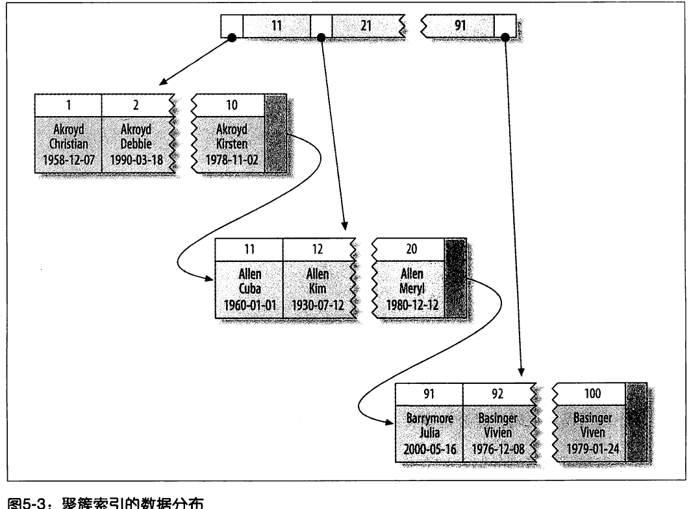
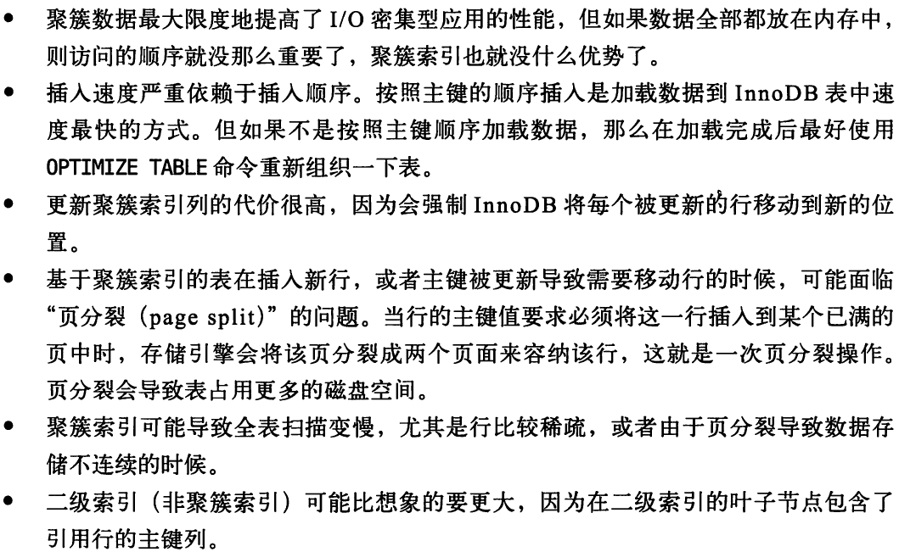

### Mysql 架构与历史
1. mysql的默认隔离级别是可重复读

### Schema与数据类型优化
1. 选择优化的数据类型
   1. 选择原则
      1. 更小的通常更好
      2. 简单就好
      3. 尽量避免NULL
   2. timestamp 和 datetime
      1. 存储日期和时间, 精确到秒
      2. timestamp只用datetime一半的存储空间, 并且可以根据时区变化
      3. timestamp允许的时间范围比datetime小得多

### 创建高性能索引
1. 索引基础
   1. MySQL支持的索引类型
         1. B-Tree索引
            1. 存储引擎决定索引的实现 \
            
            1. B+Tree索引 \
            
            1. 联合索引图 \
            
            1. B-tree索引适用场景 \
            
            1. B-tree索引的限制 \
             \
            
            注意: 这些限制并不是B-tree本身导致的, 而是MySQL优化器和存储引擎使用索引的方式导致的
         2. Hash索引
            1. 基于哈希表实现, 只能精确匹配索引所有的列的查询才有效
            2. Hash索引在引擎中的实现 \
            
            3. Hash索引的限制 \
             \
             
            4. 哈希索引的适用场景 \
            
            5. innodb自适应哈希 \
            
            6. 创建自定义哈希索引 \
            
            7. 一个对字符串添加crc32哈希索引的例子 (不用Md5, sha1因为很长)
               1. 避免hash冲突的方法 \
               
         3. 空间数据索引R-Tree \
         
         4. 全文索引
         5. 其他索引类别 \
          \
         
2. 索引的三大优点 \
   
   1. 索引时最好的解决方案吗 \
   
   
   1. ORM是否需要加索引 \
   
3. 高性能的索引策略
   1. 独立的列
   2. 前缀索引与索引选择性 \
      
      1. 一个常见的常见是针对很长的十六进制唯一ID做前缀索引
   3. 多列索引
      1. 索引合并
         1. 多个单列索引以某种方式合并起来
         2. 缺点 \
   
   1. 选择合适的索引列顺序
      1. 正确的顺序依赖于使用该索引的查询,同时需要考虑如何更好的满足排序和分组的需要
      2. 索引选择经验法则  \
       \
      
   2. 聚簇索引
      1. 聚簇索引说明 \
      
      
      1. 聚簇索引的数据分布 \
      
      1. MySQL的主键索引就是聚簇索引 \
      
      1. InnoDB只聚集在同一个页面中的记录, 包含相邻键值的页面可能相距甚远
       
      1. 聚簇索引的优点 \
      
      1. 聚簇索引的缺点 \
      
      
      1. InnoDB和MyISAM的数据分布对比
         1. MyISAM中主键索引和其他索引在结构上没有什么不同, 主键只是一个唯一非空索引
         2. MyISAM的主键分布 \
         
         1. Innodb的主键分布 \
         
         1. Innodb的二级索引 \
          \
         
      2. 聚簇索引和非聚簇索引的对比 \
      
      1. 在Innodb中按主键顺序插入行
         1. 主键选择 \
         
         1. 为什么UUID作为主键会导致效率低下 \
         
         1. 顺序主键的性能瓶颈 \
         
   3. 覆盖索引
      1. 如果一个索引包含(覆盖)所需查询字段的值, 就称之为"覆盖索引"
      2. 优点 \
      
      1. 覆盖索引对索引结构的要求 \
      
      1. explain 分析查询, 如果是覆盖索引, 在extra 字段会显示 using index
      2. 覆盖索引不生效的原因 \
      
      1. 延迟关联利用覆盖索引
      2. Innodb的覆盖索引是可以覆盖到主键的 \
      
   4. 使用索引扫描来做排序
      1. MySQL生成有序结果的两种方式 \
      
      1. 扫描索引 \
      
      1. 要求 \
       \
      
      1. 不能用索引做排序的情况 \
      
   5. 压缩(前缀压缩)索引
      1. MyISAM默认只压缩字符串, 也可以通过设置压缩int
      2. MyISAM压缩索引的方法 \
      
      1. 压缩的缺点 \
      
   6. 冗余和重复索引
      1.  MySQL重复索引 \
      
      1. MySQL冗余索引 \
      
      1. 经验法则: 大多数时候都不需要创建冗余索引, 应该尽量扩展已有索引而不是创建新索引
      2. 解决冗余索引和重复索引的方法 \
      
   7.  未使用的索引
       1.  查询索引使用情况 \
        \
       
   8.  索引和锁
       1.  MySQL中的锁定 \
       
       1. 索引对锁的影响 \
       
       1. Innodbd的索引与锁的细节 \
       
4. 索引案例学习
5. 维护索引和表

### 查询性能优化
1. 为什么查询速度慢
   1. 优化方向 \
   
   
   2. 查询的声明周期 \
   
2. 慢查询基础: 优化数据访问
   1. 分析低效查询的步骤 \
   
   2. 是否向数据库请求了不需要的数据
      1. 查询不需要的记录
      2. 多表关联时返回全部列
      3. 总是取出全部列
      4. 重复查询相同的数据
   3. Mysql是否存在扫描额外的行数
      1. 衡量查询开销的三个指标(这三个指标都记录到慢日志中, 所以慢日志是找出扫描行数过多的好办法)
         1. 响应时间 = 服务时间+排队时间(IO/锁等)
         2. 扫描的行数
         3. 返回的行数
      2. 扫描的行数和返回的行数: 通常在1:1 - 10:1
      3. 扫描的行数和返回类型
         1. EXPLAIN语句中的type反应了返回类型 \
            1. 全表扫描(ALL)
         
      4. MySQL应用where的姿势(从好到坏) \
      
      5. 扫描优化方案 \
      
3. 重构查询的方式
   1. 重构查询的指导原则 \
   
   2. 一个复杂查询还是多个简单查询
   3. 切分查询 \
   
   4. 分解关联查询
      1. 使用分解关联查询重构查询的优势 \
      
4. 查询执行的基础
   1. Mysql客户端/服务器通信协议
      1. 查询执行路径 \
        \
      
      1. Mysql客户端/服务器通信协议 \
       \
      
      1. 查询状态
         1. 查看命令: SHOW FULL PROCESSLIST
         2. 状态及其解释 \
          \
         
   2. 查询缓存 \
   
   3. 查询优化处理: 解析SQL + 预处理 + 优化SQL执行计划
      1. 语法解析器和预处理
      2. 查询优化器
         1. 优化器的作用 \
         
         2. 基于成本的优化器 \
         
         3. 成本计算的依据 \
         
         4. 导致优化器选择错误的执行计划的可能原因 \
         
         
         5. 优化策略 \
          \
         
         6. Mysql 能够处理的优化类型 \
          \
         
         
         
         7. 数据和索引的统计信息 \
         
         8. MySQL如何执行关联查询
            1. MySQL对关联查询的定义 \
            
            2. Union查询的例子 \
            
            3. MySQL关联查询的策略 \
               \
            
            4. MySQL不支持全外连接 \
            
         9. 执行计划
            1.  多表关联的一种方式 \
            
            2. MySQL实现多表关联的方式(左侧深度优先的树, 因为他是用的嵌套循环关联查询) \
            
         10. 关联查询优化器
             1.  关联优化器选取执行计划 \
              \
             
         11. 排序优化
             1.  索引排序 / 文件排序 \
             
             
             2. MySQL的两种排序算法 \
             
             3. 关联查询的排序 \
             
             4. MySQL5.6对查询排序的改进 \
             
   4. 查询执行引擎
      1. 查询执行阶段的过程   \
      
   5. 返回结果给客户端  \
   
5. MySQL查询优化器的局限性
   1. 关联子查询
      1. MySQL子查询的实现非常糟糕. IN 是一个例子
      2. 如何用好关联子查询
         1. 有时候关联子查询效率更高. 例如: NOT EXISTS 可以提前终止查询
   2. Union的限制
      1. MySQL限制下推  \
      
      2. Union的使用 \
      
   3. 索引合并优化
   4. 等值传递 (例如, 复制很大的IN集合)
   5. 并行执行
      1. MySQL不支持并行执行  \
      
   6. 哈希关联
      1. MySQL不支持哈希关联  \
      
   7. 松散索引扫描
      1. 松散索引扫描   \
      
      2. 松散索引扫描示例图   \
      
      3. MySQL在特殊场景下对松散索引的支持   \
      
   8. 最大值和最小值优化
   9.  在同一个表上查询和更新
       1.  MySQL不允许在同一个表上同时进行查询和更新 ([为什么?]())   \
       
6. 查询优化器的提示
7. 优化特定类型的查询

      